+++
date = '2023-04-11T12:00:00-07:00'
draft = false
title = 'Packet capture experiment 1'
+++
## packet delay, loss, duplicate, corrupt, out-of-order and bandwidth limit

### Goal

The goal of packet capture experiment here is to get a better understanding of TCP protocol. Besides, by reproducing the common network issues in the real world like packet delay, loss, out-of-order and brandwidth limit and saving a snapshot of packet capture result of circumstances above, we can identify and solve these problems more quickly next time.

### Method

1. Instance

    Instance provider: AWS  
    Instance type: t2.micro, 1vCPU, 1GiB memory, Low to Moderate network  
    Region: us-east-1b  
    OS: Amazon Linux 2023 AMI  
    Python: 3.9  

2. EC2 settings

    Launch 2 EC2 instance on AWS in the same region, one as server, one as client.  
    Edit security group of server, add inbound rule: Custom TCP Rule, Port Range: 8000  

3. Server/Client commands

    Start server: `python -m http.server 8000`  
    Start client: `curl <server_ip>:8000/<file_path> --output ~/<file_name>`

4. Packet capture commands  

    Server side: `tcpdump -s 120 -w server.pcap`  
    Client side: `tcpdump -s 120 -w client.pcap`  
    ping a random website before/after downloading test file: `ping google.com -c 1`  
    If download time > 1 min, stop it.  

5. Download pcap result file

    Server side: `scp -i ~/.ssh/****.pem ec2-user@*.*.*.*:~/client.pcap ~/Downloads`  
    Client side: `scp -i ~/.ssh/****.pem ec2-user@*.*.*.*:~/server.pcap ~/Downloads`

6. Experiment settings

    Client requests to download a 2 GiB file under following circumstances:

    ```
    No limit (Benchmark)
    Packet delay at 2ms (Exp-delay-2)
    Packet delay at 100ms (Exp-delay-100)
    Packet loss rate 1% (Exp-loss-1)
    Packet loss rate 20% (Exp-loss-20)
    Packet duplicate rate 1% (Exp-dup-1)
    Packet duplicate rate 20% (Exp-dup-20)
    Packet corrupt rate 1% (Exp-crpt-1)
    Packet corrupt rate 20% (Exp-crpt-20)
    Packet reorder rate 1%, gap 100ms, correlation 10% (Exp-reord-1)
    Packet reorder rate 20%, gap 100ms, correlation 10% (Exp-reord-20)
    Bandwidth limit at 50mbps (Exp-bdw-50)
    Bandwidth limit at 1mbps (Exp-bdw-1)
    ```

    commands:

    ```
    # give packets from enX0 a delay of 2ms (client)  
    tc qdisc add dev enX0 root netem delay 2ms
    # give packets from enX0 a delay of 100ms (client)  
    tc qdisc change dev enX0 root netem delay 100ms  
    # give packets from enX0 a loss rate of 1% (server)  
    tc qdisc add dev enX0 root netem loss 1%  
    # give packets from enX0 a loss rate of 20% (server)  
    tc qdisc change dev enX0 root netem loss 20%  
    # give packets from enX0 a duplicate rate of 1% (server)  
    tc qdisc add dev enX0 root netem duplicate 1%  
    # give packets from enX0 a duplicate rate of 20% (server)  
    tc qdisc change dev enX0 root netem duplicate 20%  
    # give packets from enX0 a corrupt rate of 1% (server)  
    tc qdisc add dev enX0 root netem corrupt 1%  
    # give packets from enX0 a corrupt rate of 20% (server)  
    tc qdisc change dev enX0 root netem corrupt 20%  
    # give packets from enX0 a reorder rate of 1% (server)  
    tc qdisc add dev enX0 root netem delay 100ms reorder 99% 10%  
    # give packets from enX0 a reorder rate of 20% (server)  
    tc qdisc change dev enX0 root netem delay 100ms reorder 80% 10%  
    # give packets from enX0 a speed limit of 50Mbps (server)  
    tc qdisc add dev enX0 root tbf rate 400mbit burst 10mbit latency 10ms  
    # give packets from enX0 a speed limit of 1Mbps (server)  
    tc qdisc change dev enX0 root tbf rate 8mbit burst 200kbit latency 10ms 
    ```

### Result and Analysis

To simplify, here I’ll only focus on client side packet capture result. For those who are interested in packet capture result on both sides, please refer to the [github repo](https://github.com/gongyisheng/playground/tree/main/network/experiment) for details.

Result:

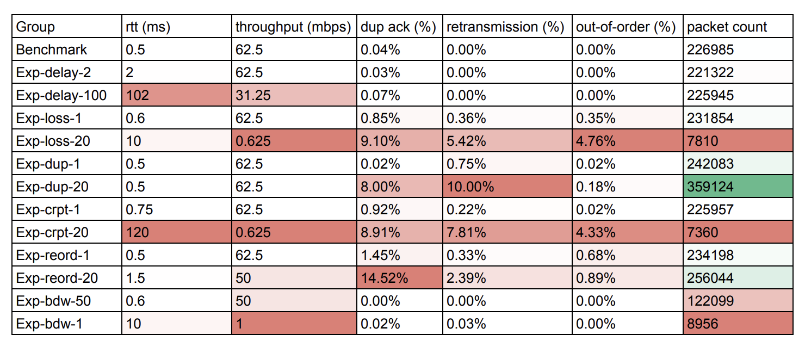

Note: rtt and throughput is estimated from graph. dup ack, retransmission, out-of-order is from wireshark expert info.

1. Establish/Destory connection

    **Establish connection**  
    
    process: [SYN]->[SYN, ACK]->[ACK]

    - Seq: byte offset of the first data byte in the current TCP segment  

    - Win: size of the receiver’s TCP receive window in bytes (calculated by window_size * window_scale)  
    - Len: length of the TCP segment, including the TCP header and payload    
    - MSS: the largest amount of data, measured in bytes, that can be sent in a single TCP segment  
    - SACK_PERM: used to indicate that the receiver supports the use of selective acknowledgment  

    

    These ACK with Len=0 are pure ACK. Sometimes we can see ACK with Len > 0, those are Piggybacking ACKs, which is used by TCP to optimize network traffic by combining the ACK of previously received packets with the transmission of new data in a single TCP segment.  

    **MSS**

    Why we have *MSS = 8961* but still can see a lot of packets with *length = 26913*? Yes, It’s because TSO (TCP Segment Offload). TCP stack sends a chunk of data for the NIC to break up into MSS pieces to send on the network. However, Wireshark uses libpcap or winpcap to grab the data before it gets handed to the NIC. Here’s the [reference](https://packetbomb.com/how-can-the-packet-size-be-greater-than-the-mtu/).

    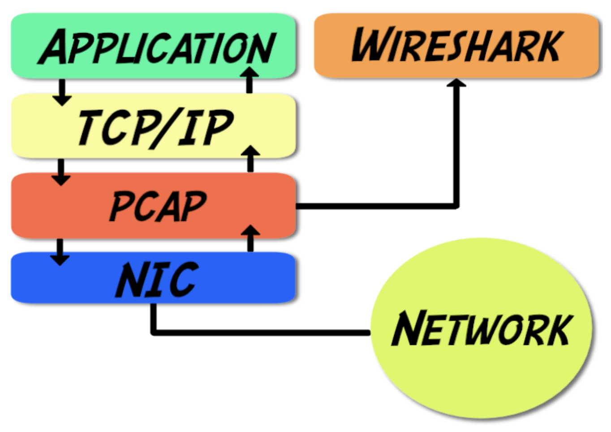

    **Destory connection**

    process: [FIN, ACK]->[ACK]->[FIN, ACK]->[ACK]

    


2. Round Trip Time:

    RTT is calculated by measuring the time elapsed between the transmission of a packet by the sender and the receipt of an acknowledgment (ACK) for that packet by the sender. Throughput = RTT * window size. RTT is usually the key metrics when we do network analysis because window size is auto-tuned by kernal. RTT can also reflect the service’s response time (when the network is good) and tell which service is the bottleneck in the whole system.

    You can typically look for the packet with a specific sequence number (such as the SYN packet), and then look for the corresponding ACK packet with the same sequence number. The time difference between the transmission of the SYN packet and the receipt of the ACK packet represents the RTT.

    The benchmark rtt is around 0.5ms, which is usually directly related with the physical distance between client and server.

    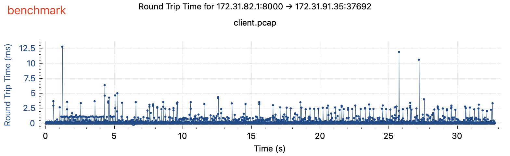
    
    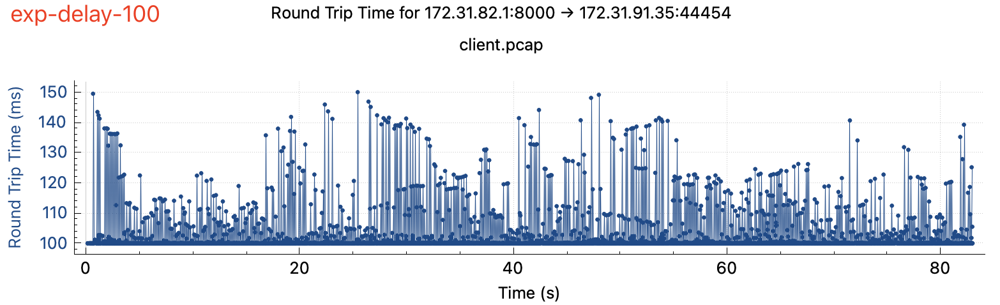
    
    
    
    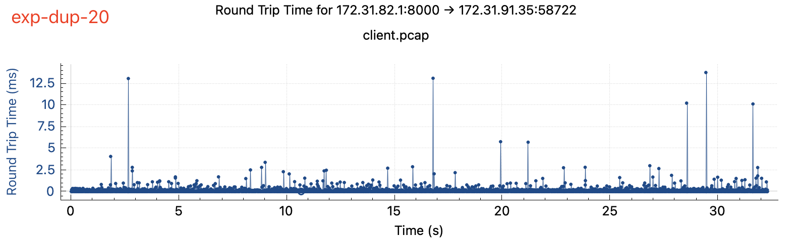
    
    
    
    
    
    

    Conclusion:

    - packet delay directly increases rtt (waiting for ack)
    - packet loss, corrupt, reorder and bandwidth limit may increase rtt indirectly, either by retransmission or ack delay
    - packet duplicate doesn’t increase rtt, duplicated packets does not need retransmission

3. Throughput

    Throughput is usually our ultimate aim for network analysis to make full use of the bandwidth we pay for. It’s usually measured by the amount of data that can be transmitted over a network during a given period of time. Throughput can be affected by rtt and window size, it’s a better monitoring metric rather than analytics metric.

    In the benchmark experiment, the throughput is about 5E+08 bits/s (62.5 MiB/s), which is common for two instance located in the same region and same VCP.

    
    
    
    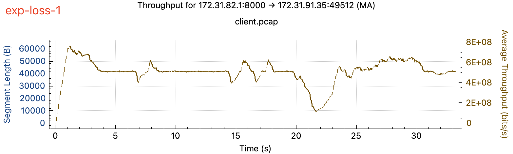
    
    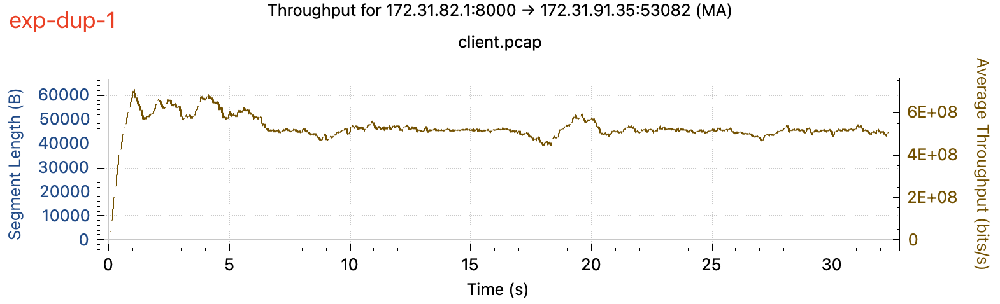
    
    
    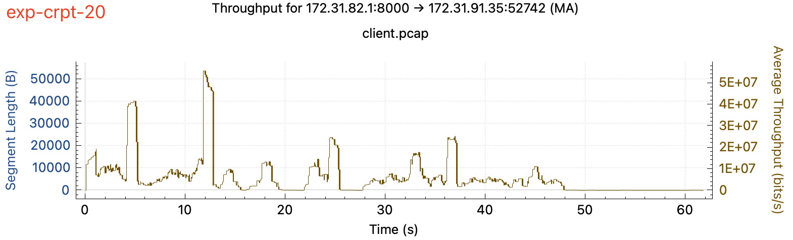
    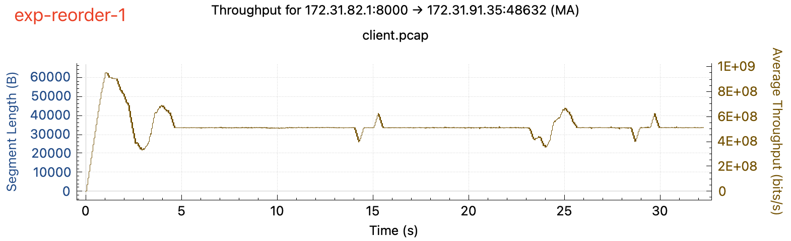
    
    
    

    Conclusion:

    - bandwidth limit affects throughput in a direct way (you will see a straight line in the graph)
    - packet delay, loss, corrupt may affect throughput in an undirect way (by RTO and ack delay)
    - packet reorder may afftect throughput, but it’s not quite much
    - packet duplicate doesn’t affect throughput

4. Time/Sequence

    A time/sequence graph is a type of graph used to visualize how sequence number changes over time of a tcp stream. By looking at the time/sequence graph, we can get an idea of how the tcp stream performs, like whether there’s delay (waiting for something), drop (reorder), and how often it happens. Time/sequence graph is usually dense if the time interval is big. Need to zoom into a short period of time for details.

    
    
    
    
    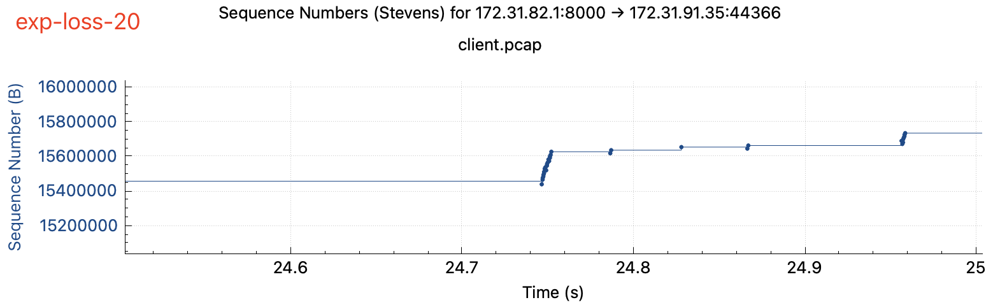
    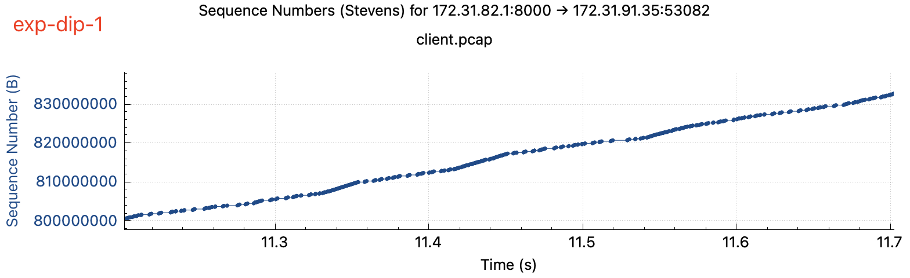
    
    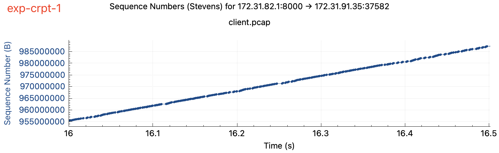
    
    
    
    
    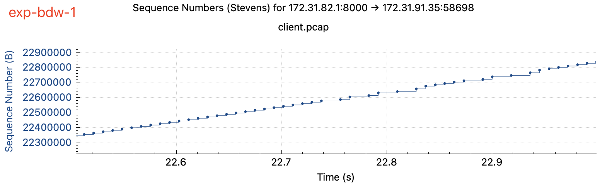

    Conclusion:

    - packet delay causes plateau in the graph directly (waiting for ack)
    - packet loss, corrupt, duplicate and bandwidth limit may cause plateau indrectly (retransmission and waiting for ack)
    - packet reorder may cause drop (process reorderd packet)

5. Window Scaling

    Sometimes congestion window size may also helps analysis. Window size is decided by buffer size, congestion control algorithm and retransmission rate. There’re a lot of articles about congestion windows in the web so I don’t intend to repeat them again. Here I attached the window scaling graphs for reference. In the benchmark experiment the window size is about 12.5kb.

    
    
    
    
    
    
    
    
    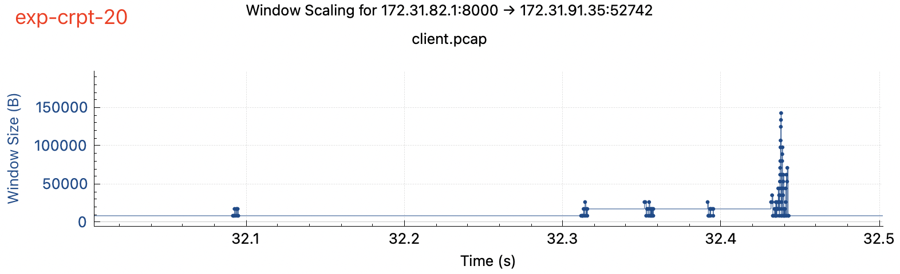
    
    
    
    

    Conclusion:

    - packet delay and reorder may result in a bigger window size (delay: receiver is too fast, scale window to allow sender to send more; reorder: part of pervious packet not received, need to scale window to receive comming packets first)
    - packet loss, corrupt, bandwidth limit may result in a smaller window size (too many packets need to be retransmissed)
    - packet duplicate does not affect window size

6. Details

    **Fast Retransmission**  

    Fast retransmission is a mechanism used in TCP to quickly recover lost packets in a data transmission.   

    

    When the sender receives three duplicate ACKs (i.e., three ACKs for the same packet). This indicates that the receiver has received some, but not all, of the packets in the transmission. Rather than waiting for the retransmission timeout (RTO) period to expire, which can be several seconds, the sender immediately assumes that the missing packet has been lost and retransmits it.

    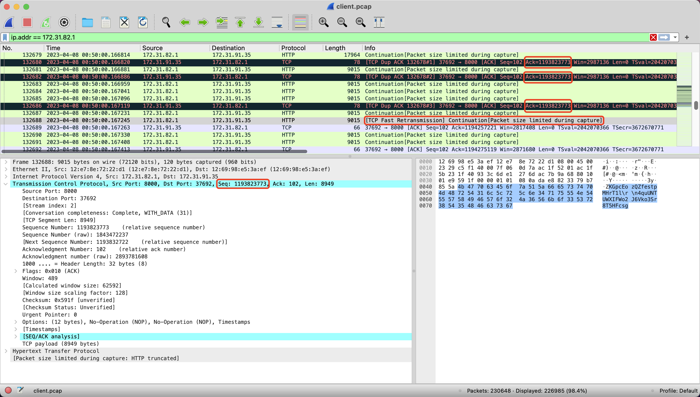

    Sometimes, several fast retransmission may group together and it is marked as out-of-order packet on WireShark.

    

    **packet delay**  

    client ack delay, server quick response, sometimes client side window full  

    

    **packet loss**  

    frequent dup ack, retransmission, sometimes RTO, server response slow  

    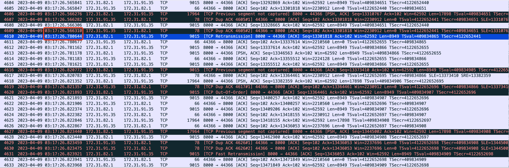

    packet duplicate: duplicated packet is marked as spurious retransmission, but no delay.

    Spurious retransmissions are one’s that are considered unnecessary — in Wireshark, a retransmission is marked as “spurious” when Wireshark has seen the ACK for the data already.

    

    **packet corrupt**  

    frequent dup ack, retransmission, sometimes RTO, server response slow  

    

    **packet reorder**  

    marked as packet loss, need retransmission, sometimes spurious retransmission

    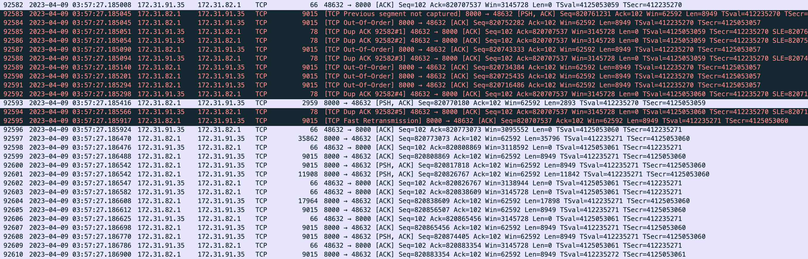

    **bandwidth limit**  

    everything is fine, just server response is slow

    