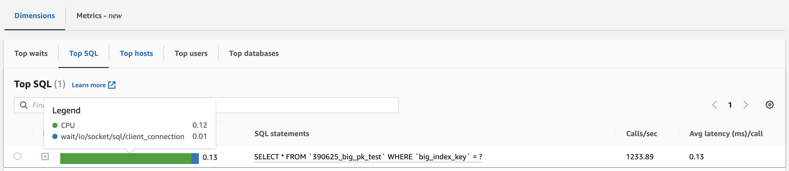

### Background

As what is explained in [my pervious post](https://blog.yellowday.day/posts/is_20m_rows_still_a_soft_limit_of_mysql_table_in_2023/), B+ tree depth decides the worst case of MySQL’s query performance, only considering those use index. And with the help of SSD, that should be fine to have a B+ tree deeper than 4 layers.

So the next question is: how bad the performance is possible to be? Here I intentionally design a table using very long string as primary key and index, which results in very deep B+ trees, up to 9 layers, to test its worst performance on SSD, which you are not expected to deal with in production.

### Environment

```
Database
MySQL version: 8.0.25
Instance type: AWS db.r5.large (2vCPUs, 16GiB RAM)
EBS storage type: General Purpose SSD (gp2)

Test Client
Linux kernal version: 6.1
Instance type: AWS t2.micro (1 vCPU, 1GiB RAM)
```

### Experiment Design

1. Create tables using long string as primary key, and another long string column as index. 
  
    I created 9 tables with 5, 25, 125, 625, 3125, 15625, 78125, 390625 of rows respectively.

    Why make the row count of tables a geometric sequence and each number has been multiplied by 5 after another? The reason is that in MySQL 8.0.25, primary key’s size should be less than 3072 bytes, which equals to 3k. As each page is 16k, one page can hold at most 5 keys. Thus, you can expect that in our index B+ tree each non-branch node has at most 5 child nodes. A table with 5 rows is 2 in depth, 25 rows is 3 in depth, etc… But in the real world it may be more complicated because the size of page directory is undecided, some of the B+ tree non branch nodes may only hold 4 nodes, making it even deeper than theory.

    ```
    CREATE TABLE `5_big_pk_test` (
      `big_pk` varchar(768) NOT NULL,
      `big_index_key` varchar(768) DEFAULT NULL,
      `id` int NOT NULL DEFAULT '0',
      PRIMARY KEY (`big_pk`),
      KEY `query_by_big_key_index` (`big_index_key`)
    ) ENGINE=InnoDB DEFAULT CHARSET=utf8mb4 COLLATE=utf8mb4_0900_ai_ci;
    ```

    Here I use charset=utf8mb4, so each character will take 4 bytes. Thus, a 768-length string is big enough to hit the upperbound of primary key size limit.

2. Insert tables with different rows. I use both test client and copying to create these tables. The script can be found[here](https://github.com/gongyisheng/playground/blob/main/mysql/big_primary_key_test/insert_data.py).

    ```
    # test client
    INSERT INTO {table} (big_pk, big_index_key) VALUES ({pk}, {pk})
    ```

    Values for big_key and big_index_key are random long string. To make it easier, the string is made up of a random head for first 10 characters and a fixed tail for the rest.

3. Use test client to execute following sql queries to test performance. The script can be found[here](https://github.com/gongyisheng/playground/blob/main/mysql/big_primary_key_test/select_test.py).

    ```
    select * from {table} where big_pk = "{target_key}"           --query by primary key
    select * from {table} where big_index_key = "{target_key}"    --query by index, but cause 2-times index tree lookup
    ```

4. Look up the innodb buffer pool status

    ```
    SHOW STATUS LIKE 'innodb_buffer_pool_pages%'
    ```

5. Be sure to reboot the database every time you finish testing on a table! Flush innodb buffer pool to avoid reading old cache and get wrong results! Also need to set following variables to avoid buffer pool dump / load during reboot.

    ```
    # Stop saving the buffer pool to disk at shutdown
    SET GLOBAL innodb_buffer_pool_dump_at_shutdown=OFF;
    # Stop loading the buffer pool from disk at startup
    SET GLOBAL innodb_buffer_pool_load_at_startup=OFF;

    # Check the status of the dump and load
    SHOW GLOBAL STATUS LIKE 'Innodb_buffer_pool_dump_status';
    SHOW GLOBAL STATUS LIKE 'Innodb_buffer_pool_load_status';
    ```

### Result

**Query 1** `select * from {table} where big_pk = \"{target_key}\"`


As we can see, the depth of B+ tree goes up as designed. And the worst case of query runtime is table with 390,625 rows, which is at about 8ms and 9 times of I/O to query on its primary key.

**Query 2** `select * from {table} where big_index_key = \"{target_key}\"`


This query requires two times index tree lookup, since both of the index trees are very deep, it’ll trigger a lot of I/O steps. The worst case is still the table with 390,625 rows, which is at about 15ms and 14 times of I/O.

### Discussion

It’s slow to query on a deep B+ tree (8-15ms), comparing with a shallow one. What makes it worse is that the query takes too much I/O resource and its QPS will be limitted by IOPS. Take my instance as an example, the IOPS benchmark is 3600/s. So the QPS of query2 on 390,625 rows table will be limited at 250/s, not to mention that we have other queries requires I/O running at the same time.

Besides, heard from my colleague [wangx](https://github.com/wangx404) that used the database CPU usage is very high when they use big strings (10 chars, 40 bytes) as index because it has to do a lot of string comparison, which is CPU-bounded. As a result, the team has to redesign the index and do DDL operations. He observed that on MongoDB, which also uses B-Tree index.

And I can reproduce this case on MySQL: after running 2 process with the select query, the cpu usage is already 17% when qps is 1200. By comparison, the cpu usage of a select query on a integer key index tree is about 20% at 2100 qps.




It’s quite common to make cluster index (secondary index) to speed up some of the queries. In these indexes the values of keys are concatted together to make a new key, which may result in big keys for index.

### Conclusion

1.   Keep primary key / index key as tiny as possible. Never use long string as primary key / index key.
2.   Be careful when you design cluster index. Make sure the concatted key is tiny enough. 

### Appendix

Original data can be found [here](https://docs.google.com/spreadsheets/d/1OC3O2bXdTQfL49fjkuVo16FmQ_PndX5j46pzdxWL0kU/edit?usp=sharing)