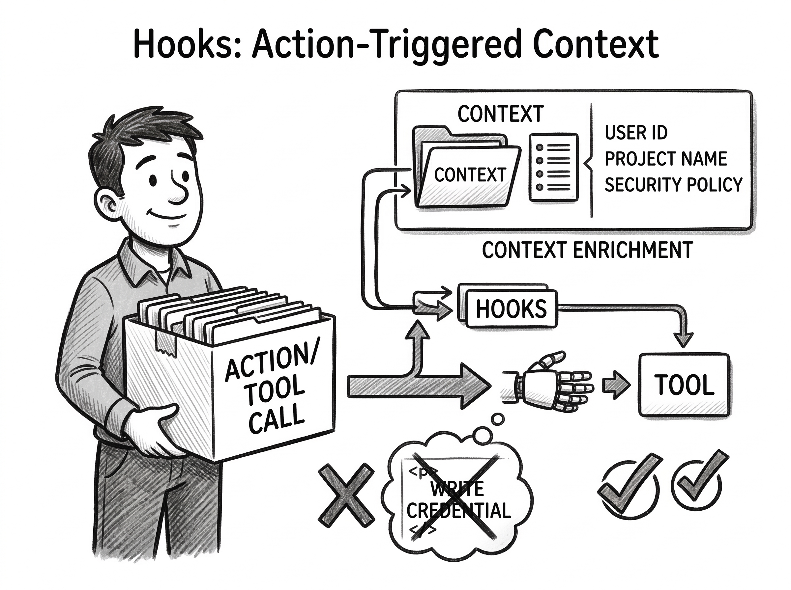

AI agents live and die by their context windows. The system prompt, tool schemas, conversation history, retrieved documents — everything the model sees during a single request shapes what it does next. **Context engineering** is the art of deciding what goes in, where it goes, and when it gets removed.

Good context engineering makes agents more reliable, faster, and cheaper. This post explores the design philosophy behind features like CLAUDE.md, hooks, skills, subagents, and CLI vs MCP — and why KV cache hit rate is critical to agent system performance.

## Effective Context Window


Models now support context windows of 128K to 1M tokens. Yet agents still ignore instructions, pick the wrong tool, and hallucinate — even when the answer is somewhere in the context. Why?

Research shows that model performance is highest when relevant information appears at the **beginning** or **end** of the context, and degrades significantly in the middle. This is the [Lost in the Middle](https://arxiv.org/abs/2307.03172) problem — a U-shaped performance curve driven by:

- **Primacy bias**: instruction fine-tuning data places task instructions at the beginning, training models to weight the start of context more heavily
- **Recency bias**: the language modeling objective (next-token prediction) naturally biases models toward nearby, recent tokens

This isn't a model bug — it reflects both the structure of the training data and how human language naturally works:

- **Pre-training** on natural text already encodes positional bias. Articles lead with conclusions, answers follow directly after questions. Even base models without fine-tuning exhibit these biases.
- **Instruction fine-tuning** teaches models to follow human conversational patterns — and in those patterns, task instructions almost always come at the **beginning** of the prompt. This amplifies primacy bias: models learn to treat the start of context as the most authoritative position.
- **Language itself is recency-biased.** Humans process language by attending heavily to recent words — pronouns refer to nearby nouns, context shifts paragraph by paragraph. The next-token prediction objective captures exactly this: predicting the next word depends most on what just came before. Recency bias isn't a flaw, it's how language works.

The model learns where information *tends* to matter, and attends accordingly. A massive context window on paper, but a much smaller effective window where the model actually pays attention.

## Context Engineering Principles


Without deliberate context engineering, things go wrong quickly:

- **Context bloat**: a single agent turn packs the context with system prompts, 20+ tool schemas, conversation history, tool results, and retrieved documents — most of it **not relevant to the current step**. The signal drowns in noise.
- **Pattern pollution**: models copy patterns from context. Let the model `git commit && git push` once after a change, and it starts auto-committing after **every** change without asking. One sloppy function in the context, and the model reproduces that style everywhere. Both correct and incorrect patterns get amplified — **context isn't just information, it's instruction by example**.
- **Cache thrashing**: non-deterministic tool responses (timestamps, UUIDs, varying result order) break KV cache prefix matching, forcing **expensive recomputation on every turn**.

Context engineering is the discipline of fighting these problems. The principles:

1. **Curate the effective context window.** Only relevant, accurate, concise information should enter it. Load context on-demand rather than always-on. The effective context window is precious, use it wisely.
2. **Maximize KV cache hit rate.** KV cache can be reused across different conversations, directly reducing latency and cost. Keep all agent trajectory unmodified, which maximizes cache hit rate while preserving all information without loss.

## CLAUDE.md / AGENTS.md: Global Context


Every project has context that applies to **every** task: code style, environment setup, project architecture, test conventions, workflow rules. Without a persistent way to provide this, you repeat the same instructions at the start of every conversation, and the agent wastes tokens re-learning your code structure each time.

You start to think: can I write a reusable document and have the agent load it as part of the system prompt? That's exactly what CLAUDE.md and AGENTS.md are. They give users a configurable surface to inject project-level global context into the most privileged position of the prompt — right after the system prompt, where primacy bias gives it the most weight.

For example, here's how [pi-mono](https://github.com/badlogic/pi-mono/blob/9e22d391/packages/coding-agent/src/core/system-prompt.ts#L70-L76) loads `AGENTS.md`:

```typescript
// Append project context files
if (contextFiles.length > 0) {
    prompt += "\n\n# Project Context\n\n";
    prompt += "Project-specific instructions and guidelines:\n\n";
    for (const { path: filePath, content } of contextFiles) {
        prompt += `## ${filePath}\n\n${content}\n\n`;
    }
}
```

Claude Code does the same with `CLAUDE.md`. The pattern is simple: read the file, append it right after the system prompt.

Because CLAUDE.md is loaded at the start of **every conversation**, it permanently occupies the effective context window. [Claude's guidance](https://code.claude.com/docs/en/best-practices#write-an-effective-claude-md) is clear: keep it concise, accurate, short, and human-readable. Only include things that apply broadly.

## Skills: On-Demand Context


As time goes on, your CLAUDE.md grows. It exceeds 4K tokens and keeps growing — it now includes workflows for brainstorming, design, implementation, testing, system debugging. But not all of these workflows are relevant to any specific task. You also start to notice the agent's performance degrading: it gets confused by conflicting rules, gets lost in the noise, or keeps doing something you don't want despite having a rule against it.

The problem is clear: CLAUDE.md is **always-on** context, but most of its content is only **sometimes** relevant.

You start to think: can we keep CLAUDE.md short but store workflow information and domain knowledge somewhere else, loading them only when necessary? To do this, we need to give the agent the power to load relevant context using its own judgment. You come up with the design: include only metadata (name, description of when to use) in the system prompt, and add instructions that allow the agent to load the full content when it decides it's needed. That's exactly what skills are. Here's how [pi-mono](https://github.com/badlogic/pi-mono/blob/9e22d391/packages/coding-agent/src/core/skills.ts#L289-L315) handles it:

```typescript
const lines = [
    "The following skills provide specialized instructions for specific tasks.",
    "Use the read tool to load a skill's file when the task matches its description.",
    "",
    "<available_skills>",
];

for (const skill of visibleSkills) {
    lines.push("  <skill>");
    lines.push(`    <name>${escapeXml(skill.name)}</name>`);
    lines.push(`    <description>${escapeXml(skill.description)}</description>`);
    lines.push(`    <location>${escapeXml(skill.filePath)}</location>`);
    lines.push("  </skill>");
}

lines.push("</available_skills>");
```

The system prompt carries a lightweight index of available skills. When the model encounters a task matching a skill's description, it reads the full skill file on demand. The context trajectory looks like this:

```
[system prompt + CLAUDE.md + skill index]  ← always-on, kept short
[user message]
[assistant: reads skill file]              ← on-demand loading
[skill content]                            ← only loaded when relevant
[assistant: tool calls]
[tool responses]
...
```

The skill content only enters the context when the agent decides it's needed. And because both CLAUDE.md and the loaded skill are kept short and focused, the model pays enough attention to follow the rules strictly — no more getting lost in a bloated 4K-token instruction file.

## Hooks: Action-Triggered Context



Some actions need guardrails no matter what task the agent is working on: pushing to a protected branch, modifying CI pipelines, writing files that contain credentials, deleting database migrations, or running destructive shell commands. Even if CLAUDE.md or a skill explicitly bans these actions, the model can still slip — rules from the beginning of context fade as the conversation grows. 

You come up with the design: add an action-based trigger that injects context right before or after action execution, when recency bias makes it impossible to ignore. That's exactly what hooks are — on-demand context like skills, but triggered by **specific actions** rather than task relevance.

For example, a pre-commit hook injects "ask the user before pushing" at the exact moment the model is about to run `git push`. This places the rule at the **end** of the current context, where recency bias gives it maximum attention. Here's how [pi-mono](https://github.com/badlogic/pi-mono/blob/63ac2df2/packages/coding-agent/src/core/agent-session.ts#L337-L361) implements an after-tool-call hook:

```typescript
this.agent.setAfterToolCall(async ({ toolCall, args, result, isError }) => {
    const hookResult = await runner.emitToolResult({
        toolName: toolCall.name,
        input: args,
        content: result.content,
        isError,
    });
    if (!hookResult || isError) return undefined;
    return { content: hookResult.content, details: hookResult.details };
});
```

Together, `CLAUDE.md`, skills and hooks cover both ends of the U-shaped attention curve:

```
Attention
   ↑
   |█                                          █|
   |█                                          █|
   |█░░░░░░░░░░░░░░░░░░░░░░░░░░░░░░░░░░░░░░░░░░█|
   +--------------------------------------------→ Position
    CLAUDE.md                          Skills, Hooks
    (primacy bias)                     (recency bias)
```

## CLI vs MCP: Tool Schemas as Hidden Context


You start adding tools to the agent. At first it works well — a few tools, clear schemas, the model picks the right one every time. But as the number of tools grows, performance starts to degrade: the model picks the wrong tool, calls tools with incorrect parameters, or ignores the right tool entirely. Sound familiar? It's the same problem as CLAUDE.md — too many unrelated tool schemas packed into the context, causing the model to get lost.

You start to investigate what's happening. Here's what the model actually sees after the chat template is applied (Qwen3 format):

```text
<|im_start|>system
# Tools

You are provided with function signatures within <tools></tools> XML tags:
<tools>
{"type": "function", "function": {"name": "get_weather", "description": "Get current weather",
  "parameters": {"type": "object", "properties": {"location": {"type": "string"}}, "required": ["location"]}}}
{"type": "function", "function": {"name": "create_issue", "description": "Create a GitHub issue",
  "parameters": {"type": "object", "properties": {"owner": {"type": "string"}, "repo": {"type": "string"},
  "title": {"type": "string"}, "body": {"type": "string"}}, "required": ["owner", "repo", "title"]}}}
... 20+ more tool schemas, ALL injected every request
</tools>
<|im_end|>

<|im_start|>user
Check the weather in London
<|im_end|>
```

Every tool's full schema (name, description, parameters) is sent as part of the system prompt in **every request**. And because tools are part of the prefix, any change to the tool list invalidates the KV cache — adding, removing, or reordering a single tool forces recomputation of the entire prefix.

You start to think: is there a way to load tools on demand, like skills? Two approaches come to mind:

1. **Attention masking** — mask unused tool schema tokens in the system prompt so the model ignores them. This works but adds complexity to the system.
2. **CLI over Bash** — only provide a Bash tool, and let the model invoke CLI commands with `--help` to discover what's available, loading only the relevant tool for the current step.

Now you find out the reason why CLI is usually better than MCP for tool-heavy workflows. CLI allows on-demand tool schema loading, just like skills. Consider GitHub: the GitHub MCP server exposes 30+ tool schemas for issues, PRs, repos, branches, releases — all loaded every request. With the `gh` CLI, the model discovers tools recursively: `gh --help` → `gh pr --help` → `gh pr create --help`, each step exposing only a small, accurate, and relevant subset of tools.

Here's an agent discovering an unfamiliar CLI on the fly:

```text
User: Deploy the contract using openclaw-cli

Agent: $ openclaw-cli --help
  Usage: openclaw-cli <command>
  Commands: deploy, verify, inspect, ...

Agent: $ openclaw-cli deploy --help
  Usage: openclaw-cli deploy <contract> [--network <name>] [--gas-limit <n>]

Agent: $ openclaw-cli deploy MyContract.sol --network mainnet
  ✓ Contract deployed at 0x1234...
```

And agents are already very good at CLIs — they can chain Unix commands with pipes, compose tools together, and leverage the entire command-line ecosystem without any of it occupying the context window. MCP still has its place — structured I/O, auto-discovery, and ease of integration make it ideal for small, focused tool sets. But for tool-heavy workflows, CLI is the more context-efficient choice.

## KV Cache and Prefix Caching


Before we dive into compaction and subagents, we need to understand the KV cache — it directly determines the speed and cost of your agent. This is arguably the most undervalued part of context engineering: most discussions focus on what the model sees, but how efficiently that context is **served** matters just as much.

When a model processes tokens, it computes key-value (KV) pairs for each token. These can be **cached and reused** across requests — if the prefix of the prompt is identical.

In a multi-turn conversation:

```
Request 1: [system prompt] [msg1]
Request 2: [system prompt] [msg1] [resp1] [msg2]        ← prefix match, cache hit
Request 3: [system prompt] [msg1] [resp1] [msg2] [resp2] [msg3]  ← prefix match
```

Each request extends the previous one. The system prompt and prior conversation are already cached. Only new tokens need computation. This is prefix caching (also called prompt caching or cross-request KV reuse).

### Thinking Tokens: Not Part of Context

Most models now support thinking mode — generating internal reasoning tokens before responding. However, thinking tokens only appear in the **last assistant message** and are not part of the trajectory. Previous thinking blocks are cleared to save context. Here's how Qwen3's chat template handles this:

```text
<|im_start|>user
What's 23 * 47?<|im_end|>
<|im_start|>assistant
                                ← thinking block from turn 1 is CLEARED
The answer is 1081.<|im_end|>
<|im_start|>user
Now multiply that by 2.<|im_end|>
<|im_start|>assistant
<think>                         ← only the LAST turn gets thinking tokens
The previous answer was 1081, so 1081 * 2 = 2162.
</think>
The answer is 2162.<|im_end|>
```

This is a deliberate context engineering choice. And it doesn't hurt KV cache hit rate — since thinking tokens are stripped from previous turns, the prefix remains stable and cache-friendly. The model's reasoning from turn N doesn't carry forward to turn N+1 unless it's captured in the actual response text. Important conclusions from thinking should surface in the output, not stay hidden in the thinking block.

You don't need to worry that you can't get thinking trajectory from OpenAI/Claude/Gemini models when building agents.

### Tool Responses: The Silent Cache Killer

Within a single conversation, tool responses don't break the cache — each request extends the previous prefix. The problem is **cross-request caching**: when different users or sessions ask similar questions, which is common in company internal workflows where teams run the same tools against the same environment, tool responses are often **non-deterministic** because:

- Timestamps in API responses change every time
- UUIDs differ between calls
- Result ordering varies (e.g., database query results without explicit ORDER BY)

Even if two users ask the same question, the tool results come back slightly different — different timestamps, different UUIDs, different ordering. This causes a prefix miss, invalidating the cache for everything after the tool result.

The fix is to make tool responses deterministic where possible:

- Strip non-deterministic fields (timestamps, UUIDs) from tool results
- Sort results by a stable key (e.g., ID) before returning them
- Remove metadata that changes between calls but doesn't affect the task

## Compaction and SubAgent


Now your agent hits another problem: some tasks just require a lot of context. Exploring a large codebase, researching across dozens of files, deep debugging — these consume massive amounts of the context window. And the context window is not unlimited. Once it's full of exploration results, there's less room for the actual work.

You come up with a design: can we use **multiple context windows** to solve this? Two approaches:

1. **Compaction** (sequential) — summarize the current context and hand it over to a fresh window. The agent continues in a new session with a compressed version of what happened before.
2. **SubAgents** (parallel) — delegate a sub-problem to a separate agent with its own fresh context window. The subagent solves it independently and returns only the result. Think of it as a CLI call: `claude --prompt "investigate how auth works in this codebase"` — a fresh process, fresh context, focused task.

Both approaches share the same fundamental trade-off: **information is lost during handoff**. Compaction summarizes a full conversation into a compressed version. Subagents reduce a full exploration into a summary result. In both cases, context is passed through a lossy bottleneck — the question is who triggers it, when, and how much is lost.

### Reactive Compaction: System-Triggered

Claude Code and most agents use reactive compaction: the **system** detects when context is getting too long and auto-compacts. It generates a summary of the conversation and injects it at the **top** of a fresh context — right where primacy bias gives it maximum weight. The model doesn't decide when to compact or what to keep; the system handles it.

**Trade-off**: one-time KV cache miss when compaction happens (the prefix changes), then the new prefix is stable and cache-friendly again. The model loses details but keeps a coherent summary in the most attended position.

### Proactive Compaction: Model-Triggered

[Tape Systems](https://tape.systems/) takes the opposite approach: the **model itself** decides when to compact by calling `tape.handoff`. The tape is an append-only log of all facts — messages, tool calls, events. Nothing is ever deleted. When the model calls handoff, it creates an **anchor** — a checkpoint with a summary and source references. Future context rebuilds from the anchor, loading only entries after it.

If the model later needs information from before the anchor, it can search back via `tape.search`. One genuine advantage: this makes subagent history searchable — instead of losing a subagent's full exploration when it returns a summary, the tape preserves everything and lets the parent agent retrieve details later. But my concern is that the model may compact too frequently — each compaction resets the prefix, causing KV cache misses.

Proactive compaction also places a higher requirement on the model itself — it must judge *when* to compact, *what* to keep, and *when* to search back. If it doesn't realize information is missing, it won't search.

## A Practical Example of me Building Agent

To tie this together — here's how context engineering played out when I built a data tagging agent for enterprise workflows. Data tagging is highly structured and predictable, which makes it a good fit for agents, but it has high requirements for stability and accuracy. Getting there was not easy.

**V1: Simple prompt + interal search tool.** A basic prompt with a knowledge base search tool. Accuracy: ~60%. The model had the right tools but not enough context to make good decisions.

**V2: Prompt engineering.** Added detailed examples to teach the model tagging patterns. Accuracy: ~70%. Better, but suffered from instability — the long prompt (around 4k tokens) caused the model to occasionally ignore its own rules or hallucinate tags.

**V3: Structured output + guardrails.** Added a `submit_answer` tool to force the model to return answers in a structured format, with guardrails that validate and reject malformed or out-of-schema responses. This didn't improve accuracy directly, but eliminated an entire class of failures — hallucinated formats, missing fields, and unparseable outputs.

**V3.5 Failed attempt** Assumed instability was a model problem. Tried multi-turn RL on open-source models (Search-R1 style) to train a specialized tagging model. Months of effort, still couldn't surpass closed-source models on this task.

**V4: Add web search tool** Noticed internal knowledge base wasn't enough for some categories. Added a web search tool for external context. Accuracy: ~75%. Helped with coverage but didn't fix the instability problem.

**V5: Workflow decomposition.** Split the single long prompt into 3 focused steps, each with its own context. Accuracy: ~85%. Smaller, focused contexts per step — the model followed instructions more reliably.

**V6: Context engineering.** Solved the remaining instability by applying the same patterns we discussed: a `load_pattern` tool (like skills) that loads relevant tagging rules on demand, and keyword-based background hints (like hooks) that inject domain context when specific patterns are detected. Accuracy: ~95-100%. The trade-off: requires continuously adding new background information as new edge cases appear.

The progression mirrors exactly the principles in this post. Context bloat → decompose. Instability → on-demand loading. Missing knowledge → action-triggered context. Each step was a context engineering decision, and each one moved the needle.

## References

Thanks to [@jakevin7](https://x.com/jakevin7) and [@HiTw93](https://x.com/HiTw93) for their posts that inspired parts of this article. 

Thanks to [Bub](https://github.com/bubbuild/bub), [Tape Systems](https://tape.systems/), and [pi-mono](https://github.com/badlogic/pi-mono) for their agent system designs.

- https://x.com/jakevin7/status/2032779857952645477
- https://x.com/HiTw93/status/2032091246588518683
- https://github.com/bubbuild/bub
- https://tape.systems/
- https://github.com/badlogic/pi-mono
