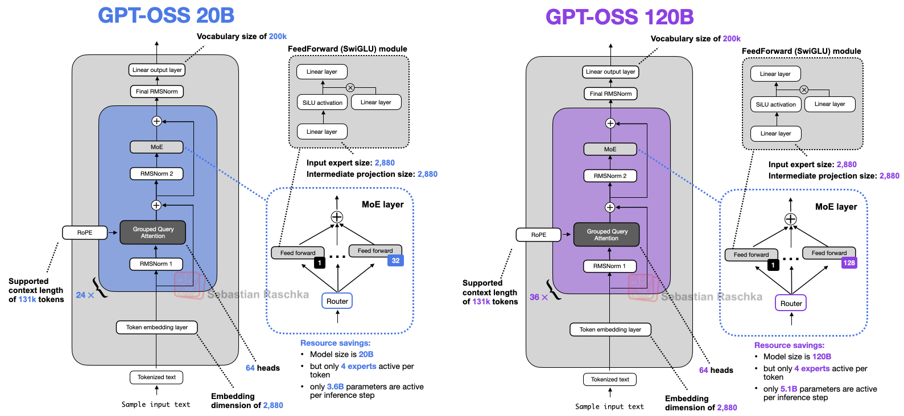
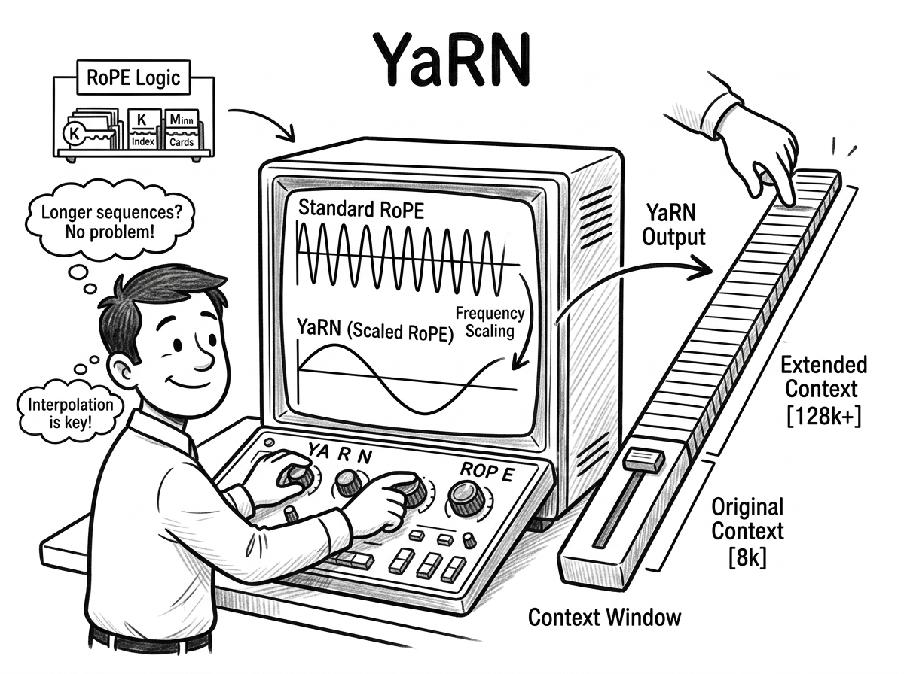
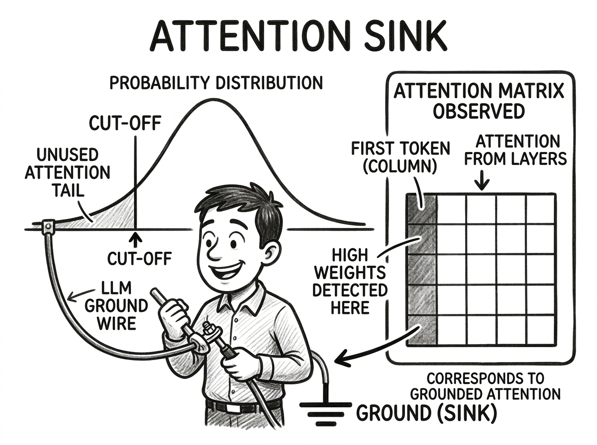

In this post, we implement GPT-OSS-20B inference from scratch in PyTorch. Building GPT-OSS shares a lot of common ground with building the Qwen3 family — if you haven't read my [Qwen3 Inference from Scratch](../qwen3_from_scratch/) and [Qwen3 MoE from Scratch](../qwen3_moe_from_scratch/) posts, I recommend starting there. 

GPT-OSS is also a sparse MoE transformer with RMSNorm + GQA + RoPE + SwiGLU experts — the shared components work the same way. This post focuses on **things GPT-OSS does differently**

Full code: [llm_from_scratch/gpt_oss](https://github.com/gongyisheng/llm-from-scratch/tree/main/gpt_oss)

Target model: [GPT-OSS-20B](https://huggingface.co/openai/gpt-oss-20b)

## Architecture Overview



Like Qwen3 MoE, GPT-OSS is a decoder-only MoE transformer — stacked blocks with GQA attention and sparse expert FFN. But it differs in several design choices:


| Category | | Qwen3-MoE | GPT-OSS |
|---|---|---|---|
| **Attention** | RoPE | Standard | YaRN (4K → 131K context) |
| | QK-Norm | RMSNorm per head | None |
| | Mask | Full causal | Alternating sliding/full |
| | Attn Sink | None | Supported |
| **MoE** | Experts | 128 experts, top-8 | 32 experts, top-4 |
| | Activation | silu(gate) * up | Clamped: gelu(gate) * (up + 1) |
| **Bias** | | All bias=False | True (QKV, output, experts, router) |
| **Tokenizer** | | HuggingFace | tiktoken (o200k_base) |
| **Quantization** | | None | MXFP4 (expert weights only) |

The full forward pass pipeline:

`token_ids → Embedding → 24× [RMSNorm → GQA (YaRN RoPE + attn sinks + sliding window) → RMSNorm → SparseMoE] → RMSNorm → lm_head → logits`

## Config

| Parameter | GPT-OSS-20B | Qwen3-MoE | Notes |
|---|---|---|---|
| vocab_size | 201,088 | 151,936 | tiktoken o200k vocabulary |
| emb_dim | 2,880 | 2,048 | Wider residual stream |
| n_heads | 64 | 32 | 2× more query heads |
| n_kv_groups | 8 | 4 | 2× more KV heads |
| head_dim | 64 | 128 | Smaller heads (but more of them) |
| n_layers | 24 | 48 | Half the depth |
| **n_experts** | **32** | 128 | Fewer, larger experts |
| **n_experts_per_token** | **4** | 8 | Less sparse routing |
| **moe_hidden_dim** | **2,880** | 768 | Much wider experts |
| **context_length** | **131,072** | 40,960 | 3× longer context |
| **sliding_window** | **128** | — | Local attention for even layers |
| **swiglu_limit** | **7.0** | — | Clamp threshold |
| **rope_base** | **150,000** | 1,000,000 | Lower base frequency |
| **yarn_original_context_length** | **4,096** | — | Training context before YaRN extension |
| **yarn_scaling_factor** | **32.0** | — | 4,096 × 32 = 131,072 |
| **yarn_beta_fast** | **32.0** | — | Fast-rotation transition point |
| **yarn_beta_slow** | **1.0** | — | Slow-rotation transition point |
| rms_norm_eps | 1e-5 | 1e-6 | Slightly different epsilon |
| tie_word_embeddings | false | false | Same |

New fields vs Qwen3-MoE:
- **`context_sliding_window`** (128) — local attention window for even-indexed layers
- **`swiglu_limit`** (7.0) — clamp threshold for gate/up projections
- **`yarn_original_context_length`** (4,096) — original training context length before YaRN extension
- **`yarn_scaling_factor`** (32.0) — how much to stretch context (4,096 × 32 = 131,072)
- **`yarn_beta_fast`** (32.0) — controls where high-frequency extrapolation starts
- **`yarn_beta_slow`** (1.0) — controls where low-frequency interpolation starts

```python
@dataclass
class GPTOSSConfig:
    # ... same fields as Qwen3MoEConfig, plus:
    swiglu_limit: float
    context_sliding_window: int
    yarn_original_context_length: int
    yarn_scaling_factor: float
    yarn_beta_slow: float   # 1.0
    yarn_beta_fast: float   # 32.0
```

## YaRN RoPE



Standard RoPE works well within the training context length, but degrades badly beyond it. GPT-OSS needs 131K — a 32× extension from its 4K training length — so it uses [YaRN](https://arxiv.org/abs/2309.00071) (Yet another RoPE extension).

### The problem with naive extension

Recall the concept of [RoPE](../qwen3_from_scratch/#rope): RoPE assigns each dimension pair of attention head a different rotation frequency (`inv_freq[i] = 1 / base^(2i/dim)`). Low indices rotate fast (catch local patterns), high indices rotate slow (catch long-range patterns). 

However, a model trained on 4,096 tokens **breaks** at position 131,072. Low-index dimensions rotate fast and have completed **many full cycles** during training — they've seen all possible angle values, so extrapolating to longer sequences is fine. But high-index dimensions rotate so slowly they **rarely finish a full cycle** — extending beyond training produces angles the model has never seen, breaking its ability to capture long-range patterns.

There are two naive approaches, each with a fatal flaw:

**Extrapolation** — use original frequencies, let positions go beyond the training range. This works for high-frequency dims (they've completed many full rotation cycles during training, so the model has seen all possible angle values). But it breaks for low-frequency dims (they produce novel, out-of-distribution angles).

**Interpolation** — divide all frequencies by scaling factor `s`, compressing positions to fit within the original range. Position 131,072 with `s=32` behaves like position 4,096 — safe everywhere. But it uniformly compresses **all** frequency dimensions, destroying the high-frequency resolution that handles local patterns (word order, syntax). Nearby tokens become harder to distinguish.

### YaRN's solution: frequency-aware blending

YaRN's key insight: **different frequency dimensions need different treatment**. The key question per dimension is: how many full rotations did this frequency complete during training?

```
rotations[i] = original_context_length / (2π * base^(2i/dim))
```

- **Many rotations** (> beta_fast): the model has seen all angle values across a full period many times over. Safe to extrapolate — no scaling needed.
- **Few rotations** (< beta_slow): the model hasn't even seen one full period. Must interpolate to stay in distribution.
- **In between**: blend smoothly from extrapolation to interpolation.

| Dimension Zone | Rotation Count | Strategy | Why |
|---|---|---|---|
| Low indices (high freq) | > 32 (beta_fast) | Extrapolate | Completed 32+ full cycles, seen all angle values |
| Middle indices | 1 – 32 | Blend | Smooth transition |
| High indices (low freq) | < 1 (beta_slow) | Interpolate | Less than one full cycle, novel angles |

### Implementation

Here's the complete YaRN RoPE class — we'll walk through each part below:

```python
class RoPE(nn.Module):
    def __init__(self, head_dim, rope_base, max_seq_len,
                 yarn_original_context_length, yarn_scaling_factor,
                 yarn_beta_fast=32, yarn_beta_slow=1):
        super().__init__()
        self.head_dim = head_dim
        self.rope_base = rope_base
        self.max_seq_len = max_seq_len
        self.yarn_original_context_length = yarn_original_context_length
        self.yarn_scaling_factor = yarn_scaling_factor
        self.yarn_beta_fast = yarn_beta_fast
        self.yarn_beta_slow = yarn_beta_slow
        self._build_buffers()

    def _build_buffers(self):
        dim = self.head_dim
        half_dim = dim // 2

        # --- Step 1: base inverse frequencies ---
        pos_freqs = self.rope_base ** (torch.arange(0, dim, 2).float() / dim)
        inv_freq_extrapolation = 1.0 / pos_freqs
        inv_freq_interpolation = 1.0 / (self.yarn_scaling_factor * pos_freqs)

        # --- Step 2: find correction range in dimension-index space ---
        def find_correction_dim(num_rotations):
            return (dim * math.log(self.yarn_original_context_length / (num_rotations * 2 * math.pi))) / (2 * math.log(self.rope_base))

        low = max(find_correction_dim(self.yarn_beta_fast), 0)
        high = min(find_correction_dim(self.yarn_beta_slow), dim - 1)
        if low == high:
            high += 0.001

        # --- Step 3: build ramp and blend frequencies ---
        ramp = torch.clamp((torch.arange(half_dim).float() - low) / (high - low), 0, 1)
        inv_freq_extrapolation_factor = 1 - ramp
        effective_inv_freq = (
            inv_freq_interpolation * (1 - inv_freq_extrapolation_factor)
            + inv_freq_extrapolation * inv_freq_extrapolation_factor
        )

        # --- Step 4: compute sin/cos with attention scaling ---
        attention_scaling = 0.1 * math.log(self.yarn_scaling_factor) + 1.0
        positions = torch.arange(self.max_seq_len)
        angles = positions[:, None] * effective_inv_freq[None, :]
        angles = torch.cat([angles, angles], dim=-1)
        self.register_buffer("sin", torch.sin(angles) * attention_scaling)
        self.register_buffer("cos", torch.cos(angles) * attention_scaling)

    def forward(self, x, position_ids):
        sin = self.sin[position_ids].to(x.dtype)
        cos = self.cos[position_ids].to(x.dtype)
        sin = sin[:, None, :, :]
        cos = cos[:, None, :, :]
        x1 = x[..., :self.head_dim // 2]
        x2 = x[..., self.head_dim // 2:]
        rotated = torch.concat([-x2, x1], dim=-1)
        return x * cos + rotated * sin
```

### Step 1: Base inverse frequencies

Same as standard RoPE, but we compute two versions — one for extrapolation (original frequencies) and one for interpolation (scaled down by 32×):

```python
pos_freqs = self.rope_base ** (torch.arange(0, dim, 2).float() / dim)
inv_freq_extrapolation = 1.0 / pos_freqs                                # keep original
inv_freq_interpolation = 1.0 / (self.yarn_scaling_factor * pos_freqs)    # compress by 32×
```

### Step 2: Find correction range

`find_correction_dim` converts a rotation count into a dimension index — "which dimension completes exactly N rotations within the original context length?" This is the inverse of the rotation formula:

```python
def find_correction_dim(num_rotations):
    return (dim * math.log(original_ctx / (num_rotations * 2 * math.pi))) / (2 * math.log(rope_base))

low = find_correction_dim(beta_fast)    # dims below this: extrapolate
high = find_correction_dim(beta_slow)   # dims above this: interpolate
```

With GPT-OSS's parameters (`dim=64, base=150000, L=4096`):
- `find_correction_dim(32)` ≈ 8.1 — dims 0–8 extrapolate (25% of half_dim)
- `find_correction_dim(1)` ≈ 17.4 — dims 18–31 interpolate (44% of half_dim)
- dims 8–17 blend (31% of half_dim)

With a small `head_dim` of 64 and a large 32× scaling factor, nearly half the dimensions need full interpolation. Compare this to models with `dim=128` where the blend zone is proportionally wider.

### Step 3: Ramp and blend

A linear ramp from 0 to 1 across the correction range. Low-index dimensions (high frequency, local patterns) keep their original frequencies. High-index dimensions (low frequency, long-range patterns) get interpolated.

```python
ramp = torch.clamp((torch.arange(half_dim).float() - low) / (high - low), 0, 1)
inv_freq_extrapolation_factor = 1 - ramp
effective_inv_freq = (
    inv_freq_interpolation * (1 - inv_freq_extrapolation_factor)
    + inv_freq_extrapolation * inv_freq_extrapolation_factor
)
```

### Step 4: Attention scaling

Interpolation compresses all position indices by factor `s`, so the angle difference between any two positions shrinks from `Δpos × inv_freq` to `Δpos × inv_freq / s`. Smaller angles mean `cos(Δθ)` is closer to 1 for nearby tokens → larger Q·K dot products → larger attention logits → sharper softmax. The model was trained expecting a certain logit spread, so this over-concentration hurts quality. YaRN counteracts this with a small empirical correction applied to the final sin/cos values:

```python
attention_scaling = 0.1 * math.log(self.yarn_scaling_factor) + 1.0
self.register_buffer("sin", torch.sin(angles) * attention_scaling)
self.register_buffer("cos", torch.cos(angles) * attention_scaling)
```

Why this formula?
- **`log(s)`** because the distortion grows sub-linearly with the scaling factor — doubling `s` doesn't double the distortion.
- **`0.1`** keeps the correction gentle — for `s=32`, this gives `0.1 × 3.47 = 0.347`.
- **`+1.0`** so the correction is a no-op when `s=1` (no scaling = no correction needed).

For GPT-OSS with `s=32`: `attention_scaling ≈ 1.347`.

The scaling must be applied to sin/cos **after** computing them, not to the angles before — `sin(c × θ) ≠ c × sin(θ)`. Scaling the angle changes the frequency; scaling the result changes the amplitude

### Comparison with NTK-Aware Interpolation

NTK-aware interpolation achieves a similar non-uniform scaling but through a simpler mechanism — changing the RoPE base:

```
base_new = base × s^(dim/(dim-2))
```

This is derived from two boundary conditions: at `i=0` (highest freq), `1/base^0 = 1` — unchanged regardless of base. At `i=dim/2-1` (lowest freq), match PI exactly. The result is a smooth gradient from "no change" at high frequencies to "full interpolation" at low frequencies.

YaRN improves on NTK-aware interpolation in two ways: (1) explicit dimension zones with sharp boundaries (extrapolate/blend/interpolate) giving finer control than the smooth NTK curve, and (2) the attention scaling correction that NTK-aware interpolation lacks entirely.

## Attention Sinks



In practice, we observe that across attention layers, the **first few tokens consistently receive disproportionately high attention weight** — regardless of their semantic content. This is a fundamental property of the attention mechanism: some query tokens are simply unrelated to all prior tokens, but softmax forces probabilities to sum to 1, so the surplus attention must go *somewhere*. The model learns to **dump it into the initial tokens**, creating artificial "[attention sinks](https://arxiv.org/abs/2309.17453)" that **distort their representations**.

GPT-OSS takes a cleaner approach: instead of relying on real tokens as sinks, each attention head has a **learnable sink parameter** — a dedicated "none of the above" option. The sink is **appended before softmax** so unused attention can route there, then **stripped after softmax** so it doesn't affect the weighted sum over V. No token's representation gets corrupted.

```
Standard attention:
  scores = Q @ K^T / sqrt(d)        shape: (batch, heads, q_len, kv_len)
  attn = softmax(scores)            weights must sum to 1 across kv_len
  output = attn @ V

With sinks:
  scores = Q @ K^T / sqrt(d)
  scores = torch.cat([scores, sink], -1)   shape: (batch, heads, q_len, kv_len + 1)
  attn = softmax(scores)                   weights sum to 1 across kv_len + 1
  attn = attn[:, :, :, :-1]                drop the sink column
  output = attn @ V                        clean weighted sum, no forced attention
```

The sink is a single learnable scalar per head, broadcast across batch and query positions:

```python
self.sinks = nn.Parameter(torch.empty(1, n_heads, 1, 1))

# In forward:
sinks = self.sinks.expand(batch, -1, q_len, -1)          # (batch, heads, q_len, 1)
scores = torch.concat([scores, sinks], dim=-1)            # append sink at the END
scores = scores - scores.max(dim=-1, keepdim=True).values  # explicit max-sub for bf16
attn = F.softmax(scores, dim=-1, dtype=scores.dtype)
attn = attn[:, :, :, :-1]                                 # strip sink before weighting V
```

This effect intensifies in deeper layers and has real consequences: when the first token is removed from the KV cache (e.g., in sliding window attention), the model **catastrophically fails** — it loses fluency and produces garbled output. The sink tokens are load-bearing, even though they carry no useful semantic information. This insight also enables [streaming inference](https://huggingface.co/blog/tomaarsen/attention-sinks): by keeping only the first ~4 sink tokens plus a recent sliding window and discarding everything in between, models can generate coherently with **constant memory** over arbitrarily long sequences.

## Alternating Sliding Window Attention


GPT-OSS alternates between local and global attention across layers:

```
Even layers (0, 2, 4, ...): sliding window attention — attend to nearest 128 tokens only
Odd layers  (1, 3, 5, ...): full causal attention — attend to all previous tokens
```

On a 131K sequence, even layers compute attention over 128 positions instead of 131K — a **~1000× reduction** in the attention score matrix for those layers. Odd layers still maintain full context. The alternation gives the model both local precision and global awareness.

```python
# After computing scores = Q @ K^T / sqrt(d):
if self.layer_idx % 2 == 0 and kv_len > self.sliding_window:
    mask = torch.tril(torch.ones(q_len, kv_len, device=x.device), diagonal=-self.sliding_window).bool()
    scores.masked_fill_(mask, float("-inf"))
```

This creates a band mask: for each query position, only the nearest `sliding_window` key positions are visible. Everything outside the window is set to `-inf` before softmax.

## MXFP4 Quantization


This is the biggest departure from Qwen3. GPT-OSS expert weights on HuggingFace are stored in **MXFP4** — a 4-bit floating point format with shared exponents. Only expert MLP weights are quantized. Attention layers, router, embeddings, and lm_head remain in bf16. This shrinks the expert MLP layer size from ~39GB (bf16) to ~13GB.

### How MXFP4 works

Each block of 32 values shares a single 8-bit exponent (E8M0 format). Each individual value is a 4-bit float (E2M1 format — 1 sign, 2 exponent, 1 mantissa bits):

```
MXFP4 block (stored as bytes):
  16 bytes of packed data: each byte holds two 4-bit values (low nibble + high nibble)
  1 byte scale: E8M0 shared exponent for the block
  Base value range: [-6.0, 6.0] (before scaling by shared exponent)

Compression:
  1. Compute shared exponent from max absolute value in block of 32
  2. Scale values by 2^-(scale - 127)
  3. Quantize each value to nearest FP4 entry → 32 four-bit indices
  4. Pack pairs of indices into bytes (low nibble + high nibble)

Decompression:
  1. Extract nibbles → 32 four-bit indices
  2. Lookup in FP4 table → 32 float values
  3. Multiply by 2^(scale - 127) → final bf16 values
```

The FP4 lookup table has just 16 entries:

```python
FP4_TABLE = [
    0.0, 0.5, 1.0, 1.5, 2.0, 3.0, 4.0, 6.0,       # positive (sign=0)
    -0.0, -0.5, -1.0, -1.5, -2.0, -3.0, -4.0, -6.0, # negative (sign=1)
]
```

The `scale` is an E8M0 value — an 8-bit unsigned integer (0–255) with a **bias of 127** (same convention as IEEE 754). So `scale = 127` means `2^0 = 1.0` (no scaling), letting a single byte cover exponents from `2^(-127)` to `2^(128)`. In practice, neural network weights are small, so scale is typically **less than 127** (negative exponent, scaling values down).

Example: a packed byte `0xA3` with `scale = 120`:
```
low nibble  = 0x3 → FP4_TABLE[3] = 1.5  → 1.5 × 2^(120-127) = 1.5 × 2^(-7) ≈ 0.0117
high nibble = 0xA → FP4_TABLE[10] = -1.0 → -1.0 × 2^(120-127) = -1.0 × 2^(-7) ≈ -0.0078
```

### Decompress Implementation

```python
def decompress_mxfp4(blocks: torch.Tensor, scales: torch.Tensor) -> torch.Tensor:
    # blocks: U8 tensor (..., n_blocks, 16) — two 4-bit values per byte
    # scales: U8 tensor (..., n_blocks) — E8M0 shared exponent per block

    low = blocks & 0x0F                     # extract low nibble
    high = (blocks >> 4) & 0x0F             # extract high nibble
    # Interleave: [low0, high0, low1, high1, ...] → (..., n_blocks, 32)
    nibbles = torch.stack([low, high], dim=-1).reshape(*blocks.shape[:-1], 32)

    lut = FP4_TABLE.to(device=blocks.device, dtype=torch.bfloat16)
    values = lut[nibbles.long()]             # lookup → (..., n_blocks, 32)

    # E8M0 scale: 2^(scale_byte - 127)
    scale_values = torch.pow(2.0, scales.to(torch.float32) - 127.0).to(torch.bfloat16)
    values = values * scale_values.unsqueeze(-1)   # broadcast across 32 values

    return values.reshape(*values.shape[:-2], -1)  # flatten blocks
```

### Clamped SwiGLU

MXFP4's limited dynamic range requires activation clamping to prevent overflow. GPT-OSS uses a modified SwiGLU activation in its experts:

```python
# Qwen3 standard SwiGLU:
output = silu(gate_proj(x)) * up_proj(x)
output = down_proj(output)

# GPT-OSS clamped SwiGLU:
# gate_up is a single fused projection, then deinterleaved
gate = gate_up[..., ::2]                 # even indices
up = gate_up[..., 1::2]                  # odd indices
gate = gate.clamp(max=7.0)               # prevent positive overflow
up = up.clamp(min=-7.0, max=7.0)         # symmetric clamp
glu = gate * torch.sigmoid(1.702 * gate) # ≈ GELU
output = glu * (up + 1)                  # the +1 is the key difference
output = down_proj(output)
```

**Why `up + 1`?** This is for **training efficiency**. Without `+1`, both gate and up start near zero after initialization — multiplying two near-zero values produces "dead zero" gradients that are hard to learn from. The `+1` avoids this by making the linear path an identity by default: `glu * (0 + 1) = glu`. The network only needs to learn small deviations from this baseline.

**Why clamp at 7.0?** The exact value is not explained by OpenAI. The clamping itself prevents activation outliers that would cause overflow with MXFP4's limited 4-bit dynamic range — but why 7.0 specifically (rather than, say, 6.0 or 8.0) is likely determined empirically during training.

**Fused gate/up projection.** Unlike Qwen3's separate `gate_proj` and `up_proj`, GPT-OSS uses a single fused projection that outputs interleaved gate and up values. The even indices are gate, odd indices are up. This is more memory-efficient — one large matmul instead of two.

### Quantization-aware Training

GPT-OSS uses QAT — the RLHF/SFT phase trains with **simulated MXFP4 quantization**, so the model learns to be robust to 4-bit precision *during* training, not as an afterthought.

The likely timeline:

| Phase | MoE weight precision |
|---|---|
| Pretraining | BF16 (likely) |
| Post-training (SFT/RLHF) | MXFP4 |
| Released checkpoint | MXFP4 |

**How does QAT work here?** Standard QAT pattern:

1. Master weights stay in BF16 (full precision)
2. **Forward pass**: quantize weights to MXFP4 on the fly, compute loss — the model "sees" the quantization error and learns around it
3. **Backward pass**: gradients computed and accumulated in BF16/FP32
4. **After training**: discard the master weights, ship only the MXFP4 version

The tricks that make FP4 training feasible: **stochastic rounding** (reduces quantization bias), **block-wise scaling** (the shared 8-bit exponent per 32 elements), and **random Hadamard transforms** (spreads outlier values across the block so no single element dominates the shared scale).

**Why not just quantize after training?** Post-training quantization (PTQ) is fast but at 4-bit the error noticeably degrades quality. The key insight is that **quantization error is not random noise — it's deterministic and structured**. For a given weight and quantization scheme, the rounding error is always the same. Because it's systematic, the model can learn to compensate: QAT does this by adjusting all weights during training.

Note that **QLoRA** relies on the same fact. Besides, only a small percentage of weights have large magnitude and cause significant quantization error, so the error matrix is effectively low-rank. QLoRA freezes the quantized weights and trains low-rank adapters to learn these errors directly.

**Do you need to decompress to BF16 at inference?** Only when **hardware** or **kernels** don't support MXFP4 natively. Optimized Triton kernels decompress block-by-block on-the-fly in registers, and Blackwell tensor cores accept FP4 inputs directly.

### Weight Loading

The weight loader iterates over safetensors shards, collecting MXFP4 block/scale pairs in a cache. When both parts of a pair are loaded, it decompresses to bf16:

```python
# MXFP4 pairs: blocks + scales → decompressed weight
MXFP4_PAIRS = {
    "mlp.experts.gate_up_proj": "moe_ffn.gate_up_proj_weight",
    "mlp.experts.down_proj":    "moe_ffn.down_proj_weight",
}

# During loading:
for hf_key, tensor in shard.items():
    for prefix, model_suffix in MXFP4_PAIRS.items():
        if hf_suffix == f"{prefix}_blocks":
            mxfp4_cache[cache_key]["blocks"] = tensor
        elif hf_suffix == f"{prefix}_scales":
            mxfp4_cache[cache_key]["scales"] = tensor

# After shard: decompress any complete pairs
for model_key, pair in mxfp4_cache.items():
    if "blocks" in pair and "scales" in pair:
        weight = decompress_mxfp4(pair["blocks"], pair["scales"])
        renamed[model_key] = weight
```

Note that GPT-OSS stores expert weights as **3D tensors** `(n_experts, out_dim, in_dim)` — all experts stacked together — unlike Qwen3 which has separate per-expert weight files. This matches the `F.linear(tokens, weight[expert_idx], bias[expert_idx])` indexing in the forward pass.

## Tokenizer

GPT-OSS uses [tiktoken](https://github.com/openai/tiktoken) (OpenAI's BPE tokenizer) instead of HuggingFace tokenizers. The base encoding is `o200k_base` (200K vocabulary), extended with model-specific special tokens loaded from `tokenizer.json`:

```python
import tiktoken

base = tiktoken.get_encoding("o200k_base")
special_tokens = {**base._special_tokens}
for token in tok_json["added_tokens"]:
    special_tokens[token["content"]] = token["id"]

encoding = tiktoken.Encoding(
    name="o200k_harmony",
    pat_str=base._pat_str,
    mergeable_ranks=base._mergeable_ranks,
    special_tokens=special_tokens,
)
```

Key special tokens: `<|startoftext|>` (199998, BOS), `<|endoftext|>` (199999, PAD), `<|return|>` (200002, EOS). Chat formatting uses a Jinja2 template, same approach as Qwen3.

## Lessons Learned

Some non-obvious things I encountered while implementing GPT-OSS:

- **YaRN scaling targets sin/cos, not angles.** `sin(c * θ)` ≠ `c * sin(θ)`. Scaling the angle before sin/cos changes the frequency — scaling the result changes the amplitude. This is a subtle but critical distinction.
- **YaRN ramp space matters.** The interpolation/extrapolation blend must be in dimension-index space, not wavelength space. The `find_correction_dim` function converts rotation counts into dimension indices where the transition should happen.
- **bf16 precision is a minefield.** Five of the ten bugs I fixed were bf16 rounding issues: RoPE buffer dtype, max-subtraction before softmax, sink concatenation order, fused vs separate QKV, and `F.linear` vs `.T.contiguous()`. Each one produced *slightly* different results that only showed up in token-for-token accuracy tests against HuggingFace. Individual operations are IEEE-754 compliant — the differences come from operation *ordering* (left-to-right accumulation, different BLAS tiling). If you're implementing a model from scratch and need exact match, prepare to care deeply about the order of floating-point operations.
- **`.T.contiguous()` is secretly expensive.** Using `weight.T.contiguous()` to match HF's BLAS path forces a full weight copy per expert per layer. With 4 active experts × 2 projections × 24 layers, that's ~4.8 GB of memcpy per decode step. `F.linear` avoids this entirely by using a BLAS transpose flag — zero-copy, ~5× faster. The tradeoff: slightly different bf16 rounding, which we accept.
- **MXFP4 decompression is simple but easy to get wrong.** The nibble interleaving order (low nibble first, then high nibble from the same byte) must match the packing convention. Getting it backwards produces garbage weights that look plausible (no NaN/inf) but generate nonsense.
