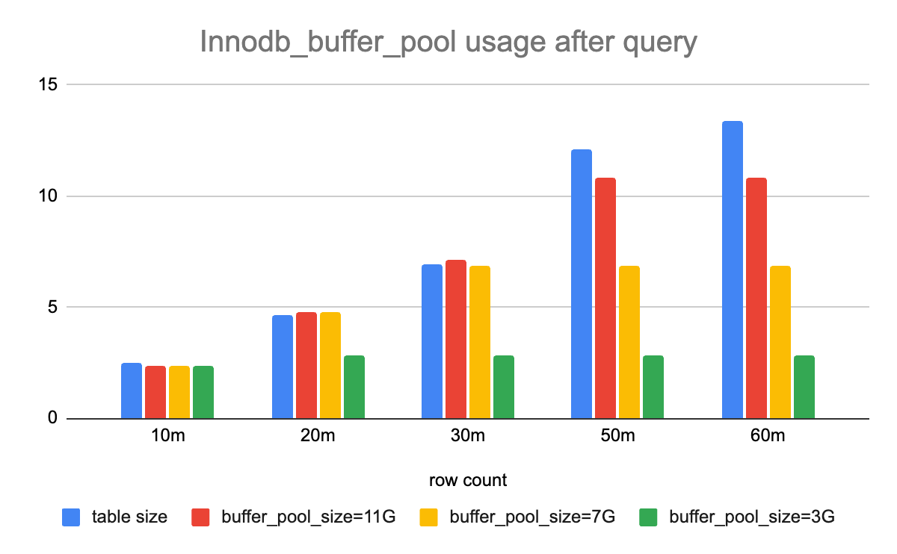
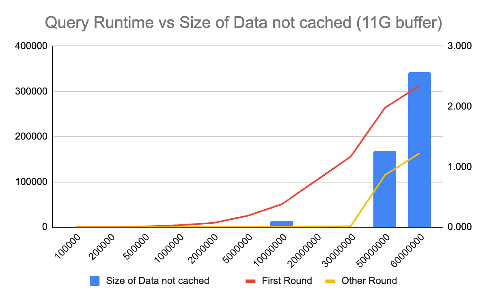
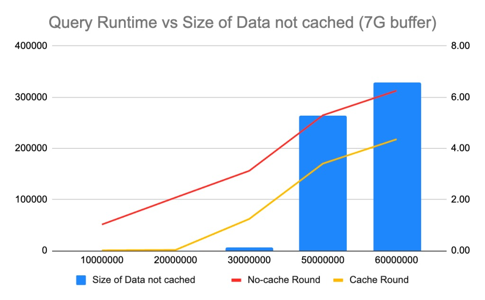
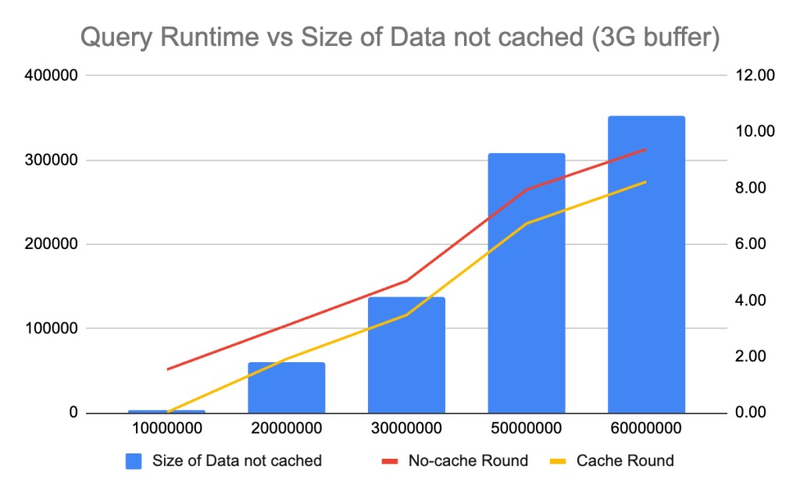
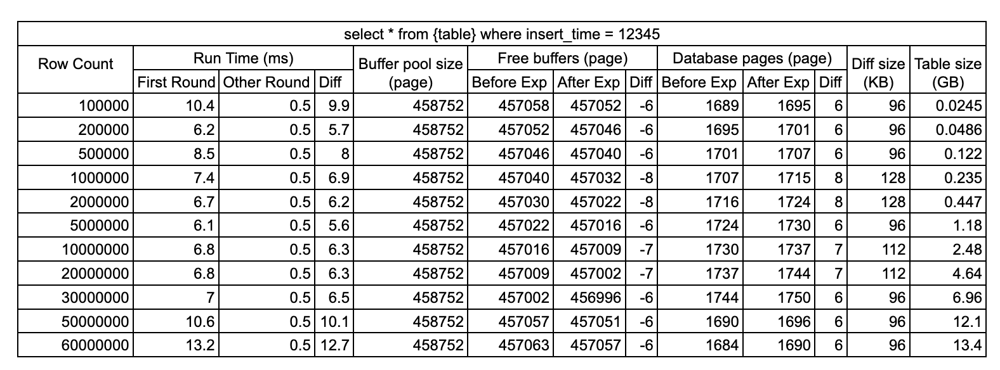
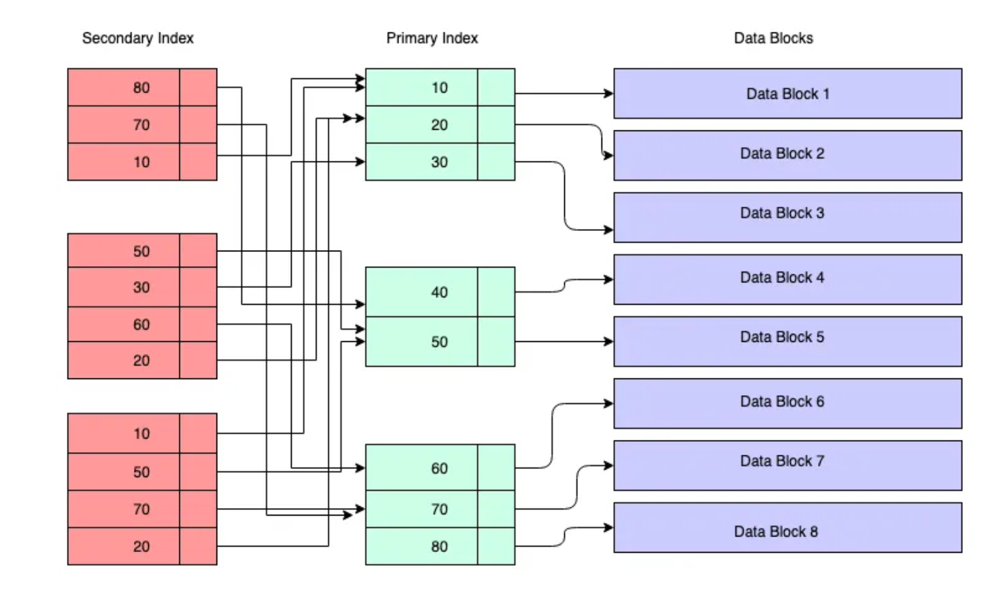

### Rumor

There's rumor around the internet that we should avoid having > 20M rows in a single MySQL table. Otherwise, the table's performance will be downgraded, you will find SQL query much slower than usual when it's above the soft limit. These judgements were made on HDD many years ago. I'm wondering if it's still true for MySQL on SSD in 2023, and if true, why is that?

### Environment

```
— Database  
MySQL version: 8.0.25  
Instance type: AWS db.r5.large (2vCPUs, 16GiB RAM)  
EBS storage type: General Purpose SSD (gp2)  
— Test Client  
Linux kernal version: 6.1  
Instance type: AWS t2.micro (1 vCPU, 1GiB RAM)
```

### Experiment Design

Create tables with same schema but different in size. I created 9 tables with 100k, 200k, 500k, 1m, 2m, 5m, 10m, 20m, 30m, 50m, 60m of rows respectively.

1. Create several tables with same schema:

	```sql
	CREATE TABLE row_test(
		`id` int NOT NULL AUTO_INCREMENT,
		`person_id` int NOT NULL,
		`person_name` VARCHAR(200),
		`insert_time` int,
		`update_time` int,
		PRIMARY KEY (`id`),
		KEY `query_by_update_time` (`update_time`),
		KEY `query_by_insert_time` (`insert_time`)
	);
	```

2. Insert tables with different rows. I use both test client and copying to create these tables. The script can be found [here](https://github.com/gongyisheng/playground/blob/main/mysql/row_test/insert_data.py).

	```sql
	# test client
	INSERT INTO {table} (person_id, person_name, insert_time, update_time) VALUES ({person_id}, {person_name}, {insert_time}, {update_time})

	# copy
	create table  like <table> 
	insert into  (`person_id`, `person_name`, `insert_time`, `update_time`)
	select `person_id`, `person_name`, `insert_time`, `update_time` from <table>
	```

Values for person_id, person_name, insert_time and update_time are randomized.

3. Use test client to execute following sql queries to test performance. The script can be found [here](https://github.com/gongyisheng/playground/blob/main/mysql/row_test/select_test.py).

	```sql
	select count(*) from <table>                             -- full table scan
	select count(*) from <table> where id = 12345            -- query by primary key
	select count(*) from <table> where insert_time = 12345   -- query by index
	select * from <table> where insert_time = 12345          -- query by index, but cause 2-times index tree lookup
	```

4. Look up the innodb buffer pool status

	```sql
	SHOW ENGINE INNODB STATUS
	SHOW STATUS LIKE 'innodb_buffer_pool_page%'
	```

5. Be sure to reboot the database every time you finish testing on a table! Flush innodb buffer pool to avoid reading old cache and get wrong results!

### Result

**Query 1** `select count(*) from <table>`


This query will cause full table scan, which is MySQL poor at.

**No-cache round:** (First round) The query is executed at the first time when no data cached in buffer pool.  
**Cache round:** (Other round) The query is executed when there's already data cached in buffer pool, usually after first execution.

Several observations:

1. The query runtime of first execution is longer than the following ones

	

	The reason is that MySQL uses innodb_buffer_pool to cache data pages. Before first execution, buffer pool is empty and it has to do heavy disk I/O to load the table from .idb file. But after first execution, the data is stored in buffer pool and following execution can get the result by in-memory calculation and avoid disk I/O, which is much faster. The process is called **MySQL buffer pool warm up**.

2. `select count(*) from <table>` will try to load the whole table to buffer pool

	

	I compared the innodb_buffer_pool statistics before / after experiment. After running the query, buffer pool usage change is equal to table size if the buffer pool is big enough. Otherwise only part of the table will be cached in the buffer pool. The reason is that the query select count(*) from table will do full table scan and count the number one row after another. This requires to load full table to memory if it's not cached. Why? Because Innodb supports transaction and it can't guarantee transactions will see the same table at different time. Full table scan is the only safe way to get the accurate row count.

3. If buffer pool cannot hold the full table, there'll be a burst in query latency

	
	
	

	I notice that the innodb_buffer_pool size can greatly impact the query performance, thus I try to run the query under different configurations. When use 11G buffer, the burst in query latency happens when table size reachs 50M. Then cut buffer size into 7G, the burst in query latency happens when table size is 30M. Finally cut buffer size to 3G, the burst in query runtime happens when table size is 20M. It's clear that if there's table data cannot be cached in buffer pool, `select count(*) from <table>` has to do expensive disk I/O to load that, which results in a burst in query runtime.

4. No-cache round has a linear relationship between query runtime and table size, regardless of buffer pool size.

	

	No-cache round runtime is decided by disk I/O, which is regardless of buffer pool size. There's no difference to use `select count(*)` to warm up buffer pool with the storage disk with same IOPS.

5. Difference of query runtime between no-cache round and cache-round is constant if table cannot be fully cached.

	Also notice that although there'll be a burst in query runtime if the table cannot be fully cached in buffer, the runtime is predictable. The difference between no-cache round runtime and cache round runtime is constant, regardless of table size. The reason is that the table is partly cached in the buffer and the difference is the time which saved by querying from buffer instead of disk.

**Query 2&3** `select count(*) from <table> where <index_column> = 12345`


This query uses the index. Since it is not a range query, it only needs to look up pages in the path of B+ tree from top to bottom, and cache these pages in the innodb buffer pool.

The B+ trees of the table I created are all 3 in depth and causes 3-4 times of I/O to warm up the buffer, which costs 4-6ms on average. After that, if I run the same query again and it'll look up the result from the memory directly, which is 0.5ms, equal to network RTT. If the cached page is not hit for a long time and evicted from buffer pool, it has to load that from disk again, which requires at most 4 times of disk I/O.

**Query 4** `select * from <table> where <index_column> = 12345`



This query causes 2 times index lookup. Since `select *` requires the query to fetch `person_name`, `person_id`, which are not contained in the index, during the query execution the database engine has to look up 2 B+ trees. Firstly it looks up the `insert_time` B+ tree to get the target row's primary key, then it looks up the primary key B+ tree to fetch the full data of the row, which is explained by the graph below:



It's the reason why we should avoid `select *` in production. And in the exeperiments the data confirms that this query load 2 times more page blocks than query 2 or 3, which is 8 at most. The average query runtime will be 6-10ms, which is also 1.5 to 2 times larger than query 2 or 3.

### How does the rumor come


First we need to know the physical structure of innodb index pages. The default page size is 16k, which consists of headers, system records, user records, page director and trailer. There'll only be 15-14k left to store the free data.

Let's say you uses INT as primary key (4 byte), and 1KB of payload in each row. Each leaf page can store 15 rows and it'll be 4+8=12 byte to make it a pointer to that page. Thus, each non-leaf page can hold at most 15k / 12 byte = 1280 pointers. If you have a 4-layer B+ tree, that can hold at most 1280*1280*15 = 24.6M rows of data.

Back to the time when HDD dominates the market and SSD is too expensive for databases, 4 times of random I/O can be the worst case we can tolerate and queries with 2 times index tree lookup even make it worse. Engineers at that time want to control the depth of index tree and don't want them to grow too deep. Since now SSD gains popularity and random I/O is less expensive than before, we can review the rules set 10 years ago.

By the way 5 layers of B+ tree can hold 1280*1280*1280*15 = 31.4B rows of data, which exceeds maximum number of INT can hold. Different assumptions on size of each row will result in different soft limit, smaller or bigger than 20M. eg, in my experiment, each row is about 816 bytes (I use `utf8mb4` charset so each character takes 4 bytes) and the soft limit of which 4-layers B+ tree can hold is 29.5M.

## Conclusion

1. `innodb_buffer_pool` size / table size decides whether there'll be a performance downgrade.
2. A more meaningful metric to tell whether you need to split a MySQL table is query runtime / buffer pool hit rate. If the queries always hit the buffer, there'll not be any performance issue. 20M rows is just a value based on experience.
3. Except for spliting table, increase innodb_buffer_pool size / database memory is also a choice.
4. If possible, avoid `select *` in production, which causes 2 times index tree lookup in the worst case.
5. (My personal opinion) 20M rows is not a quite valid soft limit of MySQL table, considering SSD gains popularity now.

## Followup

Not sure how it get on Hacker News but I'm super excited to see a lot of people shared their experience working with giant MySQL tables in production, and it looks good! [See the comments here](https://news.ycombinator.com/item?id=36038321).

## Reference

- [The physical structure of InnoDB index pages](https://blog.jcole.us/2013/01/07/the-physical-structure-of-innodb-index-pages/)
- [B+ Tree and Buffer Pool](https://lvwenhan.com/tech-epic/506.html)
- [An in-depth look at Database Indexing](https://medium.com/free-code-camp/database-indexing-at-a-glance-bb50809d48bd)

## Appendix

Original data can be found [here](https://docs.google.com/spreadsheets/d/10U6J-qT7mUpJ9rCNgM-bKXSBwwZ9QEj66mMp3I9S1wE/edit?usp=sharing)