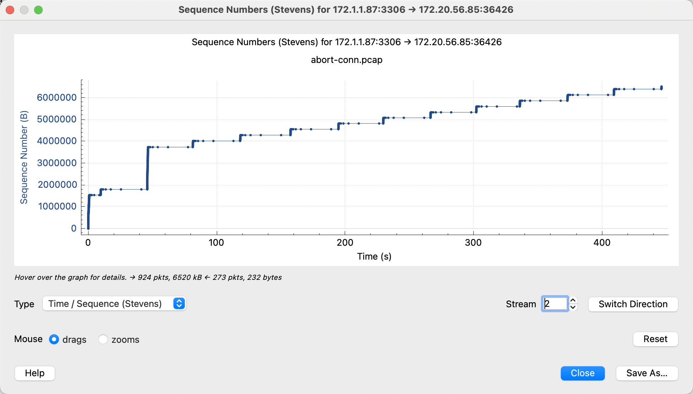
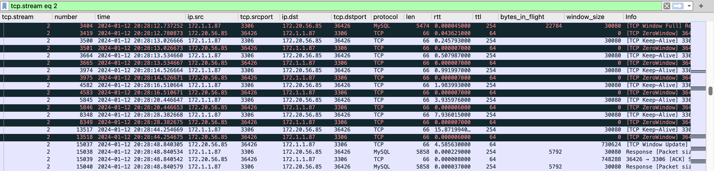
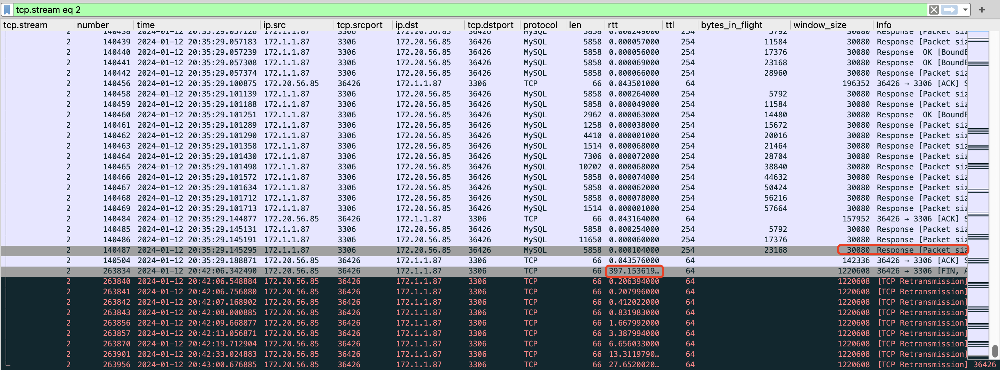
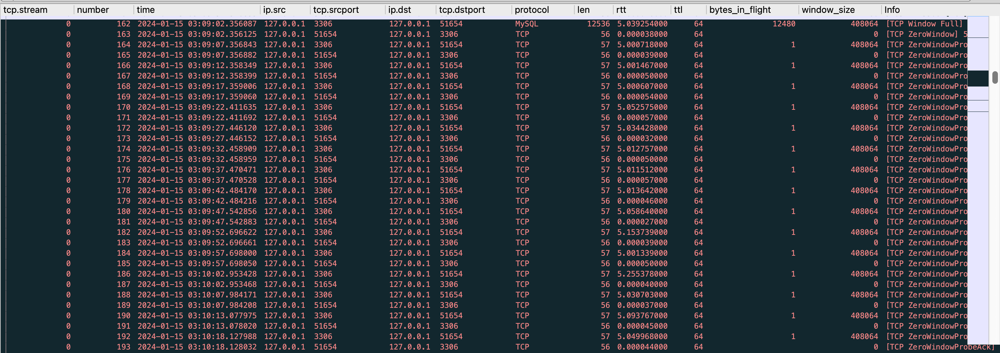
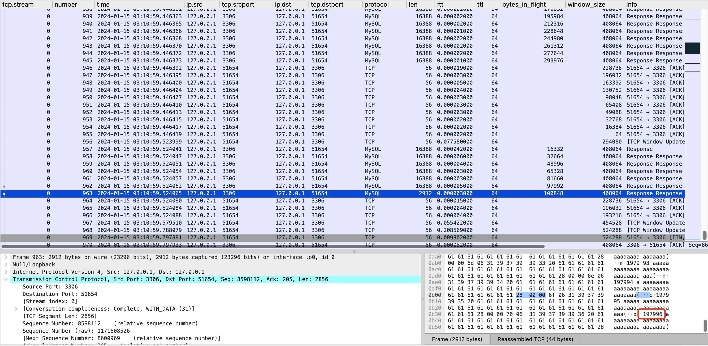
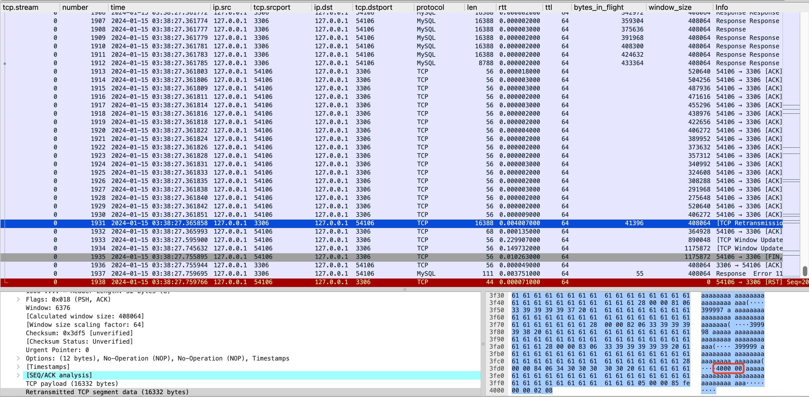

### Background
When I tried to run a big range query on mysql using `aiomysql`‘s `SSDictCursor`, everything looks fine at first but after a period of time (15min to 20min), the query stopped with error.
The error message is: 
```
Error Code 2013: Lost connection to MySQL server during query.
```
Environment
```
Database
MySQL version: 8.0.29
connect_timeout=10
net_read_timeout=30
net_write_timeout=60

Test Client
Linux kernal version: 6.1
Instance type: AWS t2.micro (1 vCPU, 1GiB RAM)
Python: 3.8.10
aiomysql: 0.1.1
PyMySQL: 1.1.0
```

### Observation

What the code is doing is like
1. execute a big range query which fetches a lot of data
2. using SSDictCursor to fetch rows, 8 in a batch
3. every row was processed by other functions, may take some time to process

Note that SSDictCursor is an unbuffered cursor and it only fetch rows as needed. It’s mainly useful for queries that return a lot of data, or for connections to remote servers over a slow network. See doc [here](https://aiomysql.readthedocs.io/en/latest/cursors.html#SSCursor).

```
conn = await aiomysql.connect(*args, **kwargs)
async with conn.cursor(aiomysql.SSDictCursor) as cursor:
    # execute sql (big range query)
    await cursor.execute(sql)
    rows = await cursor.fetchmany(size=8)
    while rows:
        for row in rows:
            <do something>
        rows = await cursor.fetchmany(size=8)
```

And here's detailed error traceback:
```
Traceback (most recent call last):
  File "/usr/local/lib/python3.8/dist-packages/aiomysql/connection.py", line 646, in _read_bytes
    data = await self._reader.readexactly(num_bytes)
  File "/usr/lib/python3.8/asyncio/streams.py", line 721, in readexactly
    raise exceptions.IncompleteReadError(incomplete, n)
asyncio.exceptions.IncompleteReadError: 23 bytes read on a total of 49 expected bytes

The above exception was the direct cause of the following exception:

Traceback (most recent call last):
  File "/opt/edison/utils/mysql_dal/libraries/dao.py", line 312, in fetch_iter
    rows = await cursor.fetchmany(size=8)
  File "/usr/local/lib/python3.8/dist-packages/aiomysql/cursors.py", line 664, in fetchmany
    row = await self._read_next()
  File "/usr/local/lib/python3.8/dist-packages/aiomysql/cursors.py", line 622, in _read_next
    row = await self._result._read_rowdata_packet_unbuffered()
  File "/usr/local/lib/python3.8/dist-packages/aiomysql/connection.py", line 1228, in _read_rowdata_packet_unbuffered
    packet = await self.connection._read_packet()
  File "/usr/local/lib/python3.8/dist-packages/aiomysql/connection.py", line 624, in _read_packet
    recv_data = await self._read_bytes(bytes_to_read)
  File "/usr/local/lib/python3.8/dist-packages/aiomysql/connection.py", line 650, in _read_bytes
    raise OperationalError(CR.CR_SERVER_LOST, msg) from e
pymysql.err.OperationalError: (2013, 'Lost connection to MySQL server during query')

During handling of the above exception, another exception occurred:

Traceback (most recent call last):
  File "/opt/edison/utils/mysql_dal/models/base.py", line 307, in fetch_table
    async for row in self._dao.fetch_iter(sql, build_connect=build_connect):
  File "/opt/edison/utils/mysql_dal/libraries/dao.py", line 312, in fetch_iter
    rows = await cursor.fetchmany(size=8)
  File "/usr/local/lib/python3.8/dist-packages/aiomysql/utils.py", line 78, in __aexit__
    await self._obj.close()
  File "/usr/local/lib/python3.8/dist-packages/aiomysql/cursors.py", line 605, in close
    await self._result._finish_unbuffered_query()
  File "/usr/local/lib/python3.8/dist-packages/aiomysql/connection.py", line 1247, in _finish_unbuffered_query
    packet = await self.connection._read_packet()
  File "/usr/local/lib/python3.8/dist-packages/aiomysql/connection.py", line 598, in _read_packet
    packet_header = await self._read_bytes(4)
  File "/usr/local/lib/python3.8/dist-packages/aiomysql/connection.py", line 646, in _read_bytes
    data = await self._reader.readexactly(num_bytes)
AttributeError: 'NoneType' object has no attribute 'readexactly'
```

When I saw this error, first thing comes to my head is: “OMG, must be another issue that must do packet capture.” That becomes my conditioned reflex when I try to solve a network issue, such as close connection, timeout, too many TIME_WAIT / CLOSE_WAIT, speed limit, etc. Yes, packet capture really helps to debug these network issues and provides evidence with high confidence (unlike the application log), that’s why I like doing packet capture so much. Everything is crystal clear under network packets and you can easily see the problem.

Okay, after running tcpdump on client side and waiting for 15 mins patiently I finally saw this error was reproduced on staging environment. Firstly let’s see the time – sequence graph



Obviously this is not the same behavior as what is said in the [doc](https://aiomysql.readthedocs.io/en/latest/cursors.html#SSCursor) (only fetch rows as needed). I saw in the first several seconds it fetched around 15 thousand rows and then started having TCP ZeroWindow problem, which indicates that the client side TCP buffer is full, can’t receive any more network packets. It’s why we have the pause of tcp steam in the middle.



And FIN packet was sent from mysql server to client in a sudden. After around 6 min the client realized that connection was closed. The connection was closed way before I saw error log.



From [mysql doc](https://dev.mysql.com/doc/refman/8.0/en/error-lost-connection.html) I learned that the issue may be caused by:
1. timeout issue, `connect_timeout` / `net_read_timeout` / `net_write_timeout`
2. max_allowed_packet if reading BLOB data

Since this is a big select query without BLOB data in it, my suspect is that `net_write_timeout` cause the problem. `net_write_timeout` is the number of seconds to wait for a block to be written to a connection before mysql server aborting the write. Default value is 60s, which is close to the pause interval (around 40s) I saw. ref to [doc](https://dev.mysql.com/doc/refman/8.0/en/server-system-variables.html#sysvar_net_write_timeout).

Next, I try to reproduce the issue on my local environment, my mac and mysql container. I set up a test table for testing and write a test script to do exactly the same fetching. To make the issue easier to reproduce, I make the fetch process wait in the middle for a configurable time and then fetching all the rest of data to see if `net_write_timeout` is the root cause. Test scripts and results can be found [here](https://github.com/gongyisheng/playground/tree/main/mysql/abort_connection_test).

When net_write_timeout is 60s, the issue can be reproduced successfully. See the original pcap file [here](https://github.com/gongyisheng/playground/blob/main/mysql/abort_connection_test/result/abort-conn-error.pcap).



And FIN was sent before query finished. The last row has id = 197,996 and error occurred.



Then set net_write_timeout to 150s, the error was gone. See the original pcap file [here](https://github.com/gongyisheng/playground/blob/main/mysql/abort_connection_test/result/abort-conn-fixed.pcap). The last row has id = 400,000 and no error observed.

```
SET SESSION net_write_timeout=150;
```



Okay, confirmed that changing `net_write_timeout` to a bigger number can solve the problem. But how about the memory usage in mysql server side? There must be some buffer allocated to such query. After looking up the doc I found that network buffer size grows up to `max_allowed_packet` and do not shrink until the connection is terminated. The defaule value is 64MiB. So one connection running big range query with SSDictCursor uses up to 64MiB memory. There should be not a lot of range queries running at the same time.

### Root Cause
`SSDictCursor` cannot control MySQL’s behavior to fetch rows as wanted. MySQL tries to send all the data to client until get blocked because of client side tcp read buffer full. Small `net_write_timeout` caused MySQL to abort connection during query before we see the error from log.

### Learned
1. Be careful to use SSDictCursor to run big range queries. Its behavior is affected by net_write_timeout. Its resource usage is affected by max_allowed_packet. I see there has already been some memory issues around it: [Why does the SSDictCursor use up to 2,5 GB of RAM when I try to fetch 1,5 million rows, while the SSCursor uses just 650 MB of RAM?](https://stackoverflow.com/questions/52220794/why-does-the-ssdictcursor-use-up-to-2-5-gb-of-ram-when-i-try-to-fetch-1-5-millio)
2. Ideally, you should avoid running these big range queries on database. Try analytical engines like Spark.

### Reference
- [stackoverflow discussion](https://stackoverflow.com/questions/10563619/error-code-2013-lost-connection-to-mysql-server-during-query)
- [How to fix Error Code 2013 Lost connection to MySQL server](https://anothercoffee.net/fix-error-code-2013-lost-connection-mysql-server-query/)