## send/receive buffer

### Goal

Get a better understanding of how send/receive buffer size may affect the network rtt and throughput. Usually send/receive buffer size is managed by kernal and application should not hardcode these values. However, real world cases are more rare and complicated. Inapporiate buffer size may be the root case of some network issues. Rare but possible. 

### Method

1. Instance

    Instance provider: AWS  
    Instance type: t2.micro, 1vCPU, 1GiB memory, Low to Moderate network  
    Region: us-east-1b  
    OS: Amazon Linux 2023 AMI  
    Python: 3.9  

2. EC2 settings

    Launch 2 EC2 instance on AWS in the same region, one as server, one as client.  
    Edit security group of server, add inbound rule: Custom TCP Rule, Port Range: 8000  

3. Server/Client commands

    Start server: `python -m http.server 8000`  
    Start client: `curl <server_ip>:8000/<file_path> --output ~/<file_name>`

4. Packet capture commands  

    Server side: `tcpdump -s 120 -w server.pcap`  
    Client side: `tcpdump -s 120 -w client.pcap`  
    ping a random website before/after downloading test file: `ping google.com -c 1`  
    If download time > 1 min, stop it.  

5. Download pcap result file

    Server side: `scp -i ~/.ssh/****.pem ec2-user@*.*.*.*:~/client.pcap ~/Downloads`  
    Client side: `scp -i ~/.ssh/****.pem ec2-user@*.*.*.*:~/server.pcap ~/Downloads`

6. Experiment settings

    Client requests to download a 2 GiB file under following circumstances:
    ```
    No limit (Benchmark)
    Send buffer size = 4096 (Exp-wmem-4096)
    Send buffer size = 4096, rtt = 100 ms (Exp-wmem-4096-rtt-100)
    Send buffer size = 4096, packet loss rate 1% (Exp-wmem-4096-loss-1)
    Send buffer size = 4096, packet duplicate rate 1% (Exp-wmem-4096-dup-1)
    Send buffer size = 4096, packet corrupt rate 1% (Exp-wmem-4096-crpt-1)
    Send buffer size = 4096, reorder rate 1%, gap 100ms, correlation 10% (Exp-wmem-4096-reorder-1)
    Send buffer size = 4096, bandwidth limit 1mbps (Exp-wmem-4096-bdw-1)
    Server cpu = 100% (Exp-server-cpu-100)
    Receive buffer size = 4096 (Exp-rmem-4096)
    Receive buffer size = 4096, rtt = 100 ms (Exp-rmem-4096-rtt-100)
    Receive buffer size = 4096, packet loss rate 1% (Exp-rmem-4096-loss-1)
    Receive buffer size = 4096, packet duplicate rate 1% (Exp-rmem-4096-dup-1)
    Receive buffer size = 4096, packet corrupt rate 1% (Exp-rmem-4096-crpt-1)
    Receive buffer size = 4096, reorder rate 1%, gap 100ms, correlation 10% (Exp-rmem-4096-reorder-1)
    Receive buffer size = 4096, bandwidth limit 1mbps (Exp-rmem-4096-bdw-1)
    Client cpu = 100% (Exp-client-cpu-100)
    ```

    commands:  

    ```
    # see current buffer size settings:
    sysctl -a|egrep "rmem|wmem"

    # origin settings:
    sysctl -w net.ipv4.tcp_rmem="4096 131072 6291456"
    sysctl -w net.ipv4.tcp_wmem="4096 20480 4194304"

    # hardcode receive buffer size to 4096 bytes (client)
    sysctl -w net.ipv4.tcp_rmem="4096 4096 4096"
    # hardcode send buffer size to 4096 bytes (server)
    sysctl -w net.ipv4.tcp_wmem="4096 4096 4096"

    # run cpu = 100% experiments:  
    taskset -c 0 python inf_loop.py  
    ## server  
    taskset -c 0 python -m http.server 8000  
    ## client  
    taskset -c 0 curl :8000/ --output ~/

    ## if necessary
    sudo nice -n 19/-20 (update process priority)
    ```

    Traffic control commands please refer to [experiment 1](https://blog.yellowday.day/packet_capture_experiment_1/). Inf_loop script is [here](https://github.com/gongyisheng/playground/blob/main/network/experiment/inf_loop.py).

### Result and Analysis

To simplify, here I’ll only focus on client side packet capture result. For those who are interested in packet capture result on both sides, please refer to the [github repo](https://github.com/gongyisheng/playground/tree/main/network/experiment) for details.

**Result**


Note: rtt and throughput is estimated from graph. dup ack, retransmission, out-of-order, zero window, window full is from wireshark expert info.

1. Relation between BDP and buffer size  

    BDP: Bandwidth Delay Product, measured by bandwidth*ttl. It’s the maximum size of packets in flight for a network.

    Next, let’s talk about the buffer size. Considering that Linux assumes that half of the send/receive TCP buffers are used for internal structures. Thus, only half of the buffer size is used to store segments, buffer size should be at least 2 BDP to leave enough space for bytes in flight. But that may still be not enoght. 

    

    If there’s packet lost, it has to take 2 rtt to transmit the packet in total. Thus, to fully utilize the available bandwidth, the TCP send and receive buffers must be large enough to prevent such situation (eg, 4 BDP, 8 BDP)

    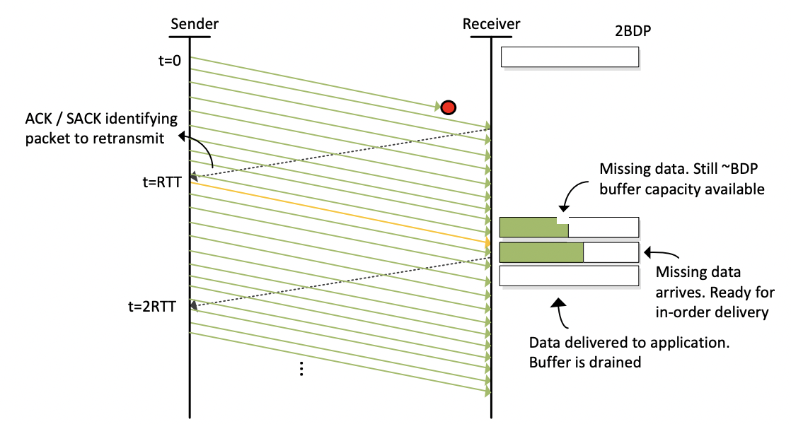

2. Window size

    The receiver must constantly communicate with the sender to indicate how much free buffer space is available in the TCP receive buffer. This information is carried in a TCP header field called window size.  

    Window size = window * 2 ^ scaling factor accoring to RFC 1323.

    

    When the TCP buffer is full, a window size of zero is advertised to inform the other end that it cannot receive any more data. When a client sends a TCP window of zero, the server will pause its data transmission, and waits for the client to recover. Once the client is recovered, it digests data, and inform the server to resume the transmission again by setting again the TCP window.  

    

3. Round Trip Time  

    
    
    
    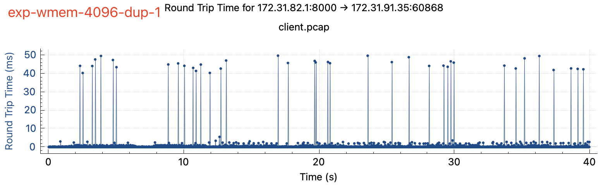
    
    
    
    
    
    
    
    
    
    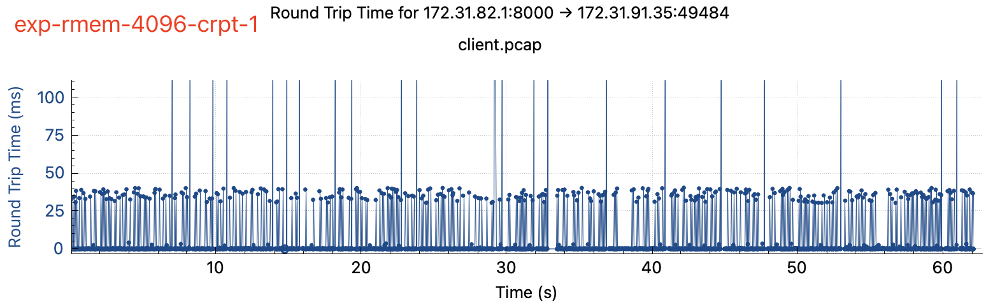
    
    
    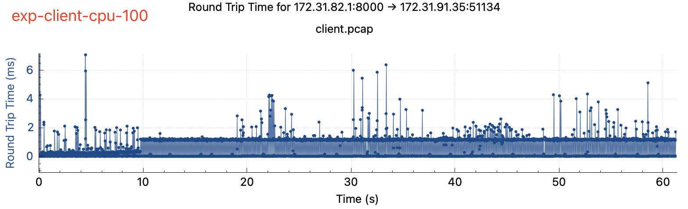

    Conclusion:

    - After limiting send buffer size or receive buffer size, rtt becomes quite sensitive to packet loss and corruption, both of which result in a big jump in rtt.
    - Reorder and duplicate may not affect rtt a lot: due to a small buffer size, the reorder packets are immediately maked as lost and retransmission packet will be sent. Deplicated packets will be thrown away quickly.
    - Bandwidth limit only afftect rtt when send buffer size is small, causing send buffer full, which makes me recall the post I wrote before: [Redis OOM due to big keys](https://blog.yellowday.day/redis_oom_due_to_big_keys/)
    - Client/Server high cpu affects rtt in a different pattern. RTT is good at the beginning but soon increases a lot after the driver queue becomes full of data and cpu is too busy to write them in / read them out.

4. Throughput

    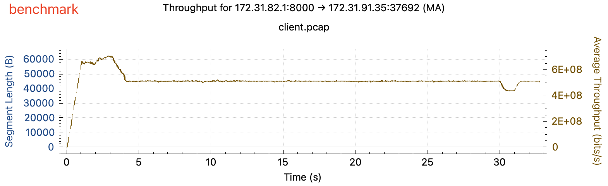
    
    
    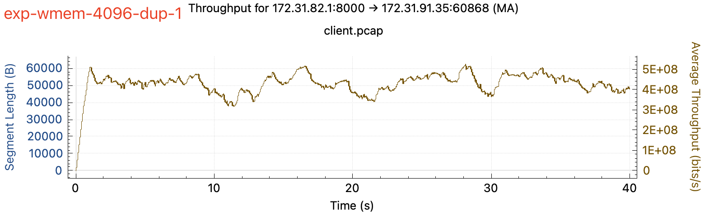
    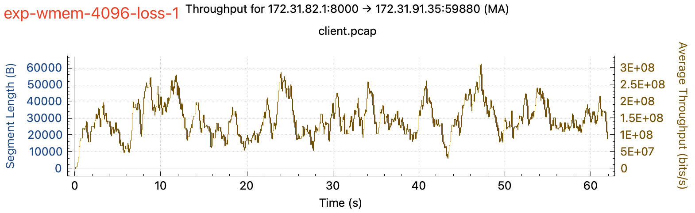
    
    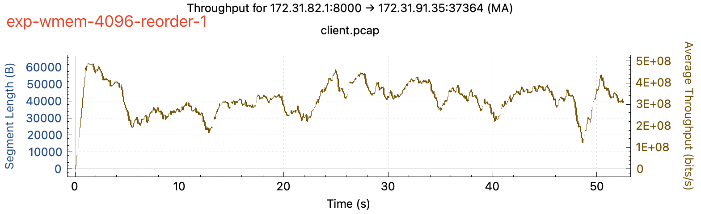
    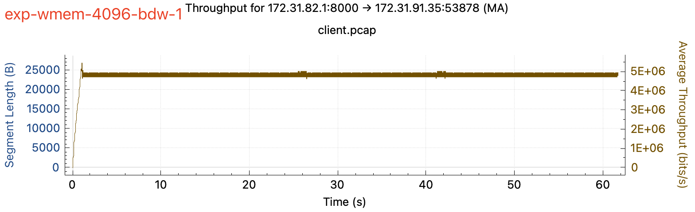
    
    
    
    
    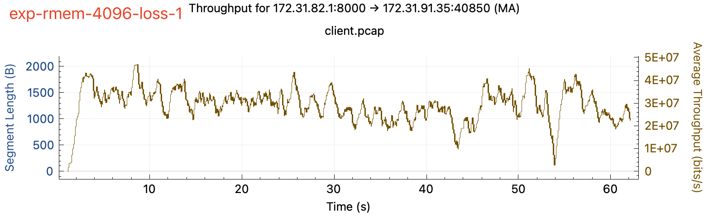
    
    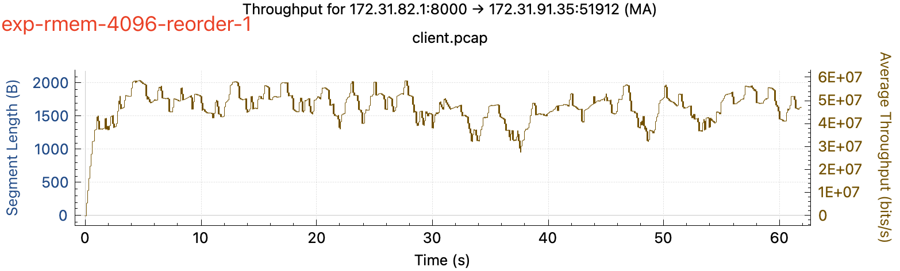
    
    

    **Conclusion-Limit send buffer**  

    - To my surprise, limiting send buffer does not take effect and the throughput is still high as 50mbps, I’m still trying the figure out the reason. There’s some unconfirmed speculations around config overwrite and wmem_queued. I’ll get back this question in another post.
    - Increase packet delay (rtt) can almost kill the throughput, maybe it hits the buffer limit somehow?
    - Packet loss and corrupt can reduce the throughput by 60%, it’s much larger than what we see when there’s no limit on send buffer. It looks also hit the buffer limit and ack delay cause the throughput drop, but need more evidence.
    - Same as when there’s no buffer limit, duplicated packet does not have impact on throughput.
    - Bandwidth limit also almost kill the throughput. But there’s an interesting finding: I limit bandwidth to 1 mbps but the actual bandwidth is only 625 kbps. It’s also something needs further investigation.

    **Conclusion-Limit receive buffer**  

    - Limit receive buffer can greatly affect the throughput. The buffer size is too small, it cannot fill BDP any more. Can’t help but wait a round trip’s time to notify the server to update window and send next packets.
    - Increase packet delay (rtt) almost reduce throughput to zero. A very high percentage of window full is reported.
    - Packet loss and corrupt cuts throughput by 30%, which is expected. Retransmission packets takes 2 rtt and it’ll reduce the overall throughput.
    - Packet duplicate does not reduce throughput. The duplicated packets are dropped.
    - Bandwidth limit continue to take effect on throughput when there’s receive buffer limit.

    **Conclusion-Server/Client high CPU usage**

    - Throughput is high at first, but quickly dropped after several seconds (about 10 to 20)
    - High CPU usage cases has a higher rate of dup ACKs, but not many TCP zero window / TCP window full. There may be problem around sending / receiving packets when CPU usage is high. A high percentage of dup ACKs are found, which means potential packet lost.

    **Conclusion-Overall**

    - Throughput becomes quite sensitive to almost every factor (lost, corrupt, reorder, and rtt increase) when the buffer size is small. If the network condition is good, that’s fine. But it’ll be a mess when the network condition is bad. 

5. Time/Sequence 

    
    
    
    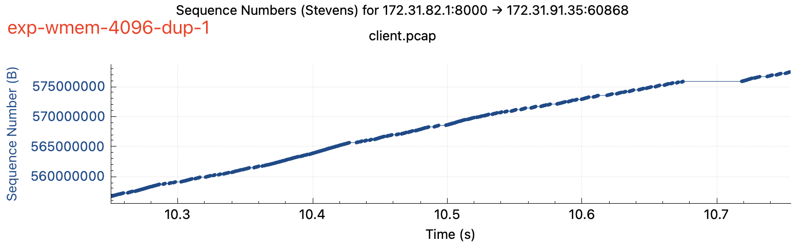
    
    
    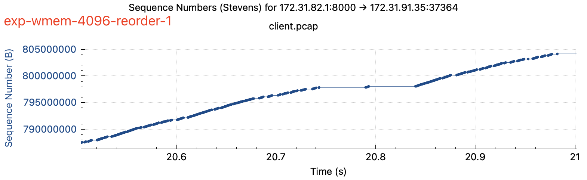
    
    
    
    
    
    
    
    
    
    

    Conclusion:

    - Most things are expected, like small buffer size + packet loss / corrupt / reorder causes plateau in the graph. Bandwidth limit and packet delay increases rtt results in step-shaped graph.
    - The packet size of limiting receive buffer size is smaller than those of limiting send buffer size, which makes the time/sequence graph of rmem=4096 cases are more dense.
    - In high cpu usage cases there’s turning point in the graph. The throughput before/after turning point is different but no plateau is found.

6. Window Scaling

    
    
    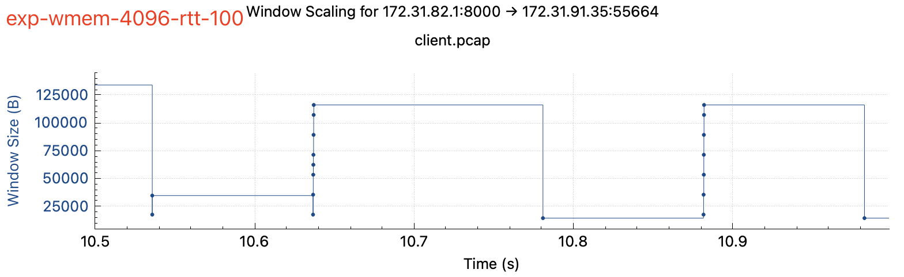
    
    
    
    
    
    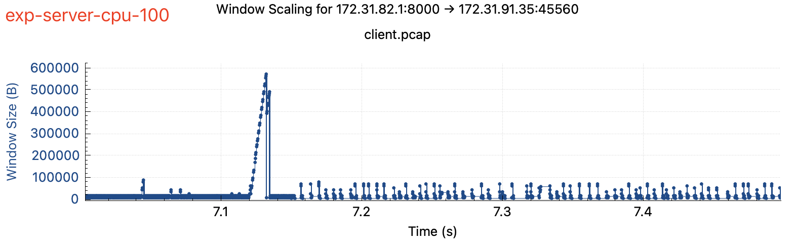
    
    
    
    
    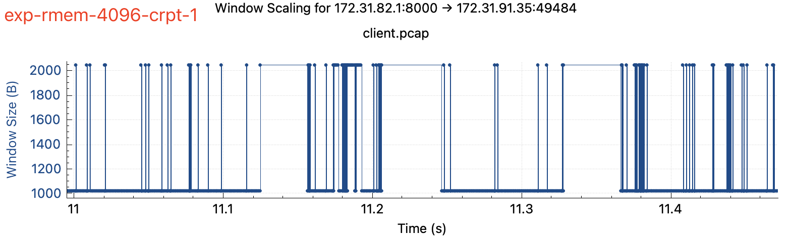
    
    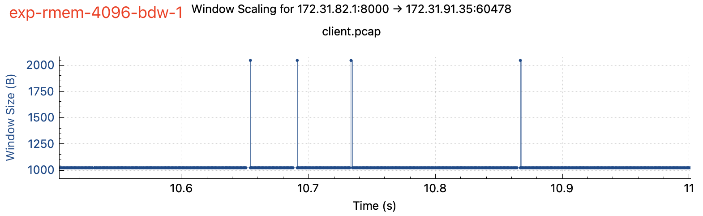
    

    Conclusion:

    - Window size is normal when we limit send buffer size. (not quite related with send buffer)
    - Window size is only 1000-2000 when we limit receive buffer size, which limits the ability server to send more packets.
    - In high cpu usage cases, the window size is normal in most of the cases but sometimes it scales up a lot. It’s caused by packet lost and client keeps sending dup ACKs, but the server does not react to that and still sends the next packets. It’s likely to be caused by a long drive queue.

7. Details

    **send buffer limit**

    Everything looks good until there’s packet lost, retransmission takes too much time.

    

    **receive buffer limit**

    A mess. TCP window is full almost every time. Window and packet size is very small.

    

    **High CPU usage**

    Everything looks good until there’s a packet lost. Too many Dup ACKs are sent out until retransmission happens.

    

    One of the guesses is the driver queue causes packet lost. Driver queue (aka ring buffer) is typically implemented as a first-in, first-out (FIFO) ring buffer, which holds descriptors which point to other data structures called socket kernel buffers ([SKBs](http://vger.kernel.org/~davem/skb.html)) which hold the packet data and are used throughout the kernel. Packet lost may happen when driver queue is full because of high cpu, either during sending or receiving packets.

    

### Learned

- Don’t hardcode buffer size! The network will be fragile if buffer size is too small, make sure buffer size > 8 BDT
- High rtt and receive buffer full are the common reasons for low throughput in production environment.
- High CPU usage slows down the network even before buffer is full. Avoid 100% cpu usage.

### Reference
- [TCP性能和发送接收窗口、Buffer的关系 – plantegg](https://plantegg.github.io/2019/09/28/%E5%B0%B1%E6%98%AF%E8%A6%81%E4%BD%A0%E6%87%82TCP--%E6%80%A7%E8%83%BD%E5%92%8C%E5%8F%91%E9%80%81%E6%8E%A5%E6%94%B6Buffer%E7%9A%84%E5%85%B3%E7%B3%BB/)
- [Linux tc qdisc的使用案例 – plantegg](https://plantegg.github.io/2016/08/24/Linux%20tc%20qdisc%E7%9A%84%E4%BD%BF%E7%94%A8%E6%A1%88%E4%BE%8B/)
- [Linux tc qdisc的使用案例 – plantegg](https://xn--hewq4b.cool/linux-tcshi-yan)
- [Network Tools and Protocols – USC](http://ce.sc.edu/cyberinfra/docs/workshop/NTP_Lab_Series.pdf)
- [tcp – man page](https://man7.org/linux/man-pages/man7/tcp.7.html)
- [traffic control – man page](https://man7.org/linux/man-pages/man8/tc.8.html)
- [长肥管道(LFT)中TCP的艰难处境与打法 – dog250](http://xn--(lft)tcp-t49l1jw71hhlbg10e9z4akm4aedrwptnmhtm5ervva25f/)
- [Queueing in the Linux Network Stack – Dan Siemon](https://www.coverfire.com/articles/queueing-in-the-linux-network-stack/)