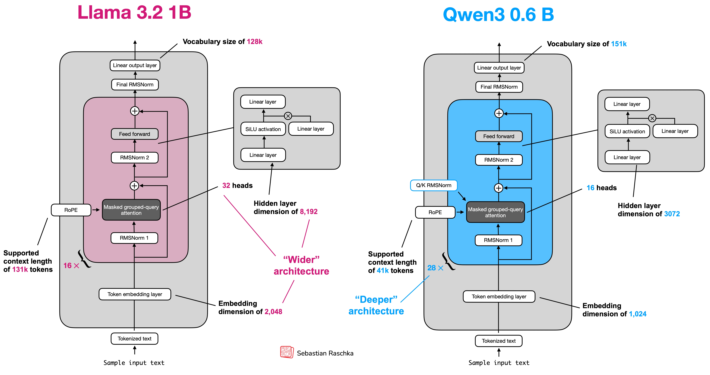
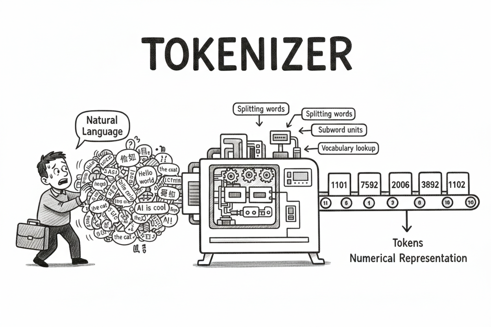
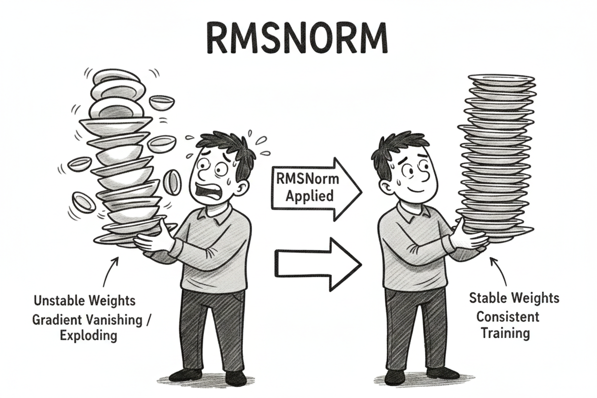
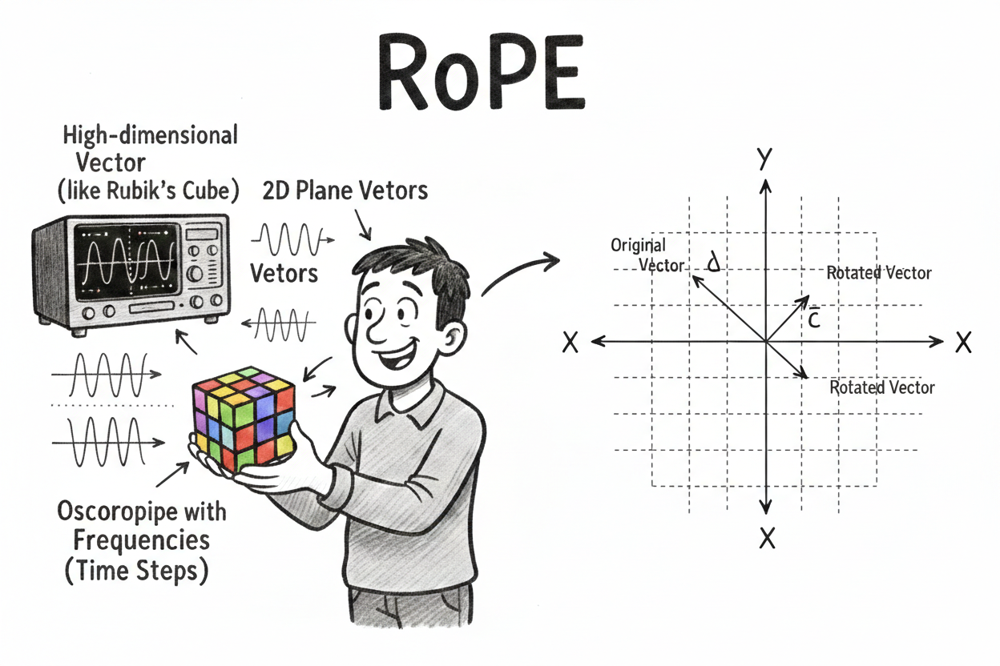
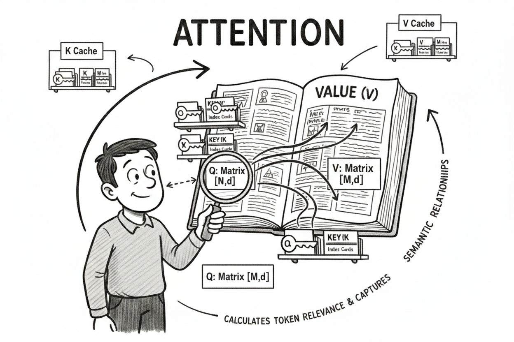
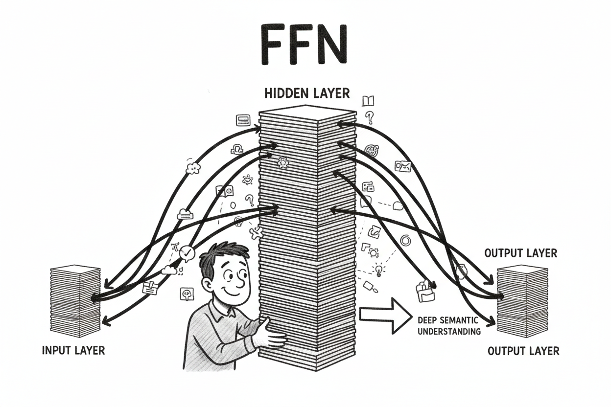
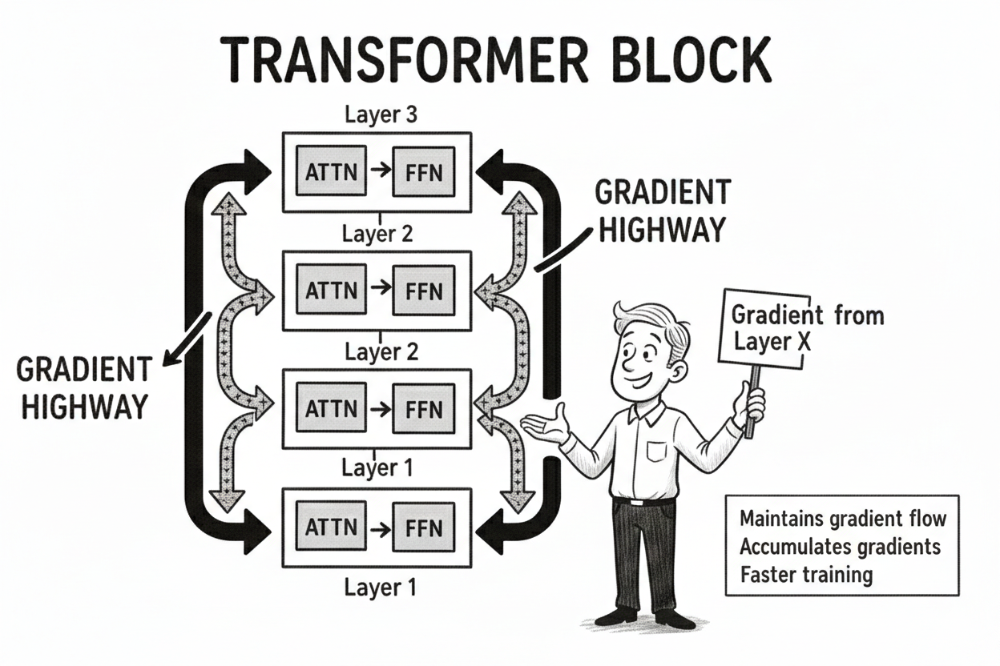
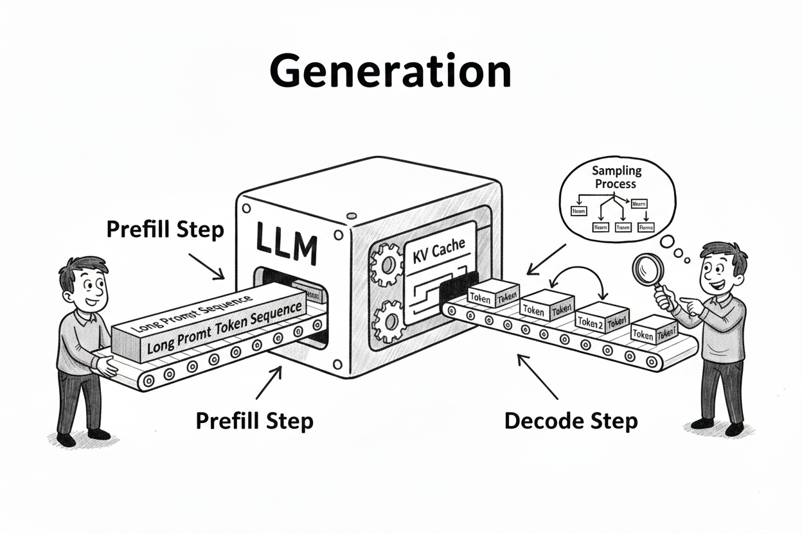
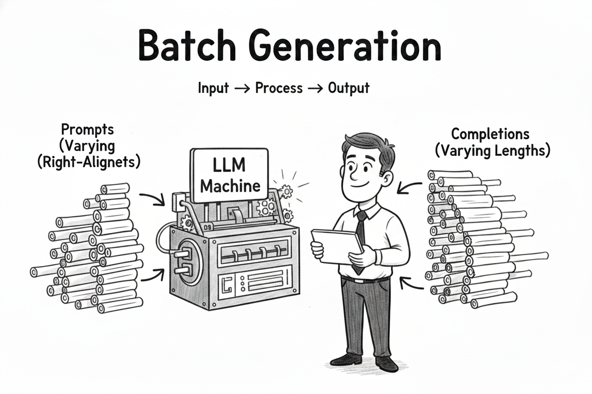

Better late than never — I've started a repo called [llm-from-scratch](https://github.com/gongyisheng/llm-from-scratch), where I reimplement popular open-source LLMs piece by piece, with a focus on making every component's structure clear and easy to follow. It's meant to be a hands-on tutorial for beginners and a personal reference for myself. The first entry is a from-scratch implementation of [Qwen3-0.6B](https://huggingface.co/Qwen/Qwen3-0.6B) in pure PyTorch — no Hugging Face `transformers`, no `vllm`, just raw tensor operations. This post walks through each core building block: tokenizer, RMSNorm, RoPE, FFN, GQA, transformer blocks, KV cache, prefill/decode, temperature sampling and batch processing — what each does, why it's designed that way, and the non-obvious details I learned along the way.

Full code: [llm_from_scratch/qwen3](https://github.com/gongyisheng/llm-from-scratch/tree/main/qwen3)

I strongly recommend using an AI coding assistant (Claude, Codex, etc.) to guide you through implementing it yourself, step by step (just like my repo). Don't just read the code — ask it to teach you. For example:

> *"I want to implement Qwen3-0.6B inference from scratch in PyTorch. Refer to this codebase and its [learning guide](https://github.com/gongyisheng/llm-from-scratch/tree/main/qwen3#learning-guide): https://github.com/gongyisheng/llm-from-scratch/tree/main/qwen3. Don't write the code for me — explain the math and design choices behind each component, answer my questions, discuss trade-offs with me, and guide me to implement it myself. The goal is to run inference successfully end to end. Start with Step 1 (config) and teach me one piece at a time."*

## Architecture Overview

Qwen3-0.6B is a decoder-only transformer. Its architecture follows the same blueprint as most modern LLMs — stack identical transformer blocks, each with an attention layer and a feed-forward network, with a few key design choices like GQA and SwiGLU that set it apart.



When the model processes a prompt, data flows through the network in one direction — this is called the **forward pass**. Here's the full pipeline for Qwen3-0.6B:

`token_ids → Embedding → 28× [RMSNorm → GQA (with RoPE) → RMSNorm → SwiGLU FFN] → RMSNorm → lm_head → logits`

- **Embedding** — a hash table, looks up each token ID in a learned table to get a dense vector. e.g. input `[3, 42, 7]` (3 token IDs) → output shape `(3, 1024)` (3 vectors of 1024 dimensions, each vector is a learned representation of the token)
- **RMSNorm** — scales the values in each vector to a consistent range so they don't explode or vanish as data flows through layers. It's an element-wise transformation — e.g. `[0.1, 100.0, -50.0]` → `[0.001, 0.89, -0.45]`
- **RoPE** (Rotary Position Embeddings) — encodes each token's position by rotating its vector. This lets the model know token order without a separate position embedding — the rotation angle depends on position, so attention scores naturally reflect how far apart two tokens are
- **GQA** (Grouped-Query Attention) — the core mechanism for information extraction. It computes similarity scores between every token pair in the sequence, so each token can "attend to" and gather information from the most relevant tokens. It uses multiple heads so different heads can capture different types of patterns (e.g. syntax, semantics, positional relationships) and can be computed in parallel on GPU. The "Grouped-Query" variant shares key/value heads across multiple query heads to reduce memory usage
- **SwiGLU FFN** (Feed Forward Network) — if attention is about gathering information *across* tokens, FFN is about processing each token's representation *individually*. It projects up to a higher dimension (1024 → 3072), applies a gated non-linear transformation (SwiGLU), then projects back down — this is where the model stores and retrieves factual knowledge
- **lm_head** — a linear layer that maps the final hidden vector (1024-dim) to a score for every token in the vocabulary (151,936-dim). These raw scores are called **logits** — they're unnormalized and can be any real number. After softmax, logits become probabilities for the next token (e.g. logits `[2.1, 5.3, -1.0, ...]` → probabilities `[0.03, 0.89, 0.001, ...]`)

One gotcha: `head_dim = 128`, NOT `emb_dim // n_heads = 64`. Classic transformers split the embedding evenly across heads, but Qwen3 decouples the two — the Q/K/V projections map **up** from 1024 to `n_heads × head_dim = 2048`, and the output projection maps back **down** to 1024. This gives each head a richer representation while keeping the residual stream narrow. Getting this wrong causes shape mismatches during weight loading — a bug that's hard to trace because the error surfaces far from the root cause.

## Config


Here are the key numbers from `config.json`:

| Parameter | Value | Description |
|---|---|---|
| vocab_size | 151,936 | Number of tokens the model can recognize |
| emb_dim | 1,024 | Dimension of token embeddings and residual stream |
| n_heads | 16 | Number of query attention heads |
| n_kv_groups | 8 | Number of key/value heads (shared across query heads via GQA) |
| head_dim | 128 | Dimension of each attention head |
| n_layers | 28 | Number of transformer blocks stacked in sequence |
| hidden_dim | 3,072 | Inner dimension of the SwiGLU feed-forward network |
| rope_base | 1,000,000 | Base frequency for Rotary Position Embeddings — higher values extend context length |
| tie_word_embeddings | true | Input embedding and output projection share the same weight matrix |

The config is a dataclass that reads `config.json` from the model directory and maps HuggingFace field names to internal names:

```python
@dataclass
class Qwen3Config:
    vocab_size: int
    emb_dim: int       # HF: hidden_size
    n_heads: int       # HF: num_attention_heads
    n_kv_groups: int   # HF: num_key_value_heads
    head_dim: int      # HF: head_dim
    n_layers: int      # HF: num_hidden_layers
    hidden_dim: int    # HF: intermediate_size
    context_length: int
    rope_base: float
    ...

    @classmethod
    def from_model_dir(cls, path):
        with open(Path(path) / "config.json") as f:
            cfg = json.load(f)
        return cls(
            vocab_size=cfg["vocab_size"],
            emb_dim=cfg["hidden_size"],
            ...
        )
```

Reading config dynamically from the model directory means you don't hardcode architecture-specific values — the same code works for Qwen3-0.6B, 1.7B, 4B, etc.

## Tokenizer



Qwen3 uses a BPE tokenizer with a vocabulary of 151,936 tokens. Besides regular language tokens (words, subwords, punctuation), the vocabulary includes **special tokens** that control model behavior:

| Token | ID | Purpose |
|---|---|---|
| <\|endoftext\|> | 151643 | End of sequence (EOS) — signals the model to stop generating |
| <\|im_start\|> | 151644 | Marks the beginning of a chat role (system/user/assistant) |
| <\|im_end\|> | 151645 | Marks the end of a chat role |
| \<think\> | 151646 | Starts a thinking/reasoning block |
| \</think\> | 151647 | Ends a thinking/reasoning block |
| \<tool_call\> | 151657 | Signals the model wants to call an external tool |
| \</tool_call\> | 151658 | Ends a tool call block |
| \<tool_response\> | 151659 | Marks the start of a tool's response |
| \</tool_response\> | 151660 | Marks the end of a tool's response |

These special tokens are how the model knows when to stop, when to think, and how to interact with external tools — they're baked into the training data, so the model has learned what to do when it sees them.

Rather than reimplementing BPE, I use the HuggingFace `tokenizers` library (Rust-backed, fast) and Jinja2 for the chat template:

```python
class Qwen3Tokenizer:
    def __init__(self, tokenizer: Tokenizer, chat_template: Template):
        self.tokenizer = tokenizer
        self.chat_template = chat_template

    @classmethod
    def from_model_dir(cls, path):
        tokenizer = Tokenizer.from_file(str(path / "tokenizer.json"))
        with open(path / "tokenizer_config.json") as f:
            template_str = json.load(f)["chat_template"]
        chat_template = Template(template_str)
        return cls(tokenizer, chat_template)

    def apply_chat_template(self, messages, enable_thinking=False):
        return self.chat_template.render(
            messages=messages,
            add_generation_prompt=True,
            enable_thinking=enable_thinking,
        )

    def encode(self, text): return self.tokenizer.encode(text).ids
    def decode(self, ids):  return self.tokenizer.decode(ids, skip_special_tokens=False)
```

Design choice: `apply_chat_template` and `encode`/`decode` are separate — this mirrors the HuggingFace `transformers` API. The template formats messages into the chat format; encode/decode just convert between text and token IDs. This separation makes it easy to inspect the formatted prompt before tokenizing.

Modern LLMs use [Jinja2](https://jinja.palletsprojects.com/) templates (stored in `tokenizer_config.json`) to define their chat format. The template loops over messages, wraps each with role tags, and appends an `assistant` turn for the model to complete:

```jinja

<|im_start|>{{ message.role }}
{{ message.content }}<|im_end|>

<|im_start|>assistant
```

For input `[{"role": "user", "content": "What is 1+1?"}]`, the template produces:

```
<|im_start|>user
What is 1+1?<|im_end|>
<|im_start|>assistant
```

The model generates from here. The `<|im_start|>` and `<|im_end|>` are special tokens that mark role boundaries — the model was trained on this exact format, so getting it wrong will degrade output quality. Using the Jinja template directly means multi-turn conversations and thinking mode (`<think>...</think>`) work out of the box without any hardcoded logic.

## RMSNorm



RMSNorm (Root Mean Square Normalization) normalizes each vector by its root mean square, keeping values in a stable range as they flow through dozens of layers. It replaces LayerNorm in modern LLMs because it's simpler and faster. The formula:

```
RMSNorm(x) = x / sqrt(mean(x^2) + eps) * gamma
```

Unlike LayerNorm, there's no mean subtraction (no centering) — just scale normalization. This makes it cheaper. The `gamma` (called `weight` in code) is a **learnable per-dimension scale** — after normalization brings all values to a similar range, gamma lets the model learn which dimensions should be amplified and which should be suppressed. Without it, every dimension would be forced to the same scale, limiting the model's expressiveness.

```python
class RMSNorm(nn.Module):
    def __init__(self, dim, eps=1e-6):
        super().__init__()
        self.weight = nn.Parameter(torch.ones(dim))  # learnable scale
        self.eps = eps

    def forward(self, x):
        dtype = x.dtype
        x = x.to(torch.float32)  # float32 for numerical stability
        rms = x.pow(2).mean(dim=-1, keepdim=True).sqrt()
        output = x / (rms + self.eps) * self.weight
        return output.to(dtype)
```

Implementation details:
- **`eps`**: a tiny constant (1e-6) added before the square root to prevent division by zero when all values are near zero.
- **Cast to float32** before computing: bfloat16 has limited precision for squaring and averaging. Cast back after.
- **`keepdim=True`**: The RMS has shape `[batch, seq, 1]` so it broadcasts correctly against `[batch, seq, dim]`.
- **Learnable weight (no bias)**: After normalization, the model needs to rescale — different dimensions may need different magnitudes.
- **Faster alternative**: `torch.rsqrt(variance + eps)` avoids separate sqrt + division (one fused op instead of two).

In Qwen3, each transformer block has **4 RMSNorms**: pre-attention (`norm1`), QK-Norm on query and key (`q_norm`, `k_norm`), and pre-FFN (`norm2`). Plus 1 final RMSNorm before lm_head. That's **4 × 28 + 1 = 113 RMSNorm calls** per forward pass — which is why RMSNorm is a **performance bottleneck** during inference. Not because of compute, but because it's **memory-bandwidth bound**: the actual math (square, mean, sqrt, multiply) is trivial, but loading/storing the entire hidden state from GPU memory dominates. This is why production implementations use **fused CUDA kernels** that do everything in one memory pass.

## RoPE (Rotary Position Embeddings)



Self-attention is permutation-invariant — `Attention("the cat sat") == Attention("sat cat the")` — so the model needs a way to know token order. RoPE solves this by **rotating** Q and K vectors based on their position before the dot product `Q @ K.T`. Since attention scores come from this dot product, the rotation makes scores naturally depend on **relative position** — `Q[pos_i] . K[pos_j]` encodes `|i - j|`.

### How rotation works

RoPE treats each head's 128-dim vector as **64 pairs** of dimensions, where each pair forms a 2D plane. For a token at position `m`, each pair `(x_{2i}, x_{2i+1})` gets rotated by angle `m × θ_i`:

```
[x_{2i}  ']   [cos(m × θ_i)  -sin(m × θ_i)] [x_{2i}  ]
[x_{2i+1}'] = [sin(m × θ_i)   cos(m × θ_i)] [x_{2i+1}]
```

where `θ_i` is the rotation frequency for the `i`-th pair:

```
θ_i = 1 / (base ^ (2i / head_dim))
```

**Why pairs, not the whole vector?** Rotation is fundamentally a 2D operation — it needs exactly two coordinates to define a plane of rotation. You can't meaningfully "rotate" a single scalar, and a 128D rotation would be overly complex. Instead, RoPE decomposes the space into 64 independent 2D rotation planes.

**Are these planes orthogonal?** Yes. Pairing `[dim_0, dim_64]`, `[dim_1, dim_65]`, etc. — any two distinct pairs span orthogonal planes because they share no coordinate axes. This means rotations in different planes don't interfere with each other.

### Frequencies — why different angles for different pairs?

Each pair rotates at a different frequency `θ_i`, geometrically spaced from fast to slow:

```python
# θ_i = 1 / (base ^ (2i / head_dim))
freqs = 1.0 / (base ** (torch.arange(0, head_dim, 2) / head_dim))
```

- Pair 0 (`θ_0 = 1.0`): highest frequency — rotates fast, captures fine-grained local position
- Pair 63 (`θ_63 = 1/base`): lowest frequency — rotates slowly, captures long-range position

This is analogous to **Fourier basis functions**: just as you decompose a signal into sine waves of different frequencies to fully represent it, RoPE decomposes position into multiple rotation frequencies. High frequencies distinguish nearby tokens (position 5 vs 6), while low frequencies distinguish distant tokens (position 1000 vs 2000).

After applying RoPE, different dimension pairs genuinely carry different kinds of positional information — early pairs encode "am I next to this token?" while later pairs encode "am I in the same paragraph?"

The `base` (1,000,000 for Qwen3) controls the **frequency decay rate**. A larger base means frequencies decay more slowly, stretching the spectrum so the lowest-frequency pair still has meaningful variation at very long sequence lengths — this is how models extend their context window.

### Why apply RoPE to Q and K, not V?

Attention scores come from `Q @ K.T`. By rotating Q and K, the dot product between them naturally depends on their **relative position** — `Q[pos_i] . K[pos_j]` encodes `|i - j|`. Values (V) carry content information; they don't participate in the "where should I look" computation, so they don't need position encoding.

### Implementation

```python
class RoPE(nn.Module):
    def __init__(self, head_dim, base, max_seq_len):
        super().__init__()
        # precompute sin/cos tables
        freqs = 1.0 / (base ** (torch.arange(0, head_dim, 2) / head_dim))
        positions = torch.arange(max_seq_len)
        angles = positions[:, None] * freqs[None, :]  # [seq, 64]
        angles = torch.cat([angles, angles], dim=-1)   # [seq, 128] (duplicate for pairs)
        self.register_buffer("cos", torch.cos(angles))
        self.register_buffer("sin", torch.sin(angles))

    def forward(self, x, position_offset=0):
        # x: (batch, n_heads, seq_len, head_dim)
        seq_len = x.shape[2]
        cos = self.cos[position_offset : position_offset + seq_len][None, None, :, :]
        sin = self.sin[position_offset : position_offset + seq_len][None, None, :, :]

        x1 = x[..., :self.head_dim // 2]   # first 64 dims
        x2 = x[..., self.head_dim // 2:]    # last 64 dims
        rotated = torch.concat([-x2, x1], dim=-1)
        return x * cos + rotated * sin
```

The `concat(-x2, x1)` trick vectorizes the 2D rotation matrix multiplication. Instead of looping over 64 pairs, we split, negate, concat, and use element-wise multiply + add. Expanding the math:
- `x1' = x1 * cos - x2 * sin`
- `x2' = x2 * cos + x1 * sin`

This is exactly the rotation matrix applied to each pair.

**`angles = positions[:, None] * freqs[None, :]` uses `*` not `@`:** Each position gets its own angle for each frequency — this is an element-wise outer product (broadcasting), not matrix multiplication. Position 5 with frequency 0.3 gives angle 1.5. It's the Cartesian product of positions and frequencies.

**`torch.cat([angles, angles])`:** The duplicated angles ensure `cos` and `sin` have shape `[seq, 128]` matching `head_dim`. The first 64 values correspond to `x1`'s rotation, the last 64 to `x2`'s rotation — they use the same angles because each pair `(x1[i], x2[i])` shares one rotation angle.

**`position_offset`:** During generation with KV cache, we decode one token at a time. The new token at decode step 5 needs the angle for position `prompt_len + 5`, not position 0. The offset indexes into the precomputed table at the correct position.

## Grouped Query Attention (GQA)



Attention is the core mechanism that enables **information flow between tokens**. Think of it like a library: you have a question **Q** (Query) to ask, **K** (Key) is the book index that helps you find relevant books, and **V** (Value) is the actual content you read from those books. The model computes how well each query matches each key (`Q @ K.T`), then uses those match scores to retrieve a weighted mix of values (`attn_weights @ V`). Without attention, each token would only know about itself — attention is what lets "it" in "The cat sat on the mat because it was tired" understand that "it" refers to "cat".

### Why Grouped-Query Attention?

There's a spectrum of attention designs:

- **Multi-Head Attention (MHA)**: each query head has its own KV head (16 Q, 16 KV) — maximum quality, but KV cache is large
- **Multi-Query Attention (MQA)**: all query heads share a single KV head (16 Q, 1 KV) — minimal memory, but quality degrades
- **Grouped-Query Attention (GQA)**: a middle ground — multiple query heads share a KV group (16 Q, 8 KV) — near-MHA quality with significantly less memory

Qwen3 uses GQA with 16 query heads and 8 KV groups — each KV group serves 2 query heads, halving KV cache memory with minimal quality loss. Newer mechanisms like **MLA** (DeepSeek) and **Linear Attention** push efficiency even further.

### Full implementation

```python
class GroupQueryAttention(nn.Module):
    def __init__(self, emb_dim, n_heads, n_kv_groups, head_dim):
        super().__init__()
        self.W_q = nn.Linear(emb_dim, n_heads * head_dim, bias=False)
        self.W_k = nn.Linear(emb_dim, n_kv_groups * head_dim, bias=False)
        self.W_v = nn.Linear(emb_dim, n_kv_groups * head_dim, bias=False)
        self.W_o = nn.Linear(n_heads * head_dim, emb_dim, bias=False)
        self.q_norm = RMSNorm(head_dim)
        self.k_norm = RMSNorm(head_dim)

    def forward(self, x, rope, position_offset=0, kv_cache=None):
        batch, seq_len, _ = x.shape

        # project and reshape to [batch, heads, seq, head_dim]
        Q = self.W_q(x).view(batch, seq_len, self.n_heads, self.head_dim).transpose(1, 2)
        K = self.W_k(x).view(batch, seq_len, self.n_kv_groups, self.head_dim).transpose(1, 2)
        V = self.W_v(x).view(batch, seq_len, self.n_kv_groups, self.head_dim).transpose(1, 2)

        # QK-Norm: stabilize attention logits
        Q = self.q_norm(Q.reshape(-1, seq_len, self.head_dim))
        Q = Q.view(batch, self.n_heads, seq_len, self.head_dim)
        K = self.k_norm(K.reshape(-1, seq_len, self.head_dim))
        K = K.view(batch, self.n_kv_groups, seq_len, self.head_dim)

        # apply RoPE (position encoding on Q and K only)
        Q = rope(Q, position_offset)
        K = rope(K, position_offset)

        # KV cache: concat past keys/values
        if kv_cache is not None:
            past_k, past_v = kv_cache
            K = torch.concat([past_k, K], dim=2)  # grow along sequence dim
            V = torch.concat([past_v, V], dim=2)
        new_kv_cache = (K, V)

        # expand KV groups to match query heads
        group_size = self.n_heads // self.n_kv_groups  # 2
        K = K.repeat_interleave(group_size, dim=1)
        V = V.repeat_interleave(group_size, dim=1)

        # attention scores
        scores = Q @ K.transpose(-2, -1) / (self.head_dim ** 0.5)
        if kv_cache is None:  # causal mask only during prefill
            mask = torch.triu(
                torch.ones(seq_len, seq_len, device=x.device), diagonal=1
            ).bool()
            scores.masked_fill_(mask, float("-inf"))
        attn = F.softmax(scores, dim=-1)
        context = attn @ V

        context = context.transpose(1, 2).reshape(batch, seq_len, -1)
        return self.W_o(context), new_kv_cache
```

### QK-Norm

Attention logits (`Q @ K.T`) can **explode in magnitude**, especially in deeper layers. RMSNorm on Q and K before computing attention keeps the dot products in a **stable range**. This is a **Qwen3-specific** design choice (not all models have it).

### KV Cache

During generation, we don't want to recompute attention over all previous tokens. The KV cache stores past K and V tensors. We don't cache Q because it's always different — during prefill it's the full prompt, during decode it's the single new token being generated.

- Shape: `[batch, n_kv_groups, seq_len_so_far, head_dim]`
- **Grows** along `dim=2` (sequence dimension) as new tokens are generated
- Q has shape `[batch, n_heads, 1, head_dim]` during decode (just the new token)
- The new Q attends to **ALL** cached K tokens — this is where the model "looks back" at context

Without KV cache, generating N tokens costs **O(N^2)** attention computations. With it, each step is **O(N)**.

### Causal Mask

LLMs generate tokens left-to-right, so earlier tokens should **never see later tokens** when computing attention scores — otherwise the model would be "cheating" by looking at the answer before predicting it. The causal mask enforces this by setting attention scores to `-inf` for all future positions, so token at position `i` can only attend to positions `0..i`:

```python
mask = torch.triu(torch.ones(seq_len, seq_len), diagonal=1).bool()
scores.masked_fill_(mask, float("-inf"))
```

**Why `-inf` instead of 0?** Because of softmax. If you mask with 0, `softmax(0)` gives some positive value — the model would still attend to future tokens. `softmax(-inf) = 0` — the masked positions contribute exactly zero attention weight.

**Why only during prefill?** During decode, Q is a single token attending to all previous K tokens via the KV cache. There's nothing "future" to mask — the cache only contains past tokens. The mask is only needed during prefill when processing the full prompt where multiple tokens exist simultaneously.

## SwiGLU FFN



If attention decides *which* tokens to look at, the FFN decides *what to do* with the gathered information. It processes **each token independently** — research suggests FFN layers act as **key-value memories** that store and retrieve factual knowledge (e.g. "Paris is the capital of France").

FFN weights make up the **largest portion** of a transformer's parameters (~2/3 in Qwen3-0.6B). Increasing the hidden dimension **directly improves model capability** — more capacity to store knowledge and learn complex features. But larger FFN means **more compute per token**, which is why architectures like **Mixture-of-Experts (MoE)** aim to make FFN sparse — only activating a subset of "expert" FFN blocks per token, so the model can scale parameters (and ability) without proportionally scaling compute.

**Why project up then down?** The up-projection (1,024 → 3,072) expands into a higher-dimensional space where the model has more room to separate and combine features. The down-projection (3,072 → 1,024) compresses it back to the residual stream dimension. If we stayed high, memory and compute costs explode; if we never went up, the model lacks capacity for complex transformations.

**Why use a gate?** Standard FFN applies an activation to all dimensions uniformly. SwiGLU adds a **gate** that learns *which* hidden dimensions to activate for each input — a learned "filter" that selectively passes or suppresses information. This gives the model finer control over information flow, which is why SwiGLU consistently outperforms ReLU in practice.

Qwen3 uses SwiGLU with three weight matrices (`W_gate`, `W_up`, `W_down`) instead of the standard two. The hidden dimension is 3,072 (3× expansion) instead of the traditional 4×, since the extra gate matrix compensates for the parameter count:

```
FFN(x) = W_down(SiLU(W_gate(x)) * W_up(x))
```

```python
class SwiGLUFFN(nn.Module):
    def __init__(self, emb_dim, hidden_dim):
        super().__init__()
        self.W_gate = nn.Linear(emb_dim, hidden_dim, bias=False)
        self.W_up   = nn.Linear(emb_dim, hidden_dim, bias=False)
        self.W_down  = nn.Linear(hidden_dim, emb_dim, bias=False)

    def forward(self, x):
        return self.W_down(F.silu(self.W_gate(x)) * self.W_up(x))
```

`W_gate` produces a gate signal (passed through SiLU = `x * sigmoid(x)`), `W_up` produces the candidate values, and they're multiplied element-wise — the gate controls how much of each hidden dimension passes through. `W_down` projects the result back to `emb_dim`.

## Transformer Block



Each of the 28 layers combines attention and FFN with residual connections and pre-normalization:

```python
class TransformerBlock(nn.Module):
    def __init__(self, config):
        super().__init__()
        self.norm1 = RMSNorm(config.emb_dim)
        self.attn = GroupQueryAttention(
            config.emb_dim, config.n_heads, config.n_kv_groups, config.head_dim
        )
        self.norm2 = RMSNorm(config.emb_dim)
        self.ffn = SwiGLUFFN(config.emb_dim, config.hidden_dim)

    def forward(self, x, rope, position_offset=0, kv_cache=None):
        residual = x
        x = self.norm1(x)
        x, new_kv_cache = self.attn(x, rope, position_offset, kv_cache)
        x = x + residual          # residual connection

        residual = x
        x = self.norm2(x)
        x = self.ffn(x)
        x = x + residual          # residual connection

        return x, new_kv_cache
```

### Residual Connections

Each sub-layer (attention, FFN) computes a **delta** (change), not a complete new representation. The residual connection adds this delta back: `output = sublayer(x) + x`. This means:
- Each layer specializes in what to *add* to the representation
- Information flows through the residual stream as a "highway" — gradients can flow directly from loss to early layers
- Without residuals, deep networks (28 layers) suffer from vanishing gradients

### Pre-Norm vs Post-Norm

Qwen3 uses **pre-norm**: normalize *before* each sub-layer, not after. Why?

With **post-norm** (`x = norm(sublayer(x) + residual)`), the residual passes through normalization — it gets distorted. The residual highway becomes lossy.

With **pre-norm** (`x = sublayer(norm(x)) + residual`), the residual bypasses normalization entirely. The addition `+ residual` preserves the full original signal. This makes training more stable and allows deeper networks.

The tradeoff: pre-norm can slightly underperform post-norm at convergence for smaller models, but it's much more robust to train at scale.

## Weight Loading

HuggingFace stores weights in safetensors format with their own naming convention. We need to map HF keys to our model's state_dict keys:

```python
KEY_MAP = {
    "model.embed_tokens.weight": "tok_emb.weight",
    "model.norm.weight": "final_norm.weight",
    "lm_head.weight": "lm_head.weight",
}

LAYER_KEY_MAP = {
    "self_attn.q_proj.weight": "attn.W_q.weight",
    "self_attn.k_proj.weight": "attn.W_k.weight",
    "mlp.gate_proj.weight":    "ffn.W_gate.weight",
    ...
}

def load_weights(model, model_dir):
    all_weights = {}
    for f in sorted(Path(model_dir).glob("*.safetensors")):
        all_weights.update(load_file(str(f)))

    renamed = {}
    for hf_key, tensor in all_weights.items():
        new_key = rename_hf_key(hf_key)
        if new_key:
            renamed[new_key] = tensor

    model.load_state_dict(renamed, strict=False)
```

**No transpose needed**: Both HuggingFace and PyTorch's `nn.Linear` store weight matrices as `[out_features, in_features]`. This is unlike JAX/Flax which uses `[in, out]` — a JAX implementation would need explicit transposes.

**`strict=False`**: RoPE's `cos` and `sin` buffers are precomputed (registered via `register_buffer`), not stored in safetensors. `strict=False` allows loading without errors from these missing keys.

**Weight tying**: When `tie_word_embeddings=true`, the embedding matrix and the output projection (`lm_head`) share the same weight tensor:
```python
if config.tie_word_embeddings:
    self.lm_head.weight = self.tok_emb.weight
```
This saves ~155M parameters for a 151,936-token vocabulary with 1,024 dimensions.

## Generation



Generation has two phases with very different system characteristics:

- **Prefill** — process the full prompt in one pass. This is **compute-bound**: the GPU is busy doing matrix multiplications over many tokens simultaneously. Measured by **TTFT** (Time To First Token).
- **Decode** — generate tokens one at a time. This is **memory-bound**: each step only processes a single token, so the bottleneck is loading model weights and KV cache from GPU memory, not compute. Measured by **TPOT** (Time Per Output Token).

This distinction matters for optimization — prefill benefits from more FLOPs (faster GPUs), while decode benefits from more memory bandwidth (higher HBM bandwidth, smaller KV cache via GQA/MQA).

### Sampling

```python
def sample(logits, temperature=1.0, top_k=-1):
    if temperature == 0 or top_k == 1:
        return torch.argmax(logits, dim=-1)  # greedy

    if top_k > 0:
        values, indices = torch.topk(logits, k=top_k)
        logits = torch.full_like(logits, -float("inf"))
        logits.scatter_(1, indices, values)

    probs = torch.softmax(logits / temperature, dim=-1)
    return torch.multinomial(probs, num_samples=1)
```

- **Temperature** controls randomness: lower is more deterministic, higher is more creative. 
- **Top-k** restricts sampling to the k most likely tokens — everything else gets `-inf` before softmax. 
- **Top-p** (nucleus sampling) keeps the smallest set of tokens whose cumulative probability exceeds p.

It's recommended to use the **model's default sampling settings** (specified in `generation_config.json`, usually `temperature=1.0` with top-k and top-p disabled). The model was trained without sampling (it sees the ground-truth next token during training) — deviating too far can cause problems in both directions: too high temperature produces incoherent outputs, while too low temperature or greedy decoding (temperature=0) can cause **degeneration** — the model gets stuck in repetitive loops, endlessly repeating the same phrase.

### Generate loop

```python
def generate(model, prompt_token_ids, max_new_tokens, temperature, top_k, eos_token_id):
    input_ids = prompt_token_ids.unsqueeze(0)  # add batch dim
    prompt_len = input_ids.shape[1]

    # prefill: process entire prompt, get first token
    logits, kv_cache = model(input_ids)
    next_token = sample(logits[:, -1, :], temperature, top_k)
    generated = [next_token.item()]

    # decode: one token at a time with KV cache
    for _ in range(max_new_tokens - 1):
        offset = prompt_len + len(generated) - 1
        logits, kv_cache = model(next_token.view(1, 1), offset, kv_cache)
        next_token = sample(logits[:, -1, :], temperature, top_k)
        generated.append(next_token.item())
        if eos_token_id and next_token.item() == eos_token_id:
            break

    return prompt_token_ids.tolist() + generated
```

**Prefill**: The entire prompt is processed in one forward pass. This produces KV cache entries for all prompt tokens and the logits for the first generated token.

**Decode**: Each step feeds only the last generated token (shape `[1, 1]`) through the model. The KV cache grows by one entry per layer. Position offset ensures RoPE uses the correct angle for the new token's actual position.

## Putting It All Together

```python
config = Qwen3Config.from_model_dir("checkpoint/Qwen3-0.6B")
tokenizer = Qwen3Tokenizer.from_model_dir("checkpoint/Qwen3-0.6B")
model = Qwen3Model(config)
load_weights(model, "checkpoint/Qwen3-0.6B")
model.eval()

messages = [{"role": "user", "content": "What is 2+2?"}]
formatted = tokenizer.apply_chat_template(messages, enable_thinking=True)
token_ids = tokenizer.encode(formatted)
prompt_tensor = torch.tensor(token_ids)

with torch.no_grad():
    output_ids = generate(model, prompt_tensor, max_new_tokens=1024,
                          temperature=1, top_k=-1, eos_token_id=config.eos_token_id)

print(tokenizer.decode(output_ids))
```

Output: `2 + 2 = 4.` at ~7.6 tok/s on CPU. Not fast, but correct — and every tensor operation is visible and debuggable.

## Batch Generation



The single-prompt `generate()` above works, but real serving needs to process multiple prompts simultaneously. Batch generation improves GPU utilization — matrix multiplications are the same cost whether the batch dimension is 1 or 8, so you get near-linear throughput scaling for free.

### The padding problem

Different prompts have different lengths. To batch them into a single tensor, we need **padding**. Decoder-only models use **left-padding** — pad tokens go at the beginning, not the end:

```
Prompt A: "What is 2+2?"           -> [PAD, PAD, PAD, What, is, 2+2, ?]
Prompt B: "Explain quantum physics" -> [Explain, quantum, physics, ...]
```

Why left-pad? During generation, we always sample from the **last** token's logits (`logits[:, -1, :]`). If we right-padded, the "last" position would be a pad token for shorter prompts — we'd be sampling from garbage. Left-padding ensures every sequence's last token is always its actual final token.

### Attention mask

Pad tokens shouldn't participate in attention. We need a **padding mask** combined with the causal mask:

```python
def make_batch_mask(prompt_lengths, max_len, device):
    # padding mask: True for real tokens, False for pad
    pad_mask = torch.arange(max_len, device=device)[None, :] >= (max_len - prompt_lengths[:, None])
    # causal mask: lower-triangular
    causal = torch.tril(torch.ones(max_len, max_len, device=device)).bool()
    # combine: [batch, 1, seq, seq] for broadcasting over heads
    mask = pad_mask[:, None, None, :] & causal[None, None, :, :]
    return mask  # True = attend, False = mask out
```

Each element `mask[b, :, i, j]` answers: "in batch item `b`, can token at position `i` attend to token at position `j`?" It's `True` only if `j <= i` (causal) AND `j` is not a pad token.

### Position IDs

With left-padding, position 0 is NOT always the first token — it might be a pad token. Each sequence needs its own position IDs:

```
Prompt A (len=4, padded to 7): positions = [0, 0, 0, 0, 1, 2, 3]
Prompt B (len=7, padded to 7): positions = [0, 1, 2, 3, 4, 5, 6]
```

Pad positions get 0 (it doesn't matter — they're masked out). Real tokens get sequential positions starting from 0. This means RoPE must accept per-token position IDs instead of a single offset:

```python
# instead of slicing cos[offset : offset + seq_len]
# index with position_ids: cos[position_ids]  -> [batch, seq, head_dim]
```

### KV cache with batches

During decode, different sequences in the batch may finish at different times (different sequence hits EOS first). The KV cache shape becomes `[batch, n_kv_groups, max_seq_so_far, head_dim]` where `max_seq_so_far` is the longest sequence. Finished sequences can be:
- **Kept generating** with a dummy token (wastes compute but keeps batch shape)
- **Removed** from the batch (requires rebatching, complex but efficient)

Production systems like vLLM use **continuous batching** — finished sequences are swapped out and new requests are swapped in, keeping the GPU busy at all times. This is where the simplicity of our from-scratch implementation ends and real serving infrastructure begins.

### Implementation

```python
def generate_batch(model, prompt_token_ids_list, max_new_tokens,
                   temperature=1.0, top_k=-1, eos_token_id=None, pad_token_id=0):
    batch_size = len(prompt_token_ids_list)
    prompt_lengths = [len(ids) for ids in prompt_token_ids_list]
    max_prompt_len = max(prompt_lengths)

    # left-pad all prompts to same length
    padded = []
    for ids in prompt_token_ids_list:
        padding = [pad_token_id] * (max_prompt_len - len(ids))
        padded.append(padding + ids)
    input_ids = torch.tensor(padded, device=device)  # [batch, max_prompt_len]

    # build position ids (0 for pad, sequential for real tokens)
    position_ids = torch.zeros_like(input_ids)
    for i, plen in enumerate(prompt_lengths):
        position_ids[i, max_prompt_len - plen:] = torch.arange(plen)

    # prefill
    logits, kv_cache = model(input_ids, position_ids=position_ids)
    next_tokens = sample(logits[:, -1, :], temperature, top_k)  # [batch, 1]
    generated = [[t.item()] for t in next_tokens]

    # track which sequences are still active
    active = [True] * batch_size

    # decode loop
    for step in range(max_new_tokens - 1):
        # position for new token: prompt_len + num_generated
        pos = torch.tensor(
            [prompt_lengths[i] + len(generated[i]) for i in range(batch_size)],
            device=device,
        ).unsqueeze(1)

        logits, kv_cache = model(next_tokens.view(batch_size, 1),
                                 position_ids=pos, kv_cache=kv_cache)
        next_tokens = sample(logits[:, -1, :], temperature, top_k)

        for i in range(batch_size):
            if active[i]:
                tok = next_tokens[i].item()
                generated[i].append(tok)
                if eos_token_id and tok == eos_token_id:
                    active[i] = False

        if not any(active):
            break

    return [ids + gen for ids, gen in zip(prompt_token_ids_list, generated)]
```

The key differences from single-prompt generation:
- **Left-padding** to align all prompts to the same length
- **Per-sequence position IDs** instead of a single offset
- **Per-sequence EOS tracking** — each sequence in the batch can finish independently
- The model's forward pass needs to accept `position_ids` tensor instead of a scalar `position_offset`

This is a simplified version. Production batch generation also handles: dynamic batching (adding new requests mid-generation), PagedAttention (efficient KV cache memory management), speculative decoding, and prefix caching.

## Lessons Learned

Some non-obvious bugs I hit during implementation:

- **`head_dim` is not `emb_dim // n_heads`**: Qwen3 explicitly sets `head_dim = 128` while `emb_dim // n_heads = 64`. This caused cryptic shape mismatches during weight loading.
- **`^` is not exponentiation in Python**: `base ^ exponent` is bitwise XOR. Use `base ** exponent`.
- **Operator precedence**: `base ** torch.arange(...) / dim` computes `(base ** arange) / dim`, not `base ** (arange / dim)`. Parentheses matter.
- **`nn.Linear` is a callable, not a tensor**: `self.W_gate(x)` calls the linear layer. `x * self.W_gate` tries element-wise multiply with the module object.
- **`keepdim=True` in reductions**: Without it, mean/sum collapse the dimension entirely, breaking broadcasting for subsequent operations.
- **KV cache concat dimension**: K/V shape is `[batch, n_kv_groups, seq, head_dim]`. New tokens concat along `dim=2` (sequence), not `dim=1` (heads).
- **Causal mask uses `-inf`, not 0**: `softmax(0) > 0` would leak future information. Only `softmax(-inf) = 0` truly blocks it.
