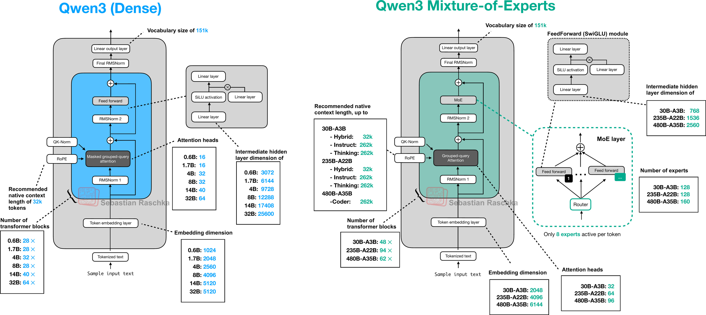

In this post, we implement Qwen3 MoE inference from scratch in PyTorch. It builds on the Qwen3 dense architecture — if you haven't read my [Qwen3 Inference from Scratch](../qwen3_from_scratch/) post, I recommend starting there, as it covers the full dense transformer pipeline (tokenizer, RMSNorm, RoPE, GQA, SwiGLU FFN, KV cache, generation). This post covers the key architectural advancement from dense to MoE: replacing the dense FFN with a **Sparse Mixture of Experts** layer. MoE is a more efficient architecture — it achieves better performance by scaling total parameters while keeping compute low, activating only a small subset of weights per token. Everything else — attention, normalization, tokenizer, generation loop — is identical.

Full code: [llm_from_scratch/qwen3_moe](https://github.com/gongyisheng/llm-from-scratch/tree/main/qwen3_moe)

Target model: [Qwen3-30B-A3B](https://huggingface.co/Qwen/Qwen3-30B-A3B)

As with the dense post, I recommend using an AI coding assistant to guide you through implementing it yourself. Since MoE builds on the dense architecture, you can start from your existing dense implementation:

> *"I've already implemented Qwen3 dense inference from scratch. Now I want to extend it to Qwen3 MoE. Refer to this codebase and its [learning guide](https://github.com/gongyisheng/llm-from-scratch/tree/main/qwen3_moe#learning-guide): https://github.com/gongyisheng/llm-from-scratch/tree/main/qwen3_moe. Don't write the code for me — explain how MoE differs from dense, walk me through the router and expert dispatch logic, and guide me to implement it myself. The goal is to run MoE inference end to end."*

## Architecture Overview

Qwen3 MoE shares the same decoder-only transformer blueprint as the dense architecture — stacked transformer blocks with GQA and pre-norm — but replaces the dense SwiGLU FFN with a Sparse Mixture of Experts layer, where a learned router selects a small subset of expert FFNs per token.



### What changes from dense to MoE?

```
Qwen3 Dense (0.6B) — TransformerBlock:
  RMSNorm → GQA → residual
  RMSNorm → SwiGLU FFN → residual

Qwen3 MoE (30B-A3B) — MoETransformerBlock:
  RMSNorm → GQA → residual              (same)
  RMSNorm → SparseMoEBlock → residual   (CHANGED)
              │
              ├── MoERouter: selects top-8 experts and router score
              ├── 8 of 128 SwiGLU experts run
              └── return weighted sum of the 8 expert outputs
```

Only one thing really changes: the single dense `SwiGLUFFN` becomes a `SparseMoEBlock` (a router + 128 small expert FFNs). Config and weight mapping are updated accordingly to support the new MoE fields (`n_experts`, `n_experts_per_token`, `moe_hidden_dim`, `moe_norm_topk_prob`).

The full forward pass pipeline becomes:

`token_ids → Embedding → 48× [RMSNorm → GQA (with RoPE) → RMSNorm → SparseMoEBlock] → RMSNorm → lm_head → logits`

### Why MoE? The scaling problem

In the [dense Qwen3 post](../qwen3_from_scratch/#swiglu-ffn), we saw that FFN weights make up ~2/3 of a transformer's parameters — they're where the model stores factual knowledge. More parameters = more capacity = smarter model. But with a dense FFN, **every parameter is activated for every token**. If you want 10× more knowledge, you need 10× more compute per token. This is the fundamental scaling bottleneck of dense models.

MoE breaks this tradeoff: instead of one large FFN that processes every token, use **128 small FFNs (experts)** and a **router** that picks only **8** of them per token. The result:

| Aspect | Dense FFN | MoE (128 experts, top-8) |
|---|---|---|
| Total FFN parameters per layer | 1 × 3 matrices (emb_dim × hidden_dim) | 128 × 3 matrices (emb_dim × moe_hidden_dim) |
| Active parameters per token | All of them | 8/128 = 6.25% |
| Qwen3 example | 1024 × 3072 × 3 = 9.4M | 128 × (2048 × 768 × 3) = 603M total, 37.7M active |

The model learns **much more** (30B params) while computing **much less** per token (~3B active). Different experts specialize in different types of tokens — the router learns to send each token to the most relevant experts.

### Design variant: shared experts

Not all MoE models route experts the same way. For example, DeepSeek-MoE introduces **shared experts** — 1-2 experts that are **always activated** for every token, whose output is added directly (not weighted by the router). They handle universal abilities (basic syntax, common patterns), freeing the routed experts to specialize. 

Qwen3 MoE does **not** use shared experts — all 128 experts go through the same top-k routing, which is simpler but means multiple experts may redundantly learn overlapping general abilities. 

Note that Qwen3's successor Qwen3-Next adds shared experts as an architectural improvement.

## Config

Here are the Qwen3-30B-A3B config values, compared with Qwen3-0.6B:

| Parameter | Qwen3-30B-A3B | Qwen3-0.6B | Notes |
|---|---|---|---|
| vocab_size | 151,936 | 151,936 | Same |
| emb_dim | 2,048 | 1,024 | 2× wider residual stream |
| n_heads | 32 | 16 | 2× more query heads |
| n_kv_groups | 4 | 8 | Fewer KV groups (more sharing) |
| head_dim | 128 | 128 | Same |
| n_layers | 48 | 28 | 1.7× deeper |
| **n_experts** | **128** | — | Total expert count (NEW) |
| **n_experts_per_token** | **8** | — | Experts activated per token (NEW) |
| **moe_hidden_dim** | **768** | — | Each expert's FFN hidden dim (NEW) |
| **moe_norm_topk_prob** | **true** | — | Normalize routing weights after top-k (NEW) |
| tie_word_embeddings | false | true | lm_head has separate weights |

The 4 new MoE fields:
- **`n_experts`** (128) — how many expert FFNs exist in each layer
- **`n_experts_per_token`** (8) — how many experts each token is routed to
- **`moe_hidden_dim`** (768) — the intermediate dimension of each expert's SwiGLU FFN (much smaller than the dense model's 3,072)
- **`moe_norm_topk_prob`** (true) — whether to normalize routing weights after top-k selection (controls if the 8 weights sum to 1.0)

```python
@dataclass
class Qwen3MoEConfig:
    # ... same fields as Qwen3Config ...
    n_experts: int             # HF: num_experts
    n_experts_per_token: int   # HF: num_experts_per_tok
    moe_hidden_dim: int        # HF: moe_intermediate_size
    moe_norm_topk_prob: bool   # HF: norm_topk_prob

    @classmethod
    def from_model_dir(cls, path):
        with open(Path(path) / "config.json") as f:
            cfg = json.load(f)
        return cls(
            ...
            n_experts=cfg["num_experts"],
            n_experts_per_token=cfg["num_experts_per_tok"],
            moe_hidden_dim=cfg["moe_intermediate_size"],
            moe_norm_topk_prob=cfg["norm_topk_prob"],
        )
```

Also note `tie_word_embeddings=false` — unlike Qwen3-0.6B, the MoE model has a separate `lm_head` weight matrix not shared with the embedding layer. This means the weight loading code must handle `lm_head.weight` as an independent parameter.

## MoE Router


The router is the "traffic controller" of MoE — it decides which experts process each token. It's surprisingly simple: a single linear projection followed by top-k selection.

```
Token hidden state (2048-dim)
            │
            ▼
┌────── MoERouter ────────┐
│ Linear(2048, 128)       │ ← one score per expert
│ torch.topk(scores, k=8) │ ← pick 8 highest
│ softmax(top_8_scores)   │ ← normalize to sum to 1
└───────────┬─────────────┘
            │
            ▼
  routing_weights: (num_tokens, 8)     ← how much each expert contributes
  selected_experts: (num_tokens, 8)    ← which 8 experts were chosen
```

### Implementation

```python
class MoERouter(nn.Module):
    def __init__(self, emb_dim, n_experts, n_experts_per_token, moe_norm_topk_prob):
        super().__init__()
        self.n_experts_per_token = n_experts_per_token
        self.moe_norm_topk_prob = moe_norm_topk_prob
        self.proj = nn.Linear(emb_dim, n_experts, bias=False)

    def forward(self, x):
        # x: (num_tokens, emb_dim)
        router_scores = self.proj(x)                                    # (num_tokens, 128)
        values, indices = torch.topk(router_scores, self.n_experts_per_token)  # both (num_tokens, 8)
        if self.moe_norm_topk_prob:
            values = F.softmax(values, dim=-1)                          # normalize to sum to 1
        return values, indices
```

### How the router works

The router's weight matrix (`Linear(2048, 128)`) is learned during training — each column represents an "expert profile", and the dot product `hidden_state @ weight.T` scores how relevant each expert is for a given token. Softmax is applied **after** top-k (`moe_norm_topk_prob=True`) so the 8 routing weights always sum to 1.0.

**Load balancing.** During training, without intervention, the router can collapse into always picking the same few "strong" experts — those experts get more training signal, become even stronger, and the rest never improve. This rich-get-richer problem wastes most of the model's capacity. Training typically adds an **auxiliary load-balancing loss** that penalizes uneven expert usage:

```
L_total = L_language_model + α * L_balance
L_balance = N * sum_i(f_i * p_i)

f_i = fraction of tokens routed to expert i
p_i = mean router probability assigned to expert i
N   = number of experts
α   = balancing coefficient (typically 0.01 ~ 0.001)
```

When load is perfectly balanced, `f_i = 1/N` for all experts and the loss is minimized. If expert 3 gets 50% of tokens while others starve, `f_3 * p_3` dominates and the loss spikes — pushing the router to spread tokens more evenly. 

Because the router is fragile — small changes can drastically shift routing patterns and destabilize the model — it is typically **frozen during post-training** (fine-tuning, RLHF), and only the experts and other weights are updated.

## Sparse MoE Block


The `SparseMoEBlock` combines the router with 128 expert FFNs. This is the module that **replaces the dense SwiGLU FFN** in each transformer layer. Each expert is a regular `SwiGLUFFN` — the same architecture from the dense model, just with the smaller `moe_hidden_dim`.

Each expert is a regular `SwiGLUFFN` — the same architecture from the dense model, just smaller:

```python
# Dense Qwen3-0.6B FFN:
SwiGLUFFN(emb_dim=1024, hidden_dim=3072)   # one large FFN

# MoE Qwen3-30B-A3B expert:
SwiGLUFFN(emb_dim=2048, hidden_dim=768)    # 128 small FFNs
```

### Implementation

The core algorithm flattens the batch, routes tokens to experts via the router, then loops over all 128 experts:

```python
class SparseMoEBlock(nn.Module):
    def __init__(self, emb_dim, n_experts, n_experts_per_token, moe_hidden_dim, moe_norm_topk_prob):
        super().__init__()
        self.experts = nn.ModuleList([
            SwiGLUFFN(emb_dim, moe_hidden_dim) for _ in range(n_experts)
        ])
        self.gate = MoERouter(emb_dim, n_experts, n_experts_per_token, moe_norm_topk_prob)

    def forward(self, x):
        batch, seq_len, emb_dim = x.shape
        hidden_states = x.view(-1, emb_dim)                     # flatten to (num_tokens, emb_dim)

        routing_weights, selected_experts = self.gate(hidden_states)
        output = torch.zeros_like(hidden_states)                 # accumulator

        for expert_idx in range(self.n_experts):                 # loop over all 128 experts
            token_idx, slot_idx = torch.where(selected_experts == expert_idx)
            if token_idx.numel() == 0:
                continue                                         # no tokens routed here

            expert_output = self.experts[expert_idx](hidden_states[token_idx])
            weights = routing_weights[token_idx, slot_idx].unsqueeze(-1)
            output[token_idx] += expert_output * weights         # weighted accumulation

        return output.view(batch, seq_len, emb_dim)
```

Let's trace what happens for a single step. Suppose we have 4 tokens and 4 experts (simplified from 128), with top-2 routing (simplified from top-8):

```
# accumulator, same shape as input
output = torch.zeros_like(hidden_states)

Router output:
  Token 0 → Expert [1, 3], weights [0.6, 0.4]
  Token 1 → Expert [0, 2], weights [0.7, 0.3]
  Token 2 → Expert [1, 2], weights [0.5, 0.5]
  Token 3 → Expert [0, 3], weights [0.8, 0.2]

Loop iteration for Expert 1:
  torch.where(selected_experts == 1) → token_idx=[0, 2], slot_idx=[0, 0]
  Run tokens 0 and 2 through Expert 1 as a batch
  output[0] += Expert1(token_0) * 0.6
  output[2] += Expert1(token_2) * 0.5
```

Each token's final output is the **weighted sum** of its selected experts' outputs. Token 0's output = `Expert1(token_0) * 0.6 + Expert3(token_0) * 0.4`.

### `torch.where` — the dispatch mechanism

`torch.where(selected_experts == expert_idx)` returns two index tensors:
- `token_idx` — which tokens selected this expert
- `slot_idx` — which slot (0-7) this expert occupies for each token (needed to look up the correct routing weight)

This pair of indices is how we "gather" the right tokens and their corresponding weights for each expert.

### Why loop over experts, not tokens?

Two possible approaches:
- **Loop over tokens**: For each token, run it through its 8 selected experts. This means 8 small matrix multiplies per token — tiny and inefficient on GPU.
- **Loop over experts**: For each expert, gather all tokens routed to it, batch them together, run one matrix multiply. This gives **larger batches** → better GPU utilization.

With 128 experts and 8 selected per token, the average expert processes `8/128 = 6.25%` of tokens. For a sequence of 1000 tokens, each expert handles ~62 tokens in one batched matmul — much more efficient than 1000 × 8 tiny matmuls.

## Weight Loading

The weight mapping extends the dense Qwen3 mapping with router and expert keys:

```python
LAYER_KEY_MAP = {
    # Attention + norms (same as Qwen3 dense)
    "input_layernorm.weight":          "norm1.weight",
    "post_attention_layernorm.weight":  "norm2.weight",
    "self_attn.q_proj.weight":          "attn.q_proj.weight",
    "self_attn.k_proj.weight":          "attn.k_proj.weight",
    "self_attn.v_proj.weight":          "attn.v_proj.weight",
    "self_attn.o_proj.weight":          "attn.o_proj.weight",
    "self_attn.q_norm.weight":          "attn.q_norm.weight",
    "self_attn.k_norm.weight":          "attn.k_norm.weight",
    # MoE router (NEW — one per layer)
    "mlp.gate.weight":                  "moe_ffn.gate.proj.weight",
}
```

For expert weights (128 experts × 3 matrices each = 384 weight tensors per layer), a simple string replacement handles the mapping:

```python
# HF: model.layers.{i}.mlp.experts.{j}.gate_proj.weight
# Ours: layers.{i}.moe_ffn.experts.{j}.gate_proj.weight

if hf_suffix.startswith("mlp.experts."):
    model_suffix = hf_suffix.replace("mlp.experts.", "moe_ffn.experts.", 1)
    return f"layers.{layer_idx}.{model_suffix}"
```

Note that Qwen3 MoE stores **separate weights per expert** — each expert has its own `gate_proj`, `up_proj`, and `down_proj` tensors. Some models (e.g. GPT-OSS) use **merged expert weights** where all experts are stacked into a single tensor:

```
Qwen3 MoE (separate):   experts.{j}.gate_proj.weight → shape (768, 2048)       × 128 tensors
Merged format:          experts.gate_proj.weight     → shape (128, 768, 2048)  × 1 tensor
```

Merged weights enable batched matrix multiplications across experts (`torch.bmm`), which can be faster on GPU. Separate weights are simpler to understand and load, but require looping over experts individually.

Qwen3-30B-A3B has **~61GB** of weights (vs ~1.2GB for the dense 0.6B), spread across multiple safetensors shards. Even though only 8 of 128 experts are activated per token, **all expert weights must be loaded into memory** — you pay the full 61GB memory cost to get the compute cost of ~3B active parameters.

## Lessons Learned

Some non-obvious things I encountered while implementing MoE:

- **Expert weight count is massive**: 128 experts × 3 matrices × 48 layers = 18,432 weight tensors just for the MoE FFN. The weight mapping logic needs to handle pattern-based renaming efficiently — you can't enumerate all keys manually.
- **Empty experts are common**: Not every expert is selected in every forward pass. The `if token_idx.numel() == 0: continue` check is essential — running an expert on zero tokens would error.
- **This naive implementation is slow**: The loop-over-experts approach is simple to understand but not GPU-efficient. Production systems (vLLM, SGLang) use **expert-parallel** strategies — batching tokens across experts with fused kernels, or distributing experts across GPUs via **Expert Parallelism (EP)**. But for learning purposes, the loop makes the routing logic crystal clear.
