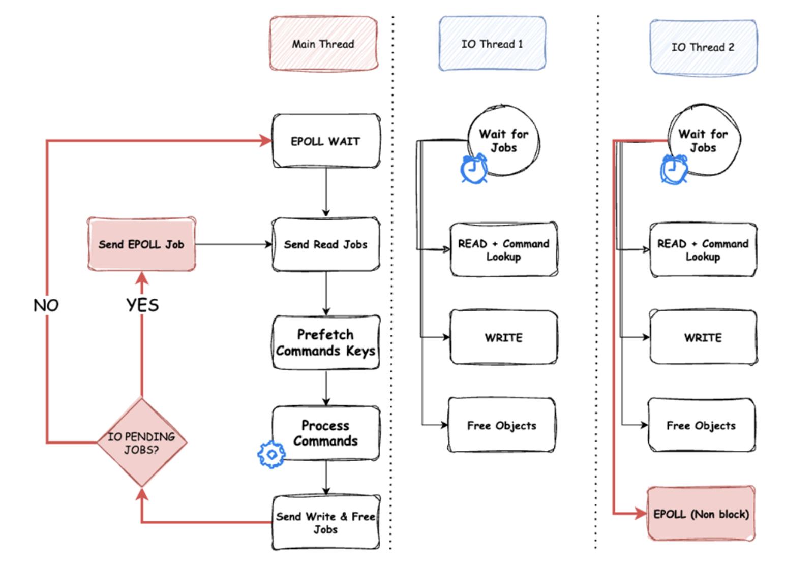

+++
date = '2025-06-30T12:00:00-07:00'
draft = false
title = 'Redis vs Valkey'
+++
### Redis vs Valkey
### Background
过去一年各大云服务厂商在Redis换license之后，力推使用Valkey代替Redis作为kv内存数据库的使用方案。Valkey作为Redis 7.2.4 fork，不仅兼容redis各个语言的client库，也解决了Redis目前存在的单线程性能瓶颈和内存占用问题，不禁好奇其性能有多大提升，周末找了个时间进行了性能benchmark。

关于Valkey相较于Redis的改进，主要有两个，一个是io-thread, 另一个是数据结构内存优化, 可以参见以下两篇blog post:

- [Unlock 1m rps - part1](https://valkey.io/blog/unlock-one-million-rps/)
- [Unlock 1m rps - part2](https://valkey.io/blog/unlock-one-million-rps-part2/)

其中io-thread是最重要的改进，支持了Epoll job并行执行，建议配置
```
io-thread=<核心数>
events-per-io-thread=2 (default)
io-threads-do-reads=yes (default)
```


另外，需要注意Redis 7.2.4 之后引入的 feature 如 time series, vector db, valkey 可能没有很好的支持，参考Redis方面的[post](https://redis.io/blog/what-is-valkey/)  
Valkey实验版本支持了RDMA，不经过OS和CPU直接进行数据读取，继续提升性能，参考以下两篇: 
- [RDMA official document](https://valkey.io/topics/RDMA/)
- [RDMA github pull request](https://github.com/valkey-io/valkey/pull/477#issuecomment-2119785640)

### Method
```
instance: RaspberryPi 5b, 4vcore 8GiB
kennel: linux 6.14.0-1005-raspi
redis: 8.0.0
valkey: 8.1.0
command: `redis-benchmark -h <host>`
client number: 50 (default)
request number: 100000 (default)

valkey单核: io-threads=1
valkey多核: io-threads=4
```

### Result
Redis 8.0
| test                               | rps      | avg_latency_ms | min_latency_ms | p50_latency_ms | p95_latency_ms | p99_latency_ms | max_latency_ms |
|------------------------------------|----------|----------------|----------------|----------------|----------------|----------------|----------------|
| PING_INLINE                        | 22031.29 | 1.906          | 0.664          | 2.055          | 2.607          | 2.815          | 4.767          |
| PING_MBULK                         | 28935.18 | 1.311          | 0.64           | 0.919          | 2.239          | 2.487          | 4.415          |
| SET                                | 30969.34 | 1.583          | 0.784          | 1.567          | 1.839          | 1.935          | 3.175          |
| GET                                | 31486.14 | 1.557          | 0.736          | 1.543          | 1.799          | 1.895          | 3.615          |
| INCR                               | 31240.24 | 1.437          | 0.568          | 1.423          | 1.871          | 1.983          | 2.991          |
| LPUSH                              | 30778.7  | 1.477          | 0.624          | 1.463          | 1.895          | 2.015          | 3.511          |
| RPUSH                              | 31084.86 | 1.461          | 0.504          | 1.439          | 1.871          | 1.999          | 4.431          |
| LPOP                               | 31328.32 | 1.478          | 0.448          | 1.423          | 1.823          | 1.927          | 3.079          |
| RPOP                               | 31377.47 | 1.497          | 0.536          | 1.455          | 1.831          | 2.023          | 5.439          |
| SADD                               | 32123.36 | 1.339          | 0.552          | 1.399          | 1.807          | 1.959          | 2.599          |
| HSET                               | 31210.99 | 1.48           | 0.832          | 1.455          | 1.855          | 1.991          | 3.959          |
| SPOP                               | 31908.1  | 1.458          | 0.44           | 1.431          | 1.783          | 1.927          | 4.159          |
| ZADD                               | 31220.73 | 1.475          | 0.84           | 1.423          | 1.839          | 1.959          | 2.679          |
| ZPOPMIN                            | 32765.4  | 1.48           | 0.576          | 1.463          | 1.735          | 1.855          | 3.671          |
| LPUSH (needed to benchmark LRANGE) | 31113.88 | 1.485          | 0.608          | 1.439          | 1.855          | 2.007          | 4.287          |
| LRANGE_100 (first 100 elements)    | 25906.74 | 1.189          | 0.504          | 1.167          | 1.479          | 1.743          | 3.215          |
| LRANGE_300 (first 300 elements)    | 16460.91 | 2.172          | 1.072          | 1.999          | 3.487          | 3.791          | 6.567          |
| LRANGE_500 (first 500 elements)    | 12318.3  | 2.195          | 0.664          | 2.167          | 2.415          | 2.847          | 6.247          |
| LRANGE_600 (first 600 elements)    | 10948.11 | 2.544          | 1.784          | 2.463          | 3.039          | 3.999          | 7.655          |
| MSET (10 keys)                     | 27639.58 | 1.787          | 1.096          | 1.719          | 2.175          | 2.423          | 3.831          |

Valkey 8.1, 单核
| test                               | rps      | avg_latency_ms | min_latency_ms | p50_latency_ms | p95_latency_ms | p99_latency_ms | max_latency_ms |
|------------------------------------|----------|----------------|----------------|----------------|----------------|----------------|----------------|
| PING_INLINE                        | 26910.66 | 1.224          | 0.632          | 1.159          | 1.655          | 2.391          | 4.863          |
| PING_MBULK                         | 24125.45 | 1.533          | 0.6            | 1.375          | 2.335          | 2.695          | 4.615          |
| SET                                | 27019.72 | 1.817          | 0.464          | 1.855          | 2.143          | 2.271          | 3.727          |
| GET                                | 31655.59 | 1.456          | 0.704          | 1.423          | 1.807          | 1.927          | 3.447          |
| INCR                               | 31625.55 | 1.47           | 0.776          | 1.463          | 1.823          | 1.951          | 3.007          |
| LPUSH                              | 31104.2  | 1.479          | 0.64           | 1.463          | 1.863          | 1.983          | 3.031          |
| RPUSH                              | 32435.94 | 1.493          | 0.584          | 1.479          | 1.767          | 1.903          | 3.719          |
| LPOP                               | 31250    | 1.486          | 0.584          | 1.479          | 1.863          | 2.007          | 3.527          |
| RPOP                               | 30684.26 | 1.407          | 0.4            | 1.391          | 1.935          | 2.039          | 3.023          |
| SADD                               | 31201.25 | 1.264          | 0.48           | 1.311          | 1.759          | 1.911          | 3.911          |
| HSET                               | 31565.66 | 1.476          | 0.608          | 1.431          | 1.807          | 1.927          | 3.287          |
| SPOP                               | 31938.68 | 1.45           | 0.576          | 1.415          | 1.783          | 1.895          | 3.039          |
| ZADD                               | 30703.1  | 1.491          | 0.648          | 1.463          | 1.903          | 2.063          | 4.511          |
| ZPOPMIN                            | 32164.68 | 1.486          | 0.544          | 1.471          | 1.775          | 1.935          | 3.191          |
| LPUSH (needed to benchmark LRANGE) | 31525.85 | 1.491          | 0.6            | 1.479          | 1.831          | 1.983          | 3.215          |
| LRANGE_100 (first 100 elements)    | 26595.74 | 1.403          | 0.464          | 1.367          | 2.079          | 2.263          | 3.751          |
| LRANGE_300 (first 300 elements)    | 12635.83 | 2.09           | 1.248          | 2.079          | 2.295          | 2.431          | 8.663          |
| LRANGE_500 (first 500 elements)    | 9476.88  | 2.751          | 1.592          | 2.743          | 2.991          | 3.151          | 11.335         |
| LRANGE_600 (first 600 elements)    | 8437.39  | 3.079          | 1.664          | 3.071          | 3.519          | 3.735          | 12.471         |
| MSET (10 keys)                     | 35063.11 | 1.286          | 0.576          | 1.255          | 1.735          | 1.815          | 2.543          |

Valkey 8.1, 多核
| test                               | rps      | avg_latency_ms | min_latency_ms | p50_latency_ms | p95_latency_ms | p99_latency_ms | max_latency_ms |
|------------------------------------|----------|----------------|----------------|----------------|----------------|----------------|----------------|
| PING_INLINE                        | 35637.92 | 1.023          | 0.24           | 0.839          | 1.351          | 4.695          | 31.135         |
| PING_MBULK                         | 38358.27 | 1.072          | 0.232          | 0.863          | 1.631          | 5.783          | 26.095         |
| SET                                | 44404.97 | 0.666          | 0.24           | 0.655          | 0.719          | 1.383          | 2.975          |
| GET                                | 50226.02 | 0.636          | 0.184          | 0.615          | 0.767          | 1.031          | 13.511         |
| INCR                               | 50100.20 | 0.676          | 0.192          | 0.599          | 0.767          | 2.287          | 19.855         |
| LPUSH                              | 51975.05 | 0.632          | 0.232          | 0.599          | 0.711          | 1.071          | 31.135         |
| RPUSH                              | 55218.11 | 0.577          | 0.232          | 0.575          | 0.671          | 0.791          | 1.695          |
| LPOP                               | 57570.52 | 0.581          | 0.192          | 0.567          | 0.703          | 0.967          | 2.039          |
| RPOP                               | 54734.54 | 0.637          | 0.184          | 0.567          | 0.735          | 3.287          | 12.919         |
| SADD                               | 57736.72 | 0.576          | 0.208          | 0.567          | 0.687          | 0.871          | 3.975          |
| HSET                               | 53191.49 | 0.658          | 0.168          | 0.567          | 0.807          | 2.919          | 19.791         |
| SPOP                               | 57736.72 | 0.574          | 0.192          | 0.567          | 0.695          | 0.887          | 1.663          |
| ZADD                               | 57836.90 | 0.580          | 0.24           | 0.575          | 0.695          | 0.879          | 2.855          |
| ZPOPMIN                            | 57770.08 | 0.573          | 0.232          | 0.567          | 0.687          | 0.855          | 1.679          |
| LPUSH (needed to benchmark LRANGE) | 56561.09 | 0.593          | 0.248          | 0.567          | 0.695          | 1.023          | 18.127         |
| LRANGE_100 (first 100 elements)    | 38417.21 | 0.840          | 0.296          | 0.735          | 0.911          | 3.759          | 21.263         |
| LRANGE_300 (first 300 elements)    | 18491.12 | 1.532          | 0.536          | 1.511          | 1.663          | 2.247          | 7.679          |
| LRANGE_500 (first 500 elements)    | 12712.94 | 2.130          | 0.352          | 2.095          | 2.287          | 3.407          | 11.007         |
| LRANGE_600 (first 600 elements)    | 11059.50 | 2.399          | 0.672          | 2.367          | 2.567          | 2.863          | 22.751         |
| MSET (10 keys)                     | 57240.98 | 0.694          | 0.2            | 0.687          | 0.855          | 1.047          | 4.727          |

Valkey/Redis, 单核
| test                               | rps      | avg_latency_ms | min_latency_ms | p50_latency_ms | p95_latency_ms | p99_latency_ms | max_latency_ms |
|------------------------------------|----------|----------------|----------------|----------------|----------------|----------------|----------------|
| PING_INLINE                        | 22.15%   | -35.78%        | -4.82%         | -43.60%        | -36.52%        | -15.06%        | 2.01%          |
| PING_MBULK                         | -16.62%  | 16.93%         | -6.25%         | 49.62%         | 4.29%          | 8.36%          | 4.53%          |
| SET                                | -12.75%  | 14.78%         | -40.82%        | 18.38%         | 16.53%         | 17.36%         | 17.39%         |
| GET                                | 0.54%    | -6.49%         | -4.35%         | -7.78%         | 0.44%          | 1.69%          | -4.65%         |
| INCR                               | 1.23%    | 2.30%          | 36.62%         | 2.81%          | -2.57%         | -1.61%         | 0.53%          |
| LPUSH                              | 1.06%    | 0.14%          | 2.56%          | 0.00%          | -1.69%         | -1.59%         | -13.67%        |
| RPUSH                              | 4.35%    | 2.19%          | 15.87%         | 2.78%          | -5.56%         | -4.80%         | -16.07%        |
| LPOP                               | -0.25%   | 0.54%          | 30.36%         | 3.94%          | 2.19%          | 4.15%          | 14.55%         |
| RPOP                               | -2.21%   | -6.01%         | -25.37%        | -4.40%         | 5.68%          | 0.79%          | -44.42%        |
| SADD                               | -2.87%   | -5.60%         | -13.04%        | -6.29%         | -2.66%         | -2.45%         | 50.48%         |
| HSET                               | 1.14%    | -0.27%         | -26.92%        | -1.65%         | -2.59%         | -3.21%         | -16.97%        |
| SPOP                               | 0.10%    | -0.55%         | 30.91%         | -1.12%         | 0.00%          | -1.66%         | -26.93%        |
| ZADD                               | -1.66%   | 1.08%          | -22.86%        | 2.81%          | 3.48%          | 5.31%          | 68.38%         |
| ZPOPMIN                            | -1.83%   | 0.41%          | -5.56%         | 0.55%          | 2.31%          | 4.31%          | -13.08%        |
| LPUSH (needed to benchmark LRANGE) | 1.32%    | 0.40%          | -1.32%         | 2.78%          | -1.29%         | -1.20%         | -25.01%        |
| LRANGE_100 (first 100 elements)    | 2.66%    | 18.00%         | -7.94%         | 17.14%         | 40.57%         | 29.83%         | 16.67%         |
| LRANGE_300 (first 300 elements)    | -23.24%  | -3.78%         | 16.42%         | 4.00%          | -34.18%        | -35.87%        | 31.92%         |
| LRANGE_500 (first 500 elements)    | -23.07%  | 25.33%         | 139.76%        | 26.58%         | 23.85%         | 10.68%         | 81.45%         |
| LRANGE_600 (first 600 elements)    | -22.93%  | 21.03%         | -6.73%         | 24.69%         | 15.79%         | -6.60%         | 62.91%         |
| MSET (10 keys)                     | 26.86%   | -28.04%        | -47.45%        | -26.99%        | -20.23%        | -25.09%        | -33.62%        |

Valkey/Redis, 多核
| test                               | rps      | avg_latency_ms | min_latency_ms | p50_latency_ms | p95_latency_ms | p99_latency_ms | max_latency_ms |
|------------------------------------|----------|----------------|----------------|----------------|----------------|----------------|----------------|
| PING_INLINE                        | 61.76%   | 86.31%         | 176.67%        | 144.93%        | 92.97%         | -40.04%        | -84.69%        |
| PING_MBULK                         | 32.57%   | 22.29%         | 175.86%        | 6.49%          | 37.28%         | -56.99%        | -83.08%        |
| SET                                | 43.38%   | 137.69%        | 226.67%        | 139.24%        | 155.77%        | 39.91%         | 6.72%          |
| GET                                | 59.52%   | 144.81%        | 300.00%        | 150.89%        | 134.55%        | 83.80%         | -73.24%        |
| INCR                               | 60.37%   | 112.57%        | 195.83%        | 137.56%        | 143.94%        | -13.29%        | -84.94%        |
| LPUSH                              | 68.87%   | 133.70%        | 168.97%        | 144.24%        | 166.53%        | 88.14%         | -88.72%        |
| RPUSH                              | 77.64%   | 153.21%        | 117.24%        | 150.26%        | 178.84%        | 152.72%        | 161.42%        |
| LPOP                               | 83.77%   | 154.39%        | 133.33%        | 150.97%        | 159.32%        | 99.28%         | 51.01%         |
| RPOP                               | 74.44%   | 135.01%        | 191.30%        | 156.61%        | 149.12%        | -38.45%        | -57.90%        |
| SADD                               | 79.73%   | 132.47%        | 165.38%        | 146.74%        | 163.03%        | 124.91%        | -34.62%        |
| HSET                               | 70.43%   | 124.92%        | 395.24%        | 156.61%        | 129.86%        | -31.79%        | -80.00%        |
| SPOP                               | 80.95%   | 154.01%        | 129.17%        | 152.38%        | 156.55%        | 117.25%        | 150.09%        |
| ZADD                               | 85.25%   | 154.31%        | 250.00%        | 147.48%        | 164.60%        | 122.87%        | -6.16%         |
| ZPOPMIN                            | 76.31%   | 158.29%        | 148.28%        | 158.02%        | 152.55%        | 116.96%        | 118.64%        |
| LPUSH (needed to benchmark LRANGE) | 81.79%   | 150.42%        | 145.16%        | 153.79%        | 166.91%        | 96.19%         | -76.35%        |
| LRANGE_100 (first 100 elements)    | 48.29%   | 41.55%         | 70.27%         | 58.78%         | 62.35%         | -53.63%        | -84.88%        |
| LRANGE_300 (first 300 elements)    | 12.33%   | 41.78%         | 100.00%        | 32.30%         | 109.68%        | 68.71%         | -14.48%        |
| LRANGE_500 (first 500 elements)    | 3.20%    | 3.05%          | 88.64%         | 3.44%          | 5.60%          | -16.44%        | -43.25%        |
| LRANGE_600 (first 600 elements)    | 1.02%    | 6.04%          | 165.48%        | 4.06%          | 18.39%         | 39.68%         | -66.35%        |
| MSET (10 keys)                     | 107.10%  | 157.49%        | 448.00%        | 150.22%        | 154.39%        | 131.42%        | -18.95%        |

### Conclusion
从rps/latency指标来看，大多数常用指令（GET SET L/RPUSH L/RPOP）单核性能大差不差，多核性能提升巨大，主要提升都由valkey独有的io-thread架构带来，高并发场景会有更好的支持。  

另外注意到Valkey的LRANGE性能明显不如Redis，其本身也是一个slow command，使用需要注意。Redis 7.2.4之后的新特性如vector storage, 

### Reference
- [Valkey multithreading - github issue](https://github.com/orgs/valkey-io/discussions/1019)
- [Unlock 1m rps - part1](https://valkey.io/blog/unlock-one-million-rps/)
- [Unlock 1m rps - part2](https://valkey.io/blog/unlock-one-million-rps-part2/)
- [RDMA official document](https://valkey.io/topics/RDMA/)
- [RDMA github pull request](https://github.com/valkey-io/valkey/pull/477#issuecomment-2119785640)
- [Valkey vs Redis benchmark](https://www.youtube.com/watch?v=9hDvWVJtljE)
