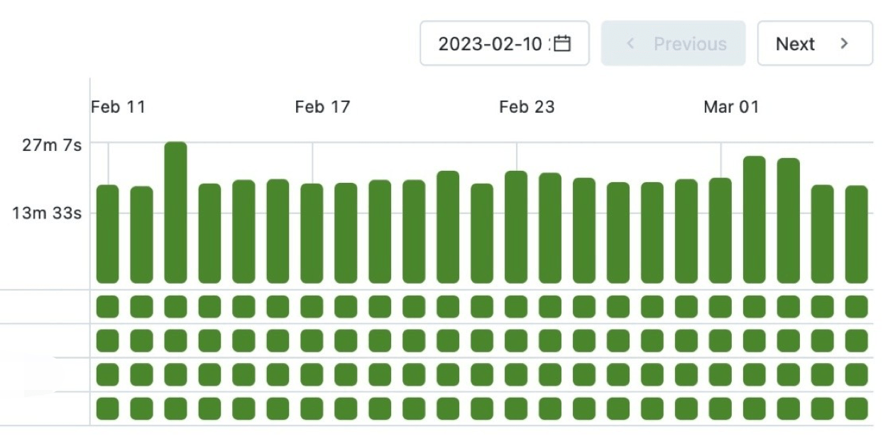
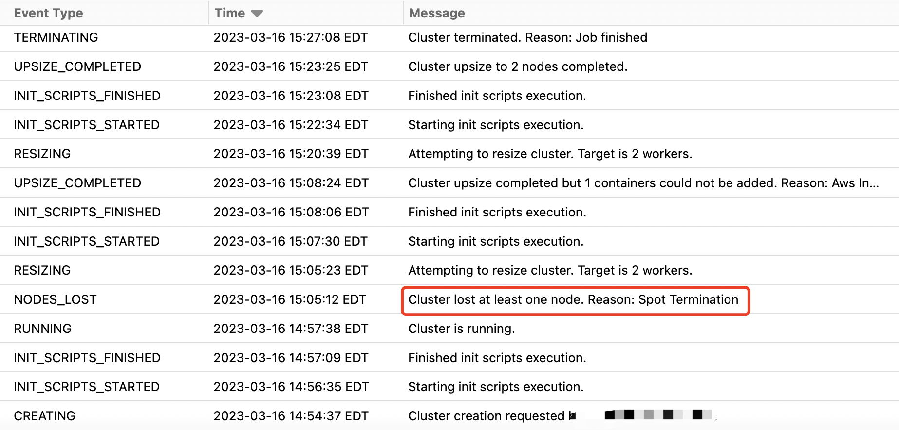
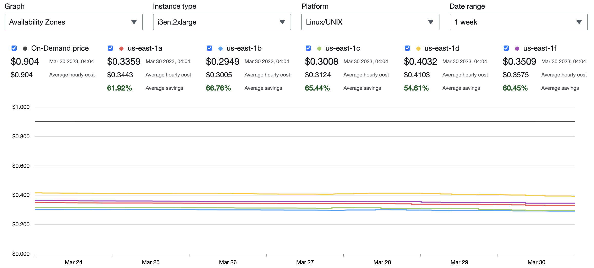
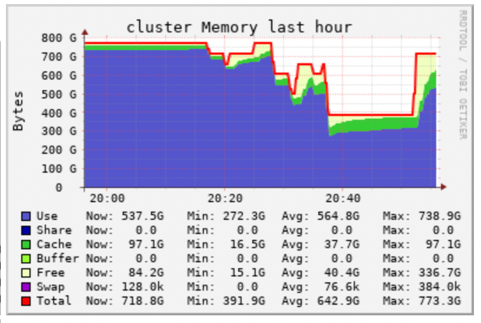

### Observation

Spark Job runtime is not stable



As what can see from the screenshot, the pipeline (spark job) runtime is not quite stable. However, the pipeline deals with almost fixed amount data everyday, the runtime should not be so quite unstable like this.

Besides, the pipeline runtime is quite stable at around 15min before migration to databricks.

### Analysis

1. Spark driver log

    ```
    23/03/16 19:04:26 INFO StandaloneAppClient$ClientEndpoint: Executor updated: app-20230316185728-0000/2 is now EXITED (Worker shutting down)
    23/03/16 19:04:26 WARN DLTDebugger: Failed to talk to RPC endpoint: dlt-debugger
    org.apache.spark.SparkException: Exception thrown in awaitResult: 
        at org.apache.spark.util.ThreadUtils$.awaitResult(ThreadUtils.scala:454)
        at org.apache.spark.rpc.RpcTimeout.awaitResult(RpcTimeout.scala:75)
        at org.apache.spark.rpc.RpcEnv.setupEndpointRefByURI(RpcEnv.scala:102)
        at org.apache.spark.rpc.RpcEnv.setupEndpointRef(RpcEnv.scala:110)
        at org.apache.spark.util.RpcUtils$.makeDriverRef(RpcUtils.scala:46)
        at org.apache.spark.debugger.DLTDebugger$.liftedTree1$1(DLTDebugger.scala:258)
        at org.apache.spark.debugger.DLTDebugger$.getDebuggerRef(DLTDebugger.scala:257)
        at org.apache.spark.debugger.DLTDebugger$.report(DLTDebugger.scala:341)
        at org.apache.spark.deploy.client.StandaloneAppClient$ClientEndpoint$$anonfun$receive$1.$anonfun$applyOrElse$5(StandaloneAppClient.scala:188)
        at scala.runtime.java8.JFunction1$mcVI$sp.apply(JFunction1$mcVI$sp.java:23)
        at scala.Option.foreach(Option.scala:407)
        at org.apache.spark.deploy.client.StandaloneAppClient$ClientEndpoint$$anonfun$receive$1.applyOrElse(StandaloneAppClient.scala:184)
        at org.apache.spark.rpc.netty.Inbox.$anonfun$process$1(Inbox.scala:115)
        at org.apache.spark.rpc.netty.Inbox.safelyCall(Inbox.scala:213)
        at org.apache.spark.rpc.netty.Inbox.process(Inbox.scala:100)
        at org.apache.spark.rpc.netty.MessageLoop.org$apache$spark$rpc$netty$MessageLoop$$receiveLoop(MessageLoop.scala:75)
        at org.apache.spark.rpc.netty.MessageLoop$$anon$1.run(MessageLoop.scala:41)
        at org.apache.spark.util.threads.SparkThreadLocalCapturingRunnable.$anonfun$run$1(SparkThreadLocalForwardingThreadPoolExecutor.scala:110)
        at scala.runtime.java8.JFunction0$mcV$sp.apply(JFunction0$mcV$sp.java:23)
        at com.databricks.unity.UCSEphemeralState$Handle.runWith(UCSEphemeralState.scala:41)
        at org.apache.spark.util.threads.SparkThreadLocalCapturingHelper.runWithCaptured(SparkThreadLocalForwardingThreadPoolExecutor.scala:74)
        at org.apache.spark.util.threads.SparkThreadLocalCapturingHelper.runWithCaptured$(SparkThreadLocalForwardingThreadPoolExecutor.scala:60)
        at org.apache.spark.util.threads.SparkThreadLocalCapturingRunnable.runWithCaptured(SparkThreadLocalForwardingThreadPoolExecutor.scala:107)
        at org.apache.spark.util.threads.SparkThreadLocalCapturingRunnable.run(SparkThreadLocalForwardingThreadPoolExecutor.scala:110)
        at java.util.concurrent.ThreadPoolExecutor.runWorker(ThreadPoolExecutor.java:1149)
        at java.util.concurrent.ThreadPoolExecutor$Worker.run(ThreadPoolExecutor.java:624)
        at java.lang.Thread.run(Thread.java:750)
    Caused by: org.apache.spark.rpc.RpcEndpointNotFoundException: Cannot find endpoint: spark://dlt-debugger@10.241.97.77:45081
        at org.apache.spark.rpc.netty.NettyRpcEnv.$anonfun$asyncSetupEndpointRefByURI$1(NettyRpcEnv.scala:175)
        at org.apache.spark.rpc.netty.NettyRpcEnv.$anonfun$asyncSetupEndpointRefByURI$1$adapted(NettyRpcEnv.scala:171)
        at scala.concurrent.Future.$anonfun$flatMap$1(Future.scala:307)
        at scala.concurrent.impl.Promise.$anonfun$transformWith$1(Promise.scala:41)
        at scala.concurrent.impl.CallbackRunnable.run(Promise.scala:64)
        at org.apache.spark.util.ThreadUtils$$anon$1.execute(ThreadUtils.scala:105)
        at scala.concurrent.impl.ExecutionContextImpl$$anon$4.execute(ExecutionContextImpl.scala:138)
        at scala.concurrent.impl.CallbackRunnable.executeWithValue(Promise.scala:72)
        at scala.concurrent.impl.Promise$DefaultPromise.dispatchOrAddCallback(Promise.scala:316)
        at scala.concurrent.impl.Promise$DefaultPromise.onComplete(Promise.scala:307)
        at scala.concurrent.impl.Promise.transformWith(Promise.scala:40)
        at scala.concurrent.impl.Promise.transformWith$(Promise.scala:38)
        at scala.concurrent.impl.Promise$DefaultPromise.transformWith(Promise.scala:187)
        at scala.concurrent.Future.flatMap(Future.scala:306)
        at scala.concurrent.Future.flatMap$(Future.scala:306)
        at scala.concurrent.impl.Promise$DefaultPromise.flatMap(Promise.scala:187)
        at org.apache.spark.rpc.netty.NettyRpcEnv.asyncSetupEndpointRefByURI(NettyRpcEnv.scala:177)
        ... 25 more
    23/03/16 19:04:26 INFO StandaloneSchedulerBackend: Executor app-20230316185728-0000/2 removed: Worker shutting down
    23/03/16 19:04:26 INFO StandaloneAppClient$ClientEndpoint: Executor added: app-20230316185728-0000/4 on worker-20230316185728-10.241.99.108-43045 (10.241.99.108:43045) with 4 core(s)
    23/03/16 19:04:26 INFO StandaloneSchedulerBackend: Granted executor ID app-20230316185728-0000/4 on hostPort 10.241.99.108:43045 with 4 core(s), 12.0 GiB RAM
    23/03/16 19:04:26 INFO StandaloneAppClient$ClientEndpoint: Executor updated: app-20230316185728-0000/4 is now FAILED (java.lang.IllegalStateException: Shutdown hooks cannot be modified during shutdown.)
    23/03/16 19:04:26 INFO StandaloneSchedulerBackend: Executor app-20230316185728-0000/4 removed: java.lang.IllegalStateException: Shutdown hooks cannot be modified during shutdown.
    ```
    Spark log4j-active log shows that there’s excutor exit. But no reason for that.

2. Spark cluster event log  

There’re spot instance lost event in the cluster event log. The reason is spot termination.



3. Discuss with team  

    However, after communicating with my colleague, what I’ve learned is:

    - Spot instance can really save EC2 cost a lot. Use the `i3en.2xlarge` instance we use as worker node as an example, spot instance price is 60% lower than on-demand.

    - Spot instance can also be used in production for critical pipelines, as long as your pipeline is not sensitive to data lost and does not include heavy shuffle and persisted dataframes.
    

    
    - Select a right type instance is also important. Different types of spot instance have different interruption rate.
    If your spark cluster includes heavy shuffle, big persisted dataframe or runtime requirement, spot instance may not be a good choice for these use cases. Termination in the middle may cause data lost, refetch and recalculation.
    
    - We have another pipeline which persists several TB data in the disk and spot termination cause part of the data to be lost and have to take hours to re-download and re-calculate, which drives us crazy.
    


    - Besides, be careful if you’re doing performance tuning experiments! Spot termination will cause baseline drift and drive you to the wrong conclusion.

### Learned

1. Take the impact of spot termination into consideration. Especially when your organization turn it on by default but you’re not aware of it. If you want to build pipelines on spot instances, you have to take its impact into consideration.  

2. Spot instance can really save a lot of cost, whether to use it or not depends on your use case. If you have decided to use it, choose the right spot instance type with lowest termination rate.

### Reference
1. [AWS wiki spot termination](https://docs.aws.amazon.com/AWSEC2/latest/UserGuide/spot-interruptions.html)
2. [AWS wiki termination rate](https://aws.amazon.com/ec2/spot/instance-advisor/)
