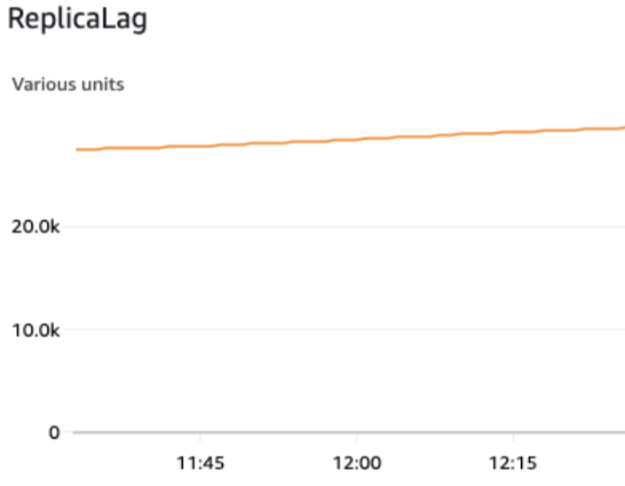
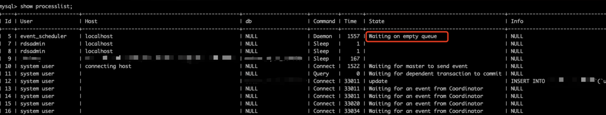
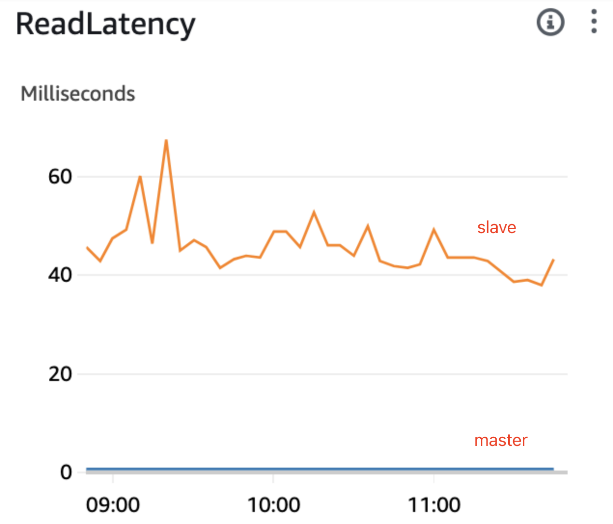
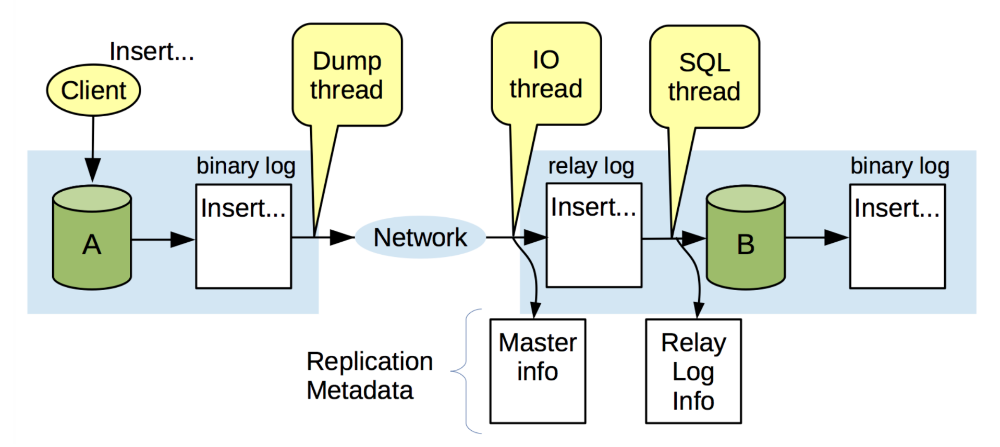
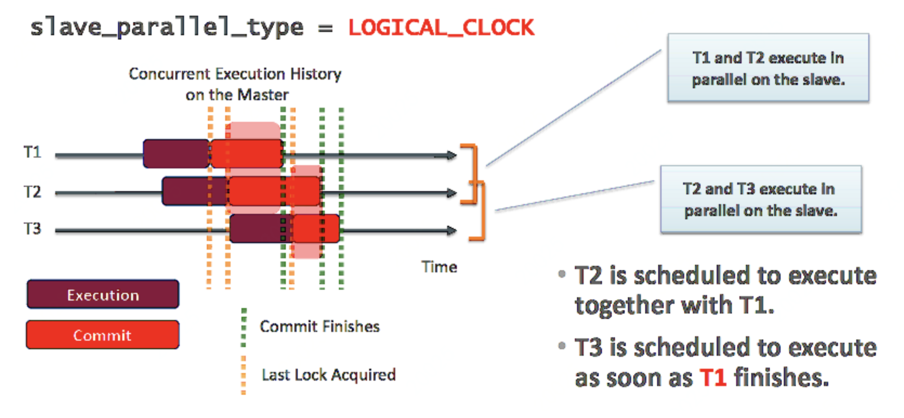
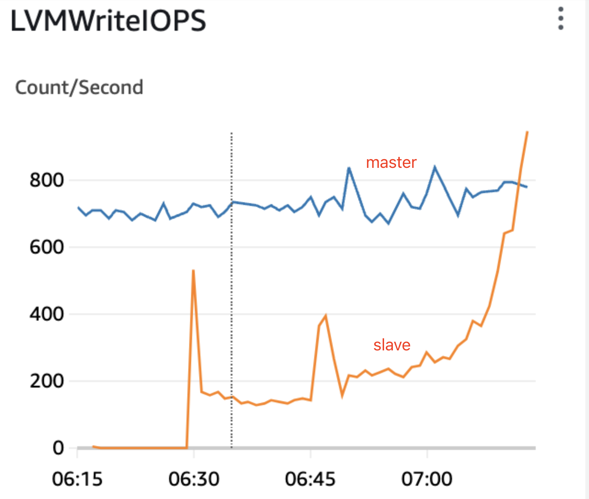
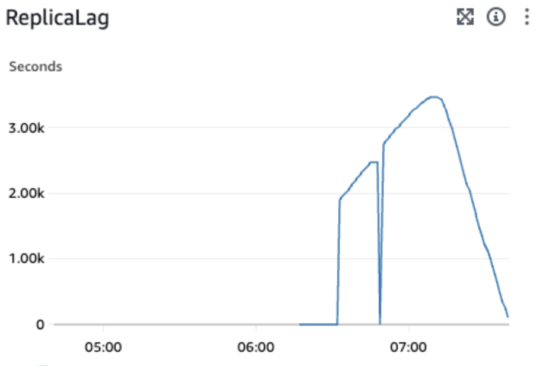

+++
date = '2024-04-09T12:00:00-07:00'
draft = false
title = 'Why MySQL replication is lagging'
+++
### Background

Our team planned to upgrade one of our MySQL instance from 8.0.28 to 8.0.36 through AWS RDS blue/green deployment. The whole process includes 4 steps:

1. set up a new MySQL 8.0.36 instance (slave), recover data from snapshot
2. new MySQL instance (8.0.36) subscribe to old MySQL instance (8.0.28)
3. once there’s no replication lags, do switch-over. The downtime is usually < 10s.
4. check online service. shutdown old instance after checking everything is good.

However, We stuck at step 2. The replication lag kept growing and it seemed never to decrease, which made it impossible to start switch-over.



### Environment
- Database (master)
    ```
    MySQL version: 8.0.28
    Storage size: 10TiB
    binlog_format MIXED
    binlog_group_commit_sync_delay 0
    binlog_order_commits ON
    binlog_row_image FULL
    binlog_row_metadata MINIMAL
    innodb_buffer_pool_size 49392123904
    sync_binlog 1
    ```

- Database (slave)
    ```
    MySQL version: 8.0.36
    Storage size: 10TiB
    innodb_buffer_pool_size 49392123904
    innodb_flush_log_at_trx_commit 1
    slave_allow_batching ON
    slave_parallel_type LOGICAL_CLOCK
    slave_parallel_workers 8
    slave_preserve_commit_order ON
    sync_binlog 1
    ```

### Observation
Firstly, after running `show processlist`, we observed that there were only 1 out of 8 replication workers is running, other workers were either “waiting for an event from Coordinator” or “waiting for dependent transaction to commit”.



Next, after keeping running `show slave status`, we observed that the slave was not stuck at a transaction (or a binlog position), it just ran slower and could’t catch up with master.


Besides, we also noticed that write IOPS of slave is much lower than master, and the read latency of slave is much higher than master.



There’re 2 questions to answer after having these observations:
1. Why can’t slave replication workers run SQL in parallel?
2. Is there anything makes replication process so slow? Any long transactions or slow SQLs?

### Why can’t slave replication workers run SQL in parallel



According to MySQL replication architecture, the slave use two kinds of threads to accomplish replication, IO thread and SQL thread. If multi-thread replication is enabled, the SQL thread will turn into a coordinator thread and it distribute SQL for replication workers to execute. We can also see the status of IO thread and SQL thread through `SHOW SLAVE STATUS` and check `Slave_IO_Running` and `Slave_SQL_Running`.



In our case, we use logical clock replication, thus multi-threaded replication (MTR) has already been used. Transactions with overlapping execution period can be executed concurrently on slave, such as T1 and T2, or T2 and T3. The reason is that transactions with overlapping execution period are on the same database version, thus they are not dependent with each other. However, database cannot tell whether transactions without overlapping execution period had dependency relationship, T1 and T3 cannot be executed concurrently on slave.

A easier way to check the concurrency potential is `last_committed` in binlog. Query with same `last_committed` can be executed concurrently.

```
mysqlbinlog \
--read-from-remote-server \
--host=<YOUR HOST> \
--port=3306  \
--user <YOUR USER> \
--password \
--raw \
--verbose \
--result-file=<LOCAL PATH> \
<BINLOG FILE NAME>
```

However, we notice that from binlog most of the queries cannot be executed concurrently, which means that it’s normal to have most of the replication workers with “waiting for an event from Coordinator” status.

```
last_committed=11062 sequence_number=11063
last_committed=11063 sequence_number=11064
last_committed=11064 sequence_number=11065
last_committed=11065 sequence_number=11066
last_committed=11066 sequence_number=11067
last_committed=11067 sequence_number=11068
last_committed=11068 sequence_number=11069
last_committed=11069 sequence_number=11070
last_committed=11069 sequence_number=11071
last_committed=11071 sequence_number=11072
last_committed=11072 sequence_number=11073
last_committed=11073 sequence_number=11074
last_committed=11074 sequence_number=11075
last_committed=11075 sequence_number=11076
last_committed=11076 sequence_number=11077
last_committed=11077 sequence_number=11078
last_committed=11078 sequence_number=11079
last_committed=11079 sequence_number=11080
```

I think the reason behind that is our write QPS is not high. There’re not a lot of concurrent transactions, which results in that last_committed in binlog is sparsely distributed.

### Is there anything makes replication process so slow? Any long transactions or slow SQLs?

Since the concurrency of replication worker cannot be improved, we had to move our focus to transactions and SQL.

```
SELECT thr.processlist_id AS mysql_thread_id,
       concat(PROCESSLIST_USER,'@',PROCESSLIST_HOST) User,
       Command,
       FORMAT_PICO_TIME(trx.timer_wait) AS trx_duration,
       current_statement as `latest_statement`
  FROM performance_schema.events_transactions_current trx
  INNER JOIN performance_schema.threads thr USING (thread_id)
  LEFT JOIN sys.processlist p ON p.thd_id=thread_id
 WHERE thr.processlist_id IS NOT NULL 
   AND PROCESSLIST_USER IS NOT NULL 
   AND trx.state = 'ACTIVE'
 GROUP BY thread_id, timer_wait 
 ORDER BY TIMER_WAIT DESC LIMIT 10;
```

We use the SQL query above to check whether there’re long transactions. However, the result looks good, no blocking transaction found.

Next we wanted to check whether there’re slow queries. No record found in slow query log, we had to run same query on master and slave to compare its runtime. We found that following query took only <10ms in master, but around 500ms in slave, user_id + device_id is indexed:

```
SELECT * FROM <table> WHERE user_id = <XXX> AND device_id = <XXX>
```

That looked wierd but reminded me of the fact that our slave MySQL innodb buffer pool didn’t get warmed up. Thus I took a look at innodb buffer pool hit rate using `show innodb status`:

```
---BUFFER POOL 0
Buffer pool size   376796
Free buffers       314104
Database pages     62627
Old database pages 23138
Modified db pages  11683
Pending reads      1
Pending writes: LRU 0, flush list 0, single page 0
Pages made young 111, not young 0
0.00 youngs/s, 0.00 non-youngs/s
Pages read 62064, created 562, written 3023
311.52 reads/s, 0.00 creates/s, 1.11 writes/s
Buffer pool hit rate 384 / 1000, young-making rate 0 / 1000 not 0 / 1000
Pages read ahead 0.00/s, evicted without access 0.00/s, Random read ahead 0.00/s
LRU len: 62627, unzip_LRU len: 0
I/O sum[0]:cur[476], unzip sum[0]:cur[0]
```

After warming up by loading several hot tables to innodb, it becomes much better (hit rate 38.4%—>97.6%):

```
---BUFFER POOL 0
Buffer pool size   376793
Free buffers       96773
Database pages     279961
Old database pages 103364
Modified db pages  11146
Pending reads      0
Pending writes: LRU 0, flush list 0, single page 0
Pages made young 98, not young 0
0.18 youngs/s, 0.00 non-youngs/s
Pages read 279359, created 602, written 1993
12.70 reads/s, 0.88 creates/s, 3.18 writes/s
Buffer pool hit rate 976 / 1000, young-making rate 0 / 1000 not 0 / 1000
Pages read ahead 0.00/s, evicted without access 0.00/s, Random read ahead 0.00/s
LRU len: 279961, unzip_LRU len: 0
I/O sum[0]:cur[49], unzip sum[0]:cur[0]
```

However, it still doesn’t solve the problem. We notice that the lag still doesn’t decrease. Now the slow queries are on the rest of the tables in the database. These tables take around 10T, which of most are cold data. However, it’s impossible to warm up these data to 48GiB buffer pool. We have to stop INSERT/UPDATE/DELETE queries on these tables on master for a period of time.

Once again we create a new blue/green deployment, a new slave instance, warming up the hot tables, and we finally see the lag to decrease. And switch-over was successfully carried out.




Warm up queries:

```
SELECT count(*) FROM <TABLE>;
SELECT count(distinct index_id) FROM <TABLE>;
```

### Root Cause

1. Miss to warm up MySQL innodb buffer pool —> slow queries —> lag too big

### Reference

- [MySQL复制延迟优化的方法论](https://keithlan.github.io/2018/08/01/mysql_replication_lag_ideas)
- [What to Look for if Your MySQL Replication is Lagging](https://severalnines.com/blog/what-look-if-your-mysql-replication-lagging/#:~:text=The%20most%20certain%20cases%20in,your%20MySQL%20database%20to%20delay)
- [MySQL Replication–多线程复制MTS](https://www.cnblogs.com/gaogao67/p/11151621.html)
- [A Dive Into MySQL Multi-Threaded Replication](https://www.percona.com/blog/a-dive-into-mysql-multi-threaded-replication/)
- [记一次不常见到主从延迟问题](https://developer.aliyun.com/article/708841)
- [MySQL 8.0: How to display long transactions](https://blogs.oracle.com/mysql/post/mysql-80-how-to-display-long-transactions)