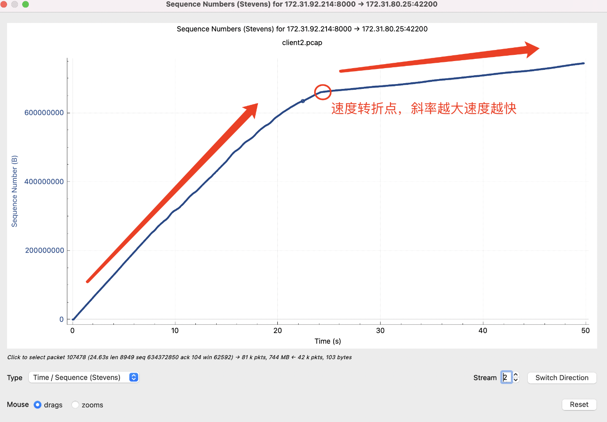
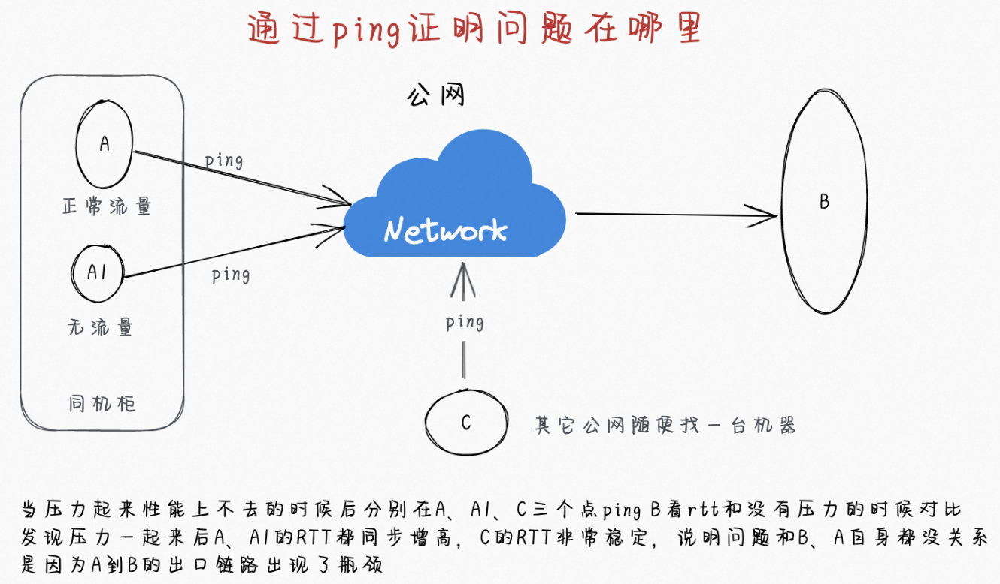
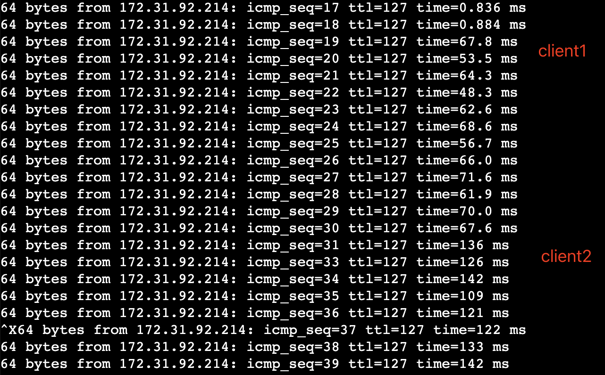
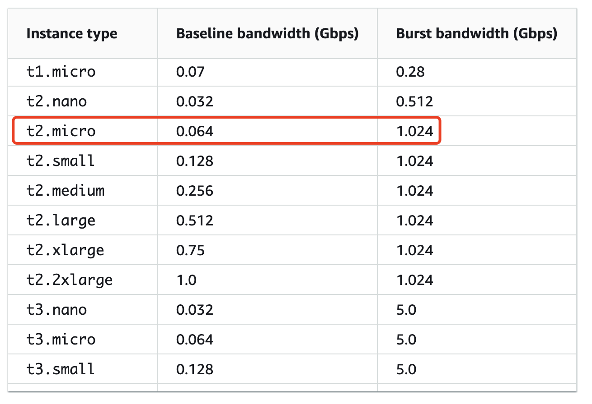
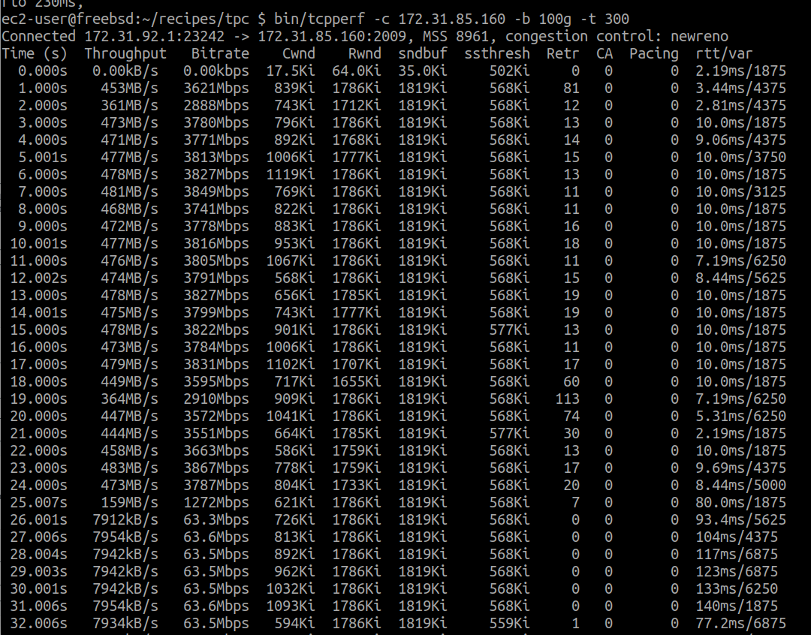
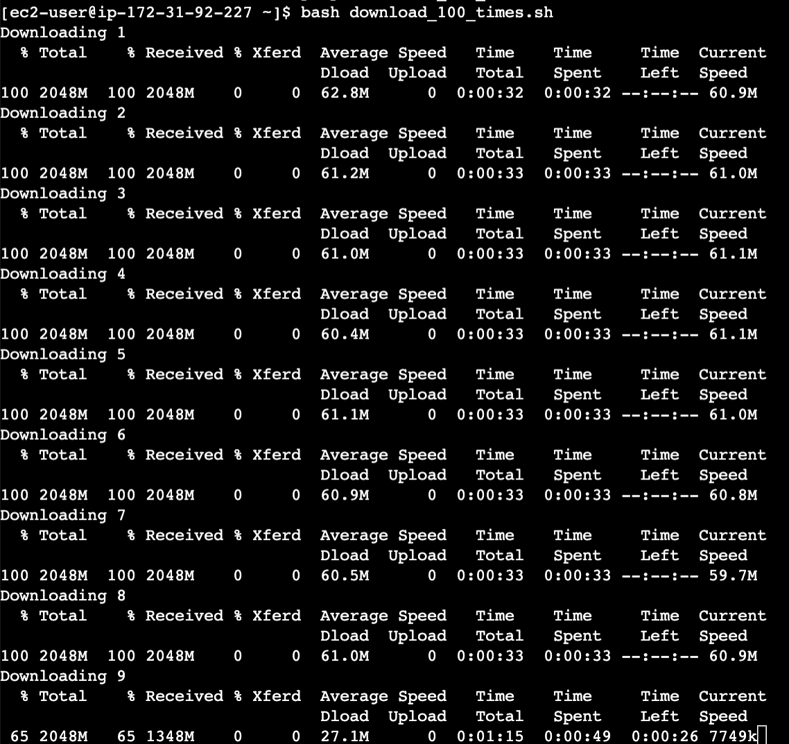

### 背景

这个问题一开始是在进行RDS实验的时候发现的。最初的情景是，多台机器同时对数据库进行select和insert操作时，会发现insert操作会造成select操作qps大幅下降，且insert操作结束之后select操作的qps仍不能回升。起初以为是RDS的问题，但是在复现问题、监控RDS之后发现RDS的压力其实很小。于是开始怀疑是网络的问题，在简化了场景和操作之后，发现能在过去做tcp实验的机器上复现，于是用这个更简单的场景进行问题复现和分析。

### 环境

linux kernal version: 6.1  
linux image: amazon/al2023-ami-2023.0.20230419.0-kernel-6.1-x86_64  
instance type: AWS t2.micro (1 vCPU, 1GiB RAM)  
tc qdisc: fq_codel  

无网络流量情况下：  
network rtt: 0.5 ms  
network bandwidth: 60 MB/s  

### 操作

1. 开三台 t2.micro 机器，一台做 server，两台做client，在server上放一个 2GB 大小的文件
2. client1 通过 curl get server 文件
3. 等待一段时间（约20s），client1网速稳定后，client2 通过 curl get server 文件
4. 可以观察到两种情况（如果无法复现请多试几次，就能复现）  
正常情况：两个 client 速度稳定在30MB/s左右  
降速情况：两个 client 速度降低到3.5MB/s左右  
5. 关掉client2，观察到client1恢复到7-8MB/s，但是远低于60MB/s的带宽上限
6. 降速情况发生之后，client1/2重新通过curl 下载 server文件，就会出现起初网络速度在30-50MB/s，但10s后会降速7-8MB/s的情况，需要重启server才能恢复到60MB/s

### 分析
1. 抓包

    通过tcpdump抓包，获得了完整的降速过程中，server和两个client的网络包的传输情况，pcap文件已上传到[Github](https://github.com/gongyisheng/playground/tree/main/network/throughput_drop_case)


    
    
    
    

    可以观察到：

    1. rtt有明显上升，rtt从降速前的小于1ms上升到降速后的50-100ms
    2. 两边rtt不对等，在降速后关掉client2, server->client1 tcp stream的rtt在server端和client端差异很大

2. 猜测A：bufferbloat

    

    同时，在tcp流中发现有大量的dup ack，很像是buffer size太大导致的bufferbloat，使得一次乱序引发 fast retransmit 太多，让 cwnd 降得太狠。

    可尝试的解决方法是把MTU改成普通的1500，用 fq_codel 做 qdisc，或者把拥塞算法从 CUBIC 换成 BBR，但是经过[@Shuo Chen](https://twitter.com/bnu_chenshuo)尝试后以上方法都不解决问题。

3. 猜测B：拥塞窗口存在缓存值
    ```
    # 查看tcp_metrics
    ip tcp_metrics show | grep 
    # 清除tcp_metrics
    ip tcp_metrics flush all
    ip tcp_metrics delete 
    # 禁用tcp_metrics
    sysctl -w net.ipv4.tcp_no_metrics_save = 1
    ```

    Quote from [plantegg's blog](https://plantegg.github.io/2018/06/14/%E5%B0%B1%E6%98%AF%E8%A6%81%E4%BD%A0%E6%87%82TCP--%E6%9C%80%E7%BB%8F%E5%85%B8%E7%9A%84TCP%E6%80%A7%E8%83%BD%E9%97%AE%E9%A2%98/)

    ```
    tcp_metrics会记录下之前已关闭TCP连接的状态，包括发送端cwnd和ssthresh，如果之前网络有一段时间比较差或者丢包比较严重，就会导致TCP的ssthresh降低到一个很低的值，这个值在连接结束后会被tcp_metrics cache住，在新连接建立时，即使网络状况已经恢复，依然会继承tcp_metrics中cache的一个很低的ssthresh值。

    对于rtt很高的网络环境，新连接经历短暂的“慢启动”后(ssthresh太小)，随即进入缓慢的拥塞控制阶段(rtt太高，cwnd增长太慢)，导致连接速度很难在短时间内上去。而后面的连接，需要很特殊的场景之下(比如，传输一个很大的文件)才能将ssthresh再次推到一个比较高的值更新掉之前的缓存值，因此很有可能在接下来的很长一段时间，连接的速度都会处于一个很低的水平。

    每个连接的ssthresh默认是个无穷大的值，但是内核会cache对端ip上次的ssthresh(大部分时候两个ip之间的拥塞窗口大小不会变)，这样大概率到达ssthresh之后就基本拥塞了，然后进入cwnd的慢增长阶段。

    如果因为之前的网络状况等其它原因导致tcp_metrics缓存了一个非常小的ssthresh，tcp的cwnd指数增长阶段很快就结束，然后进入cwnd+1的慢增加阶段导致整个速度感觉很慢
    ```

    但实验证明tcp_metrics并没有cache不合理的值，且flush tcp_metrics并不解决问题

    降速前:

     

    降速后:

    

4. 猜测C：中间链路限速

    重新分析抓包得到结果，在 Time/Sequence 图上有转折点，在rtt跃升的时间节点之后曲线斜率下降，网络传输速度降低

    
    

    网络速度影响的本质是：**拥塞窗口大小和RTT**。如果速度降了我们要去看这两个因素。如果RTT变为原来的10倍，拥塞窗口和send buffer/receive buffer也要变为原来的10倍才能保持原来的速度，如果拥塞窗口上不去，要么是碰到了buffer size limit，要么是碰到了拥塞点，发生丢包导致窗口上不去。

    Quote from [plantegg](https://twitter.com/plantegg):

    ```
    正常来说rtt是很稳定的，如果某台服务器流量大了之后rtt会升高，升高的原因是流量大了各个环节的响应，处理会慢了导致rtt升高(比如网络包需要交换机中转，中转时间就包含在rtt中，但交换机因为流量太大排队中转的包多了rtt自然就高了)

    但是这个case中，小流量的时候(rtt极小，绿色左边，大概0.5ms),流量上来后绿色部分的rtt在2ms，这个2ms就是比0.5ms上升了1.5ms，这个多出来的1.5ms就和流量有很大的关系，正常情况流量稳定不变，rtt也稳定不变，但是上图绿色到红色的rtt跳变10倍就肯定可以排除掉流量太大导致的
    ```

    但观察到拥塞窗口在rtt翻10倍过程中始终保持不变，且已知server端存在问题的假设已经被排除，开始怀疑是中间链路上限速了，限速可以是来自于物理机层面的，也可以是来自于VPC层面的。

    

    需要设计一个ping-ping实验来证明中间链路有没有限速 (plantegg提供，原始方案[在此](https://articles.zsxq.com/id_7s08new77k2q.html))

    

    实验过程：
    1. 找一个空跑的内网client，ping server
    2. 找一个空跑的公网client（比如我的电脑），ping server
    3. 在限速情况下开启两个client去下载文件，观测ping过程中rtt的变化

    结果是
    1. 无限速时，rtt约0.5ms
    2. 有限速时，内网空跑client在没有client下载文件时，rtt=0.8ms，1个client下载时 rtt=60ms，2个client下载时rtt=120ms
    3. 有限速时，公网client，无论是否有client 在下载，rtt均稳定在80-90ms

    
    

    因此，证明是内网链路网速被限制，不是 server机器问题，查阅[文档](https://docs.aws.amazon.com/AWSEC2/latest/UserGuide/general-purpose-instances.html#general-purpose-network-performance)可知t2.micro的baseline bandwidth = 0.064Gbit/s，等于8MB/s, 与限速值相符。

    

    尝试把两边的wmem/rmem限制都调大10倍，发现拥塞窗口都会限制在某个值停止增长，且速度依然没有提升：

    wmem/rmem X10 后：

    

    wmem/rmem X10 后，改用reno算法:

    

    此时可证明是AWS是通过扩大rtt+retry限制拥塞窗口来实现限速，比单纯delay ack（会导致拥塞窗口上升，buffer size增大）相比十分高明，且能在tcpstream中观测到丢包非常规律地发生。

    

### 后续

- [@Hao Chen](https://twitter.com/haoel) 在t2.medium上做了实验，也复现了AWS 如何通过rtt来限制t2 instance流量，使得instance逐渐失去突增能力的过程，实验结果在这个[Google Sheet](https://docs.google.com/spreadsheets/d/1ayC9SV1kgGjB_VHa8pAuyxjMIIZf5bEh1kiYDTo8j6I/edit#gid=0).

- [@Shuo Chen](https://twitter.com/bnu_chenshuo) 在 t3.micro 上用 FreeBSD 13 复现，观察到 AWS 先用对付 Linux 的办法：故意丢包乱序 + RTT=10ms，发现不灵之后，恼羞成怒，包也不丢了，直接卡脖子（加rtt）。总之就是不让你白嫖网速。对 Linux 是智斗，每秒钟丢你一两个包，RTT=10ms，让你自己cwnd小、速度上不去，你也不好说啥。对 FreeBSD 就上武力了。（FreeBSD 13的拥塞算法还是古早的NewReno）形象的比喻：一个渣男（AWS）和小三（Linux，好忽悠）以及正房（FreeBSD）的相互厮杀。小三好忽悠，正房经验老道，但是都不抵渣男没有下限。

    

- [@yishenggong](https://twitter.com/Orange41324306) 测试用1个client->1个server持续下载文件，测试是否会触发限速，结果是5分钟后突增容量耗尽，触发限速。此实验证明在t2.micro持续进行单线程I/O也会触发限速，多线程（进程）场景会更容易地触发限速。

    

- [@yishenggong](https://twitter.com/Orange41324306) 对t2.micro server进行流量控制，将网速限制在基础流量的80% (6MB/s)，抓包发现结果中不再有规律丢包，网络比较流畅，证明AWS不会对低于基础流量的机器进行随机丢包。

    

### 引用

- [AWS EC2 Network Performance](https://docs.aws.amazon.com/AWSEC2/latest/UserGuide/general-purpose-instances.html#general-purpose-network-performance)
- [就是要你懂TCP–TCP性能问题](https://plantegg.github.io/2018/06/14/%E5%B0%B1%E6%98%AF%E8%A6%81%E4%BD%A0%E6%87%82TCP--%E6%9C%80%E7%BB%8F%E5%85%B8%E7%9A%84TCP%E6%80%A7%E8%83%BD%E9%97%AE%E9%A2%98/), author [@plantegg](https://twitter.com/plantegg)
- [一战成名的ping](https://articles.zsxq.com/id_7s08new77k2q.html), author [@plantegg](https://twitter.com/plantegg)
- [twitter thread](https://twitter.com/bnu_chenshuo/status/1654130088643002374), author: [@Shuo Chen](https://twitter.com/bnu_chenshuo)
- [twitter thread](https://twitter.com/haoel/status/1654655067365179393), author: [@Hao Chen](https://twitter.com/haoel)
- [twitter thread tree](https://treeverse.app/view/RDzsOXjO)
