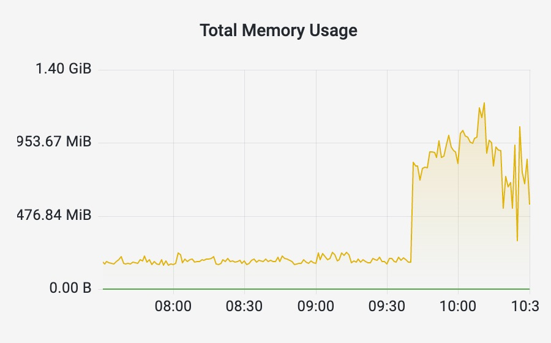
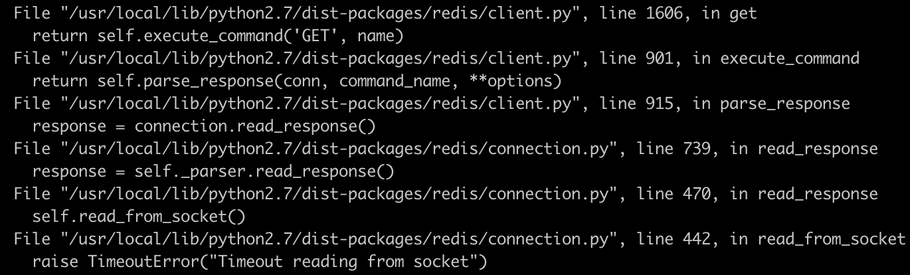
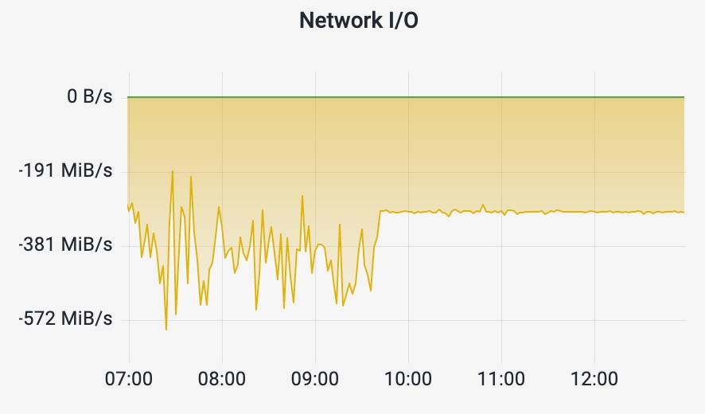
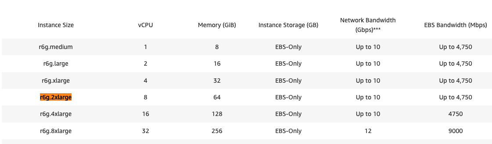
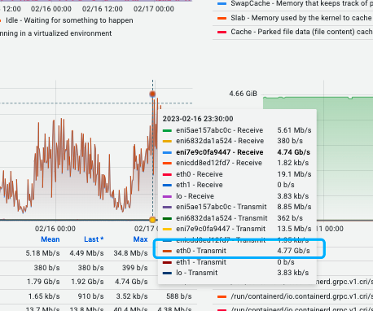

+++
date = '2023-02-16T12:00:00-07:00'
draft = false
title = 'Redis OOM due to big keys'
+++
### Observation
1. Queue client performance went down  
    Everything worked well in the morning until we got monitoring alarm at 12:45 PM EST: `<topic_name> Queue lag is too big`. The issue happened in a service which is responsible for consuming message from message queue, processing message and writing it to database. The service also uses Redis to cache some objects which can be reused every time it processes the message. Auto-scaling rule is applied to the service so there’ll be tens to hundreds of pods running under heavy workload. We observed that the consumer speed went down by 50%, causing messages to be backlogged in the queue.

2. Redis memory went up for X10 times, finally OOM  
    Next, we receive another alarm: `<Redis_name> Redis memory usage increase over 30% per hour` at 1:00 PM EST. Actually the monitoring dashboard showed that Redis memory went up by X10 times! It raised from 100M to 1GB. It started at 12:39 PM, which is before queue lag is too big warning. The memory usage is stable at 1G to 1.5G at first, but went up gradually and finally OOM 3hrs later.
    

3. Client side error: Timeout reading from socket  
    I looked up the log of the service and found this error: `Timeout reading from socket`. We have Redis socketTimeout = 300s, which means that the client doesn’t get message back from Redis after 5min!
    

4. Network out speed was limited at 300 Mbps  
    The network out speed is very stable and limited at 300 Mbps.Before 12:39 PM, the network out speed fluctuated between 300-500 Mbps.
    

### Analysis
1. Which line of code throw out the error  
    Almost every line of code to get key from redis throws this error, It’s not caused by a specific line of code

2. redis-cli, SLOWLOG GET  
    There’s timeout error, so it worths to take a look at slowlog. I saw there were some keys that took about 10s to load, but it happened long before 12:39 PM EST. Nothing suspecious was found.

3. redis-cli, MEMORY STATS  
    Since I can’t get any information to slove the problem from performance downgrade and Timeout error, I have to switch to another clue to investigate: Redis memory increase. I use MEMORY STATS to see which causes memory usage to increase.
    ```
    MEMORY STATS
    1) "peak.allocated"
    2) (integer) 3761107656
    3) "total.allocated"
    4) (integer) 1171592296
    5) "startup.allocated"
    6) (integer) 1417976
    7) "replication.backlog"
    8) (integer) 0
    9) "clients.slaves"
    10) (integer) 0
    11) "clients.normal"
    12) (integer) 996545640
    13) "aof.buffer"
    14) (integer) 0
    15) "lua.caches"
    16) (integer) 0
    17) "db.0"
    18) 1) "overhead.hashtable.main"
        2) (integer) 954544
        3) "overhead.hashtable.expires"
        4) (integer) 677536
    19) "overhead.total"
    20) (integer) 999595696
    21) "keys.count"
    22) (integer) 17310
    23) "keys.bytes-per-key"
    24) (integer) 67601
    25) "dataset.bytes"
    26) (integer) 171996600
    27) "dataset.percentage"
    28) "14.69837474822998"
    29) "peak.percentage"
    30) "31.150192260742188"
    31) "allocator.allocated"
    32) (integer) 1165686536
    33) "allocator.active"
    34) (integer) 1174016000
    35) "allocator.resident"
    36) (integer) 1226031104
    37) "allocator-fragmentation.ratio"
    38) "1.0071455240249634"
    39) "allocator-fragmentation.bytes"
    40) (integer) 8329464
    41) "allocator-rss.ratio"
    42) "1.0443053245544434"
    43) "allocator-rss.bytes"
    44) (integer) 52015104
    45) "rss-overhead.ratio"
    46) "0.93485987186431885"
    47) "rss-overhead.bytes"
    48) (integer) -79863808
    49) "fragmentation"
    50) "0.98332488536834717"
    51) "fragmentation.bytes"
    52) (integer) -19436600
    ```
    The result showed that clients.normal is too big (about 1G), dataset.percentage is only 14%. The problem is not caused by a burst of newly added data, but something with Redis client overhead.

4. redis-cli, CLIENT LIST  
    Okay, we know that there’s problems with redis client overhead. So which client overhead cause the problem? I use CLIENT LIST to get the information and statistics about the client connections. The result showed that there were too many clients with tot-mem=7M/5M, oll=1.
    ```
    id=2136697 addr=***.***.***.***:***** laddr=***.***.***.***:***** fd=508 name= age=3034 idle=2 flags=N db=0 sub=0 psub=0 multi=-1 qbuf=0 qbuf-free=0 argv-mem=0 obl=0 oll=0 omem=0 tot-mem=20504 events=r cmd=get user=default redir=-1
    id=2135439 addr=***.***.***.***:***** laddr=***.***.***.***:***** fd=766 name= age=6148 idle=1 flags=N db=0 sub=0 psub=0 multi=-1 qbuf=0 qbuf-free=40954 argv-mem=0 obl=0 oll=1 omem=7340056 tot-mem=7401512 events=rw cmd=get user=default redir=-1
    id=2135638 addr=***.***.***.***:***** laddr=***.***.***.***:***** fd=589 name= age=5784 idle=1 flags=N db=0 sub=0 psub=0 multi=-1 qbuf=0 qbuf-free=0 argv-mem=0 obl=0 oll=1 omem=5242904 tot-mem=5263408 events=rw cmd=get user=default redir=-1
    ```
    It looked messages were backloged in the out buffer to be sent out. And we know that the network out speed is limited at 300 MB, is there anything limits the network speed?

5. Work with DevOps team  
    Confirmed that no speed limit rule set by DevOps team. 
     
    Confirmed that the network speed of instance Redis pod running in hit the limit of AWS EC2 instance we use around 12:39 PM EST by DevOps team  
    

### Root Cause
1. Redis big key  
    There’re several big keys stored in Redis. Each one is about 5 – 7Mb. Imagine if there’re 100 pods request the same key in a second, it requires 500-700 Mbps network brandwith to work well.  

2. Then hit network speed limit of AWS instance we use.  
    Network output of redis pod is limited at 300 Mbps when the instance network hit the upperbound (4750 Mbps).

3. Data to be sent out is backlogged in the buffer, causing memory to increase, finally OOM   

    The data to be sent out line up in the network output buffer, which can be read from clients.normal and takes more and more memory, finally OOM.

### Solution
Avoid requesting Redis big key. Since this key is not frequently updated and has a loose consistency requirement, we use memory cache instead.

### Learned
1. Avoid Redis big key.   
    Don’t store big keys in Redis which may be frequently requested! If you have to store big key in Redis, avoid frequent request for big key and use MGET to improve the performance. Loading big key frequently can cause a lot of problems (Redis cpu usage too high, get command takes too much time, and hits network speed limit)  

2. Everything has a limit.   
    Estimate the qps and network I/O that your service will bring to Redis (and other external services) before use them.  
